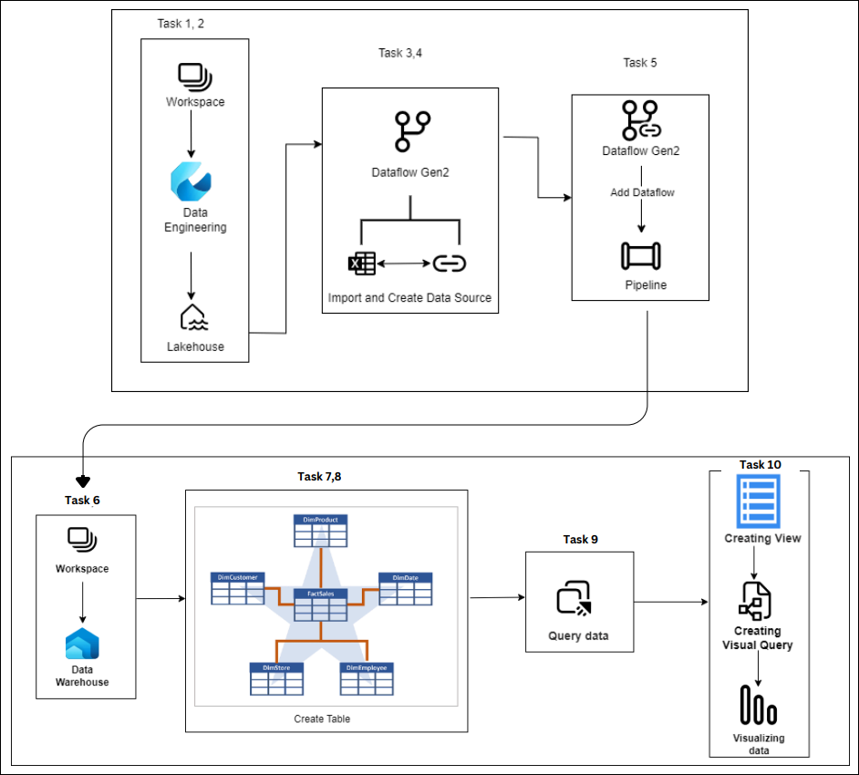

# Get Started with Data Warehouses and Ingesting Data with Dataflows Gen2 with Microsoft Fabric

## Overall Estimated Duration: 4 Hours

## Overview

In this lab, you'll explore key components of Microsoft Fabric's data solution. First, you'll learn to create and use Dataflows (Gen2) to ingest, transform, and standardize data from various sources, preparing it for analysis and landing it in a Lakehouse or other destinations. Next, you'll analyze the processed data within a relational data warehouse in Microsoft Fabric, leveraging its SQL capabilities for querying and visualization. Together, these labs demonstrate how to integrate dataflows and data warehouses to build a comprehensive, end-to-end analytics solution using Microsoft Fabric.

## Objective

In this lab, You will master dataflows, data warehousing, and reporting in Microsoft Fabric :

- **Create and use a Dataflow (Gen2) and Analyze the data in Microsoft Fabric** : Learn to create and use Dataflows (Gen2) in Microsoft Fabric for efficient data ingestion, transformation, and standardization from various sources. Then, master building and querying a relational data warehouse, enhancing its data model, and leveraging the default dataset to generate detailed reports. This lab covers connecting to multiple data sources, cleansing data, optimizing the warehouse, and creating comprehensive analytics reports.

## Pre-requisites

- Fundamental knowledge on Microsoft Fabric
- Basic understanding of Data Analytics

## Architecture

This lab begins with setting up a workspace and a Lakehouse in the Data Engineering area (Tasks 1 and 2). Next, Dataflows (Gen2) are created to import and configure data sources (Tasks 3 and 4). These dataflows are then integrated into a pipeline (Task 5) for additional processing. Then  Data Warehouse is created (Task 6), where tables are created and structured (Tasks 7 and 8). Following this, data is queried (Task 9) and views are created for further analysis. Finally, visual queries are developed (Task 10) to enable data visualization and provide insights, completing the end-to-end data management and analysis workflow.

## Architecture Diagram

## Explanation of Components

- **Workspace** : Acts as the central hub for organizing and managing data engineering activities in this lab, facilitating the setup and coordination of various components.
- **Lakehouse** : Provides a unified storage solution for raw and processed data, supporting data ingestion and transformation processes crucial for this lab's analytics workflow.
- **Dataflows (Gen2)** : Used to ingest, transform, and standardize data from diverse sources, ensuring clean and consistent data is available for further analysis and reporting in this lab.
- **Data Warehouse** : Serves as the structured storage solution for organizing and analyzing large datasets, enabling efficient querying and reporting for comprehensive data insights in this lab.
- **Pipeline** : Orchestrates the movement and transformation of data, ensuring seamless integration and data flow between different components.
- **Visual Query Tool** :  Enables the creation of visual queries and views, allowing participants to easily analyze and visualize data, and draw actionable insights from the lab's dataset.

## Getting Started with Lab

Once you're ready to dive in, your virtual machine and lab guide will be right at your fingertips within your web browser.
 

### Virtual Machine & Lab Guide
 
Your virtual machine is your workhorse throughout the workshop. The lab guide is your roadmap to success.
 
## Exploring Your Lab Resources
 
To get a better understanding of your lab resources and credentials, navigate to the **Environment Details** tab.
 

 
## Utilizing the Split Window Feature
 
For convenience, you can open the lab guide in a separate window by selecting the **Split Window** button from the top right corner.
 

 
## Managing Your Virtual Machine
 
Feel free to start, stop, or restart your virtual machine as needed from the **Resources** tab. Your experience is in your hands!
 

 
 
 Click "Next" from the bottom right corner to embark on your Lab journey!
 
  
 
Now you're all set to explore the powerful world of technology. Feel free to reach out if you have any questions along the way. Enjoy your workshop!

## Support Contact

The CloudLabs support team is available 24/7, 365 days a year, via email and live chat to ensure seamless assistance at any time. We offer dedicated support channels tailored specifically for both learners and instructors, ensuring that all your needs are promptly and efficiently addressed.

Learner Support Contacts:

- Email Support: labs-support@spektrasystems.com
- Live Chat Support: https://cloudlabs.ai/labs-support

## Happy Learning!!
