# Lab 02: Ingest data with a pipeline

### Estimated Duration: 120 Minutes

## Overview
Data pipelines define a sequence of activities that orchestrate an overall process, usually by extracting data from one or more sources and loading it into a destination; often transforming it along the way. Pipelines are commonly used to automate extract, transform, and load (ETL) processes that ingest transactional data from operational data stores into an analytical data store, such as a lakehouse or data warehouse. The graphical pipeline canvas in the Fabric user interface enables you to build complex pipelines with minimal or no coding required.

## Lab Objectives

In this lab, you will complete the following tasks:

 - Task 1: Create a pipeline
 - Task 2: Create a notebook
 - Task 3: Modify the pipeline

## _Architecture Diagram_

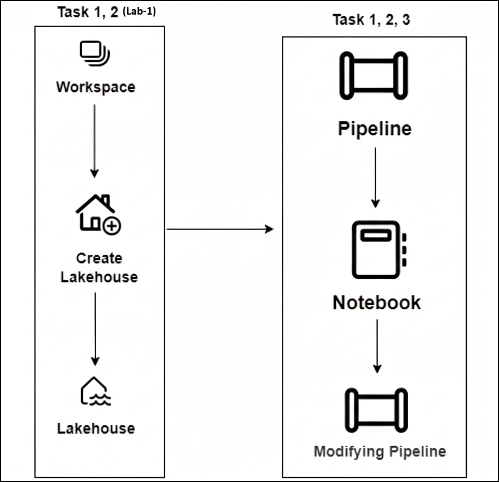

## Use Data Factory pipelines in Microsoft Fabric

A data lakehouse is a common analytical data store for cloud-scale analytics solutions. One of the core tasks of a data engineer is to implement and manage the ingestion of data from multiple operational data sources into the lakehouse. In Microsoft Fabric, you can implement *extract, transform, and load* (ETL) or *extract, load, and transform* (ELT) solutions for data ingestion through the creation of *pipelines*.

Fabric also supports Apache Spark, enabling you to write and run code to process data at scale. By combining the pipeline and Spark capabilities in Fabric, you can implement complex data ingestion logic that copies data from external sources into the OneLake storage on which the lakehouse is based, and then uses Spark code to perform custom data transformations before loading it into tables for analysis.

> **Note**: You'll need a Microsoft Fabric license to complete this exercise. Complete the previous task to proceed further.

## Task 1: Create a pipeline

A simple way to ingest data is to use a **Copy Data** activity in a pipeline to extract the data from a source and copy it to a file in the lakehouse.

1. On the **Home** page for your lakehouse, Under **Get data (1)** select **New pipeline (2)**.

    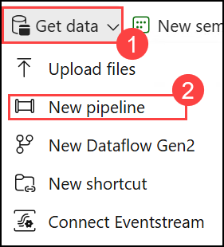

1. Create a new data pipeline named **Ingest Sales Data (3)** and click **Create (4)**.

    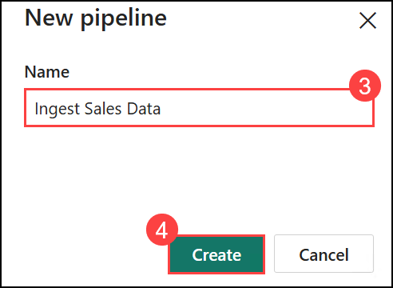

2. If the **Copy Data** wizard doesn't open automatically, select **Copy Data** in the pipeline editor page.

3. In the **Copy Data** wizard, on the **Choose a data source (1)** page, in the **New sources (2)** section, search **Http (3)** and select **Http (4)**.

    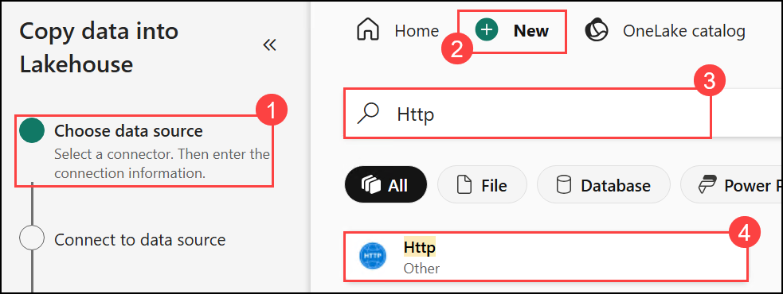

4. You will be navigated to Connect to data source.

5. In the **Connect to data source** section, enter the following settings for the connection to your data source:
    - **URL**: `https://raw.githubusercontent.com/MicrosoftLearning/dp-data/main/sales.csv`
    - **Connection**: Create new connection
    - **Connection name**: *Specify a unique name*
    - **Authentication kind**: Basic (*Provide the username and password and note it in notepad*)

5. Select **Next**. Then ensure the following settings are selected:
    - **Relative URL**: *Leave blank*
    - **Request method**: GET
    - **Additional headers**: *Leave blank*
    - **Binary copy**: <u>Un</u>selected
    - **Request timeout**: *Leave blank*
    - **Max concurrent connections**: *Leave blank*

6. Select **Next**, and wait for the data to be sampled and then ensure that the following settings are selected:
    - **File format**: DelimitedText
    - **Column delimiter**: Comma (,)
    - **Row delimiter**: Line feed (\n)
    - **First row as header**: Selected
    - **Compression type**: None

7. Select **Preview data** to see a sample of the data that will be ingested. Then close the data preview and select **Next**.

8. On the **Choose data destination** page, select your existing lakehouse.

    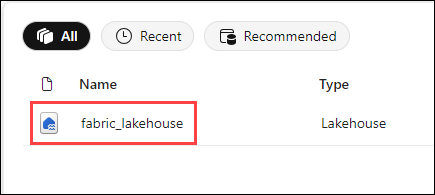

    >**Note:** If the fabric lakehouse is already selected, please continue with the further steps.

9. Set the following data destination options, and then select **Next**:
    - **Root folder**: Files
    - **Folder path name**: new_data
    - **File name**: sales.csv
    - **Copy behavior**: None

10. Set the following file format options and then select **Next**:
    - **File format**: DelimitedText
    - **Column delimiter**: Comma (,)
    - **Row delimiter**: Line feed (\n)
    - **Add header to file**: Selected
    - **Compression type**: None

11. On the **Copy summary** page, review the details of your copy operation and then select **Save + Run**.

    A new pipeline containing a **Copy Data** activity is created, as shown here:

    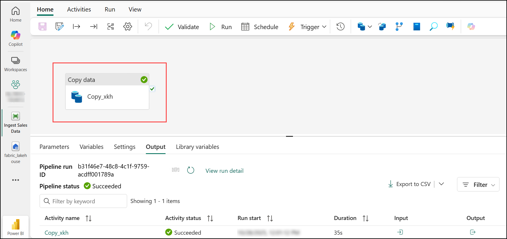

12. When the pipeline starts to run, you can monitor its status in the **Output** pane under the pipeline designer. Use the **&#8635;** (*Refresh*) icon to refresh the status, and wait until it has succeeded.

13. In the menu bar on the left, select your lakehouse.

14. On the **Home** page, in the **Lakehouse explorer** pane, expand **Files (1)** and select the **new_data (2)** folder to verify that the **sales.csv (3)** file has been copied.

    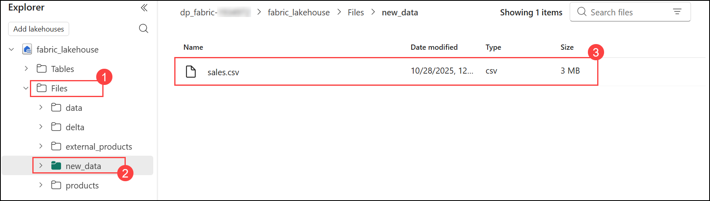

## Task 2: Create a notebook

1. On the **Home** page for your lakehouse, in the **Open notebook (1)** menu, select **New notebook (2)**.

   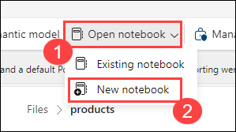

    After a few seconds, a new notebook containing a single *cell* will open. Notebooks are made up of one or more cells that can contain *code* or *markdown* (formatted text).

2. Select the existing cell in the notebook, which contains some simple code, and then replace the default code with the following variable declaration.

    ```python
   table_name = "sales"
    ```

3. In the **ellipsis (...)** menu for the cell (at its top-right) select **Toggle parameter cell**. This configures the cell so that the variables declared in it are treated as parameters when running the notebook from a pipeline.

    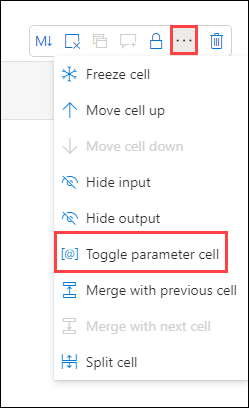

4. Under the parameters cell, use the **+ Code** button to add a new code cell. Then add the following code to it:

    ```python
   from pyspark.sql.functions import *

   # Read the new sales data
   df = spark.read.format("csv").option("header","true").load("Files/new_data/*.csv")

   ## Add month and year columns
   df = df.withColumn("Year", year(col("OrderDate"))).withColumn("Month", month(col("OrderDate")))

   # Derive FirstName and LastName columns
   df = df.withColumn("FirstName", split(col("CustomerName"), " ").getItem(0)).withColumn("LastName", split(col("CustomerName"), " ").getItem(1))

   # Filter and reorder columns
   df = df["SalesOrderNumber", "SalesOrderLineNumber", "OrderDate", "Year", "Month", "FirstName", "LastName", "EmailAddress", "Item", "Quantity", "UnitPrice", "TaxAmount"]

   # Load the data into a table
   df.write.format("delta").mode("append").saveAsTable(table_name)
    ```

    This code loads the data from the sales.csv file that was ingested by the **Copy Data** activity, applies some transformation logic, and saves the transformed data as a table - appending the data if the table already exists.

5. Verify that your notebooks look similar to this, and then use the **&#9655; Run all** button on the toolbar to run all of the cells it contains.

    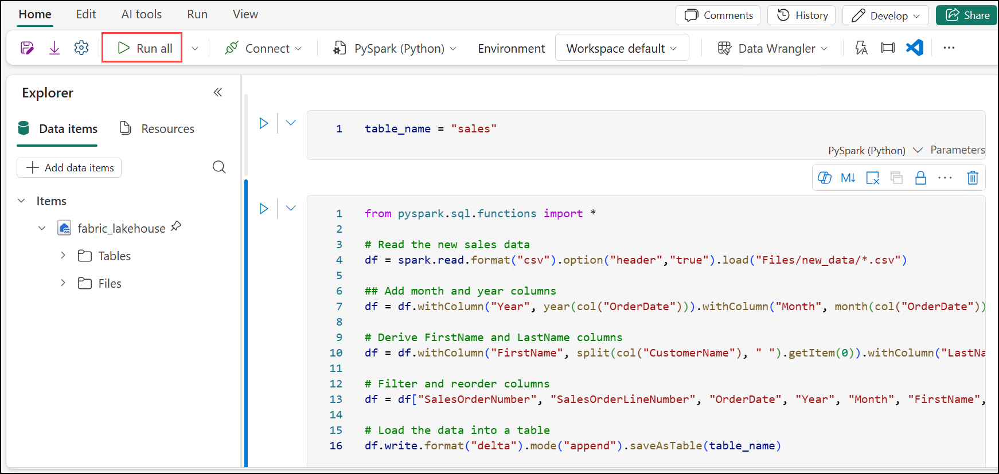

6. When the notebook run has completed, in the **Lakehouse explorer** pane on the left, in the **ellipsis (...)** menu for **Tables** select **Refresh** and verify that a **sales** table has been created.

7. In the notebook menu bar, use the ⚙️ **Settings** icon to view the notebook settings. Then set the **Name** of the notebook to **Load Sales** and close the settings pane.

8. In the hub menu bar on the left, select your lakehouse.

9. In the **Explorer** pane, refresh the view. Then expand **Tables (1)**, and select the **sales (2)** table to see a preview of the data it contains.

   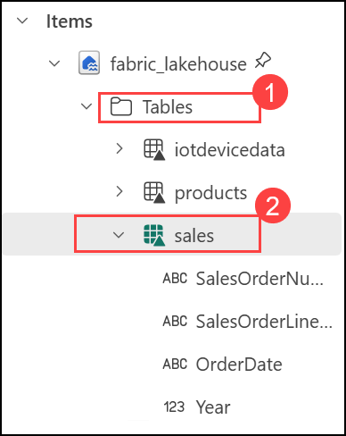

## Task 3: Modify the pipeline

Now that you've implemented a notebook to transform data and load it into a table, you can incorporate the notebook into a pipeline to create a reusable ETL process.

1. In the hub menu bar on the left, select the **Ingest Sales Data** pipeline you created previously.

2. On the **Activities** tab, in the **More activities** list, select **Delete data**. Then position the new **Delete data**  activity to the left of the **Copy data** activity and connect its **On completion** output to the **Copy data** activity, as shown below:

    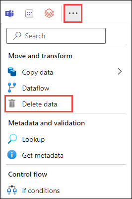

    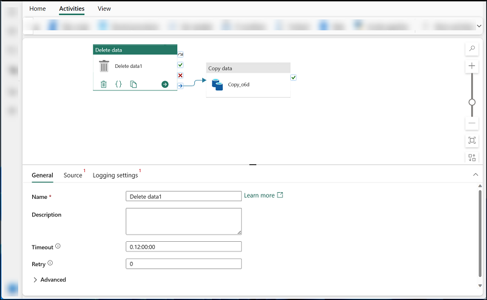

3. Select the **Delete data** activity, and in the pane below the design canvas, set the following properties:
    - **General**:
        - **Name**: Delete old files

          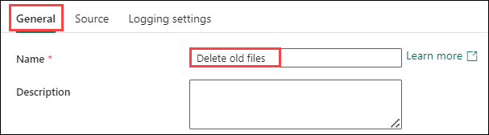

    - **Source**
        - **Data store type**: Workspace
        - **Workspace data store**: *Your lakehouse*
        - **File path type**: Wildcard file path
        - **Folder path**: Files / **new_data**
        - **Wildcard file name**: *.csv        
        - **Recursively**: *Selected*

          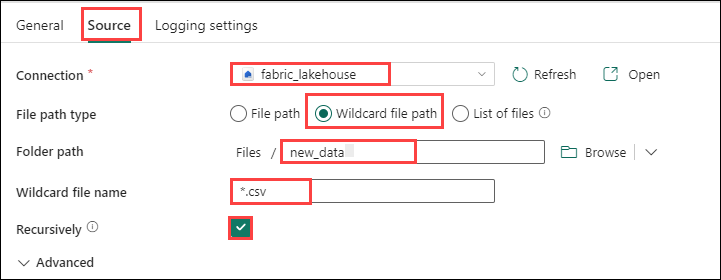

    - **Logging settings**:
        - **Enable logging**: *<u>Un</u>selected*

          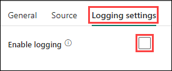

    These settings will ensure that any existing .csv files are deleted before copying the **sales.csv** file.

4. In the pipeline designer, on the **Activities** tab, select **Notebook** to add a **Notebook** activity to the pipeline.

5. Select the **Copy data** activity and then connect its **On Completion** output to the **Notebook** activity as shown here:

    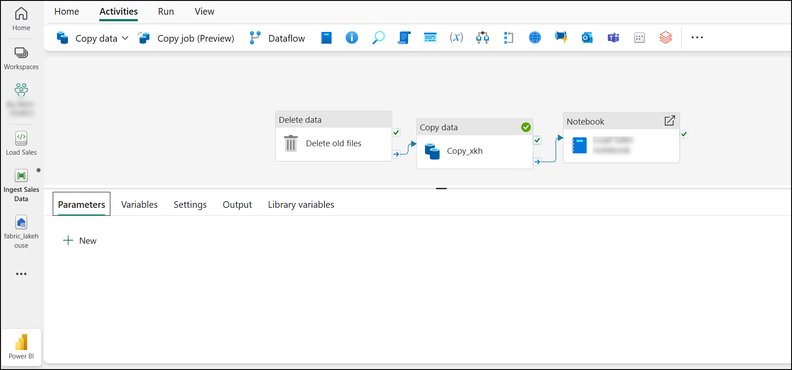

6. Select the **Notebook** activity, and then in the pane below the design canvas, set the following properties:
    - **General**:
        - **Name**: Load Sales notebook

            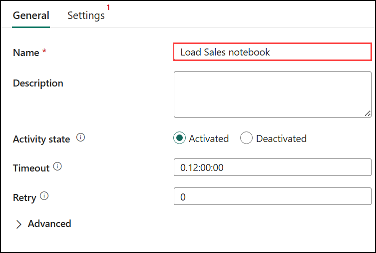
    
    - **Settings**:
        - **Notebook (1)**: Load Sales
        - **Base parameters (2)**: *Add a new parameter with the following properties:*
            
            | Name | Type | Value |
            | -- | -- | -- |
            | table_name | String | new_sales |

            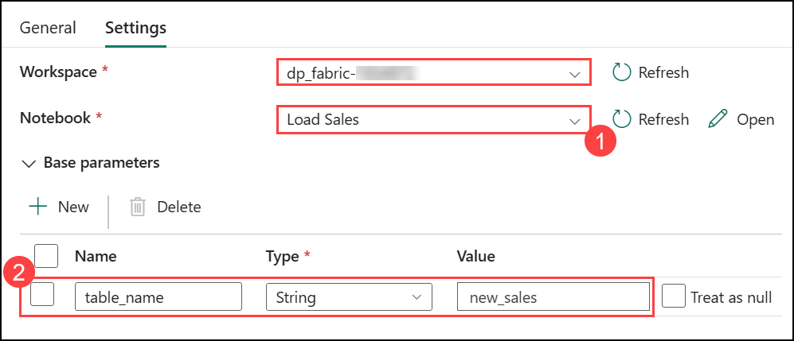

    The **table_name** parameter will be passed to the notebook and override the default value assigned to the **table_name** variable in the parameters cell.

7. On the **Home** tab, use the **&#128427;** (*Save*) icon to save the pipeline. Then use the **&#9655; Run** button to run the pipeline, and wait for all of the activities to complete.

    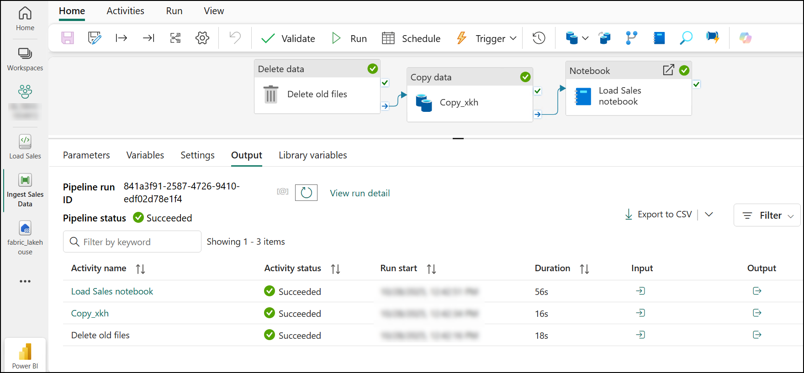

8. In the hub menu bar on the left edge of the portal, select your lakehouse.

9. In the **Explorer** pane, expand **Tables** and select the **new_sales** table to see a preview of the data it contains. This table was created by the notebook when it was run by the pipeline.

   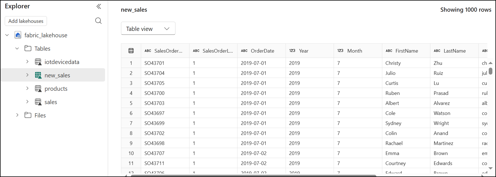

In this exercise, you implemented a data ingestion solution that uses a pipeline to copy data to your lakehouse from an external source, and then uses a Spark notebook to transform the data and load it into a table.

## Summary

In this lab, you created a pipeline to automate data processing, developed a notebook for writing and testing your pipeline logic, and then modified the pipeline to refine its functionality. These tasks helped you gain practical experience in building and optimizing data workflows within a pipeline.

### You have successfully completed the lab.
