# Exercise 1 : Create and use a Dataflow (Gen2) in Microsoft Fabric 

In this exercise, you will use Dataflows (Gen2) to ingest, transform, and standardize data. You will set up data ingestion processes, apply necessary transformations, and create standardized datasets for analysis. This exercise will help you understand how to efficiently prepare and manage data using Dataflows (Gen2).

## Objectives:
- Task 1 : Create a workspace
- Task 2 : Create a lakehouse
- Task 3 : Create a Dataflow (Gen2) to ingest data
- Task 4 : Add data destination for Dataflow
- Task 5 : Add a dataflow to a pipeline

## Task 1 : Create a workspace

Before working with data in Fabric, create a workspace with the Fabric trial enabled.

1. Sign into [Microsoft Fabric](https://app.fabric.microsoft.com) at `https://app.fabric.microsoft.com` and select **Power BI**.

   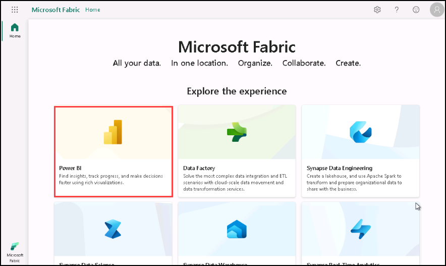

2. From the PowerBI home page, select **Account Manager** from the top-right corner to start the free **Microsoft Fabric trial**. and click on **Free trial**.
    
    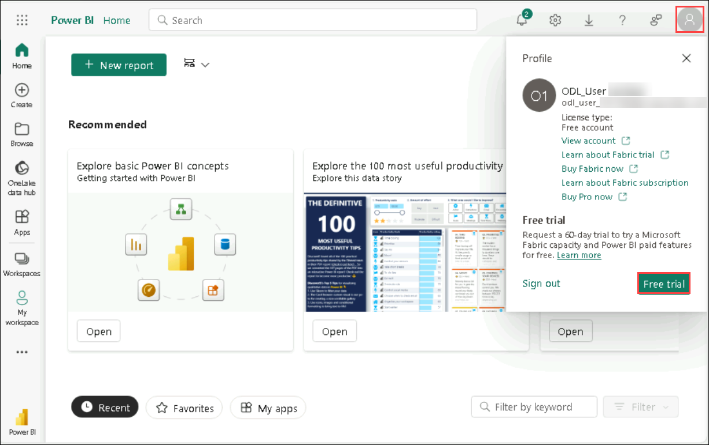
     
4. If prompted, agree to the terms and then select **Start trial**. 

   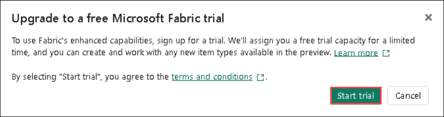
   
5. Once your trial capacity is ready, you receive a confirmation message. Select **Stay on current page** to begin working in Fabric.

    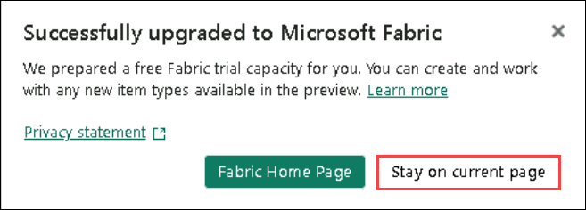
   
6. On the dashboard, on the top menu you can see **Trial Status 59 days left**.

    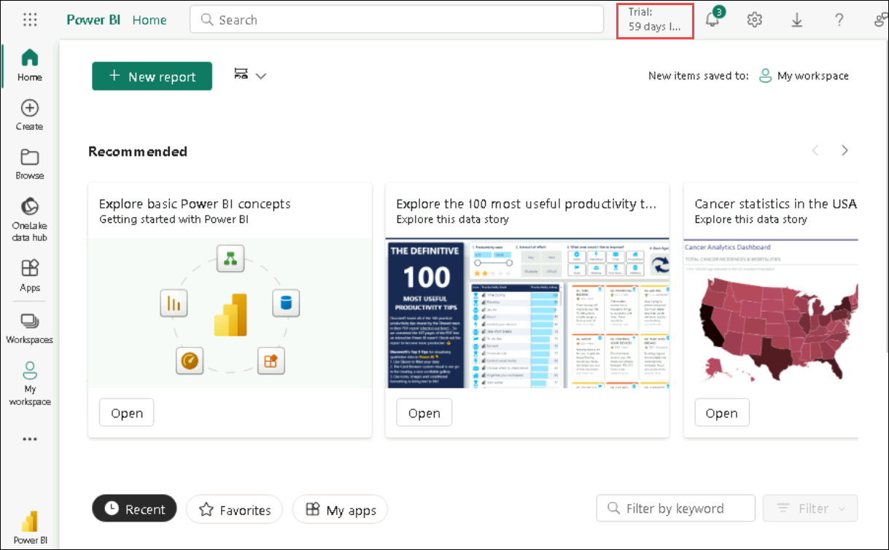

   You now have a **Fabric (Preview) trial** that includes a **Power BI trial** and a **Fabric (Preview) trial capacity**.

7. In the menu bar on the left, select **Workspaces** (the icon looks similar to &#128455;).

   

8. Create a new workspace with a name **dp_fabric-<inject key="Deployment ID" enableCopy="false"/>**, selecting a licensing mode that includes Fabric capacity (*Trial*, *Premium*, or *Fabric*).
9. When your new workspace opens, it should be empty, as shown here:

    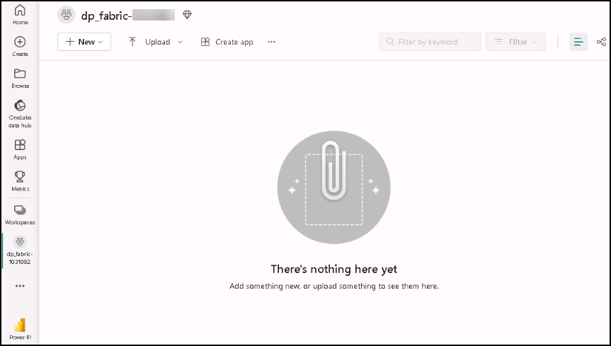

## Task 2 : Create a lakehouse

Now that you have a workspace, it's time to switch to the **Data Engineering** experience in the portal and create a data lakehouse into which you'll ingest data.

1. At the bottom left of the Power BI portal, select the **Power BI** icon and switch to the **Data Engineering** experience.

2. In the **Data engineering** home page, create a new **Lakehouse** with a name of **dp_lakehouse**.

    After a minute or so, a new empty lakehouse will be created.

   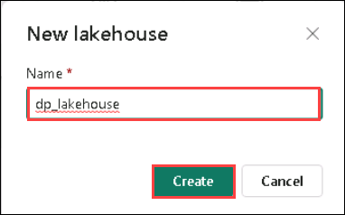

## Task 3 : Create a Dataflow (Gen2) to ingest data

Now that you have a lakehouse, you need to ingest some data into it. One way to do this is to define a dataflow that encapsulates an *extract, transform, and load* (ETL) process.

1. In the home page for your workspace, select **New Dataflow Gen2**. After a few seconds, the Power Query editor for your new dataflow opens as shown here.

   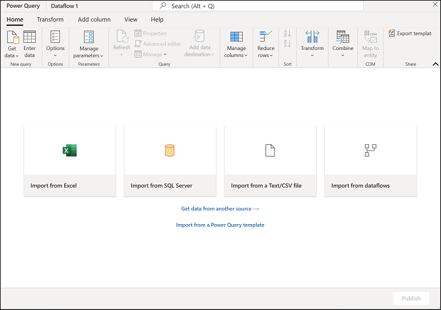

2. Select **Import from a Text/CSV file**, and create a new data source with the following settings:
 - **Link to file**: *Selected*
 - **File path or URL**: `https://raw.githubusercontent.com/MicrosoftLearning/dp-data/main/orders.csv`
 - **Connection**: Create new connection
 - **data gateway**: (none)
 - **Authentication kind**: Anonymous

3. Select **Next** to preview the file data, and then **Create** the data source. The Power Query editor shows the data source and an initial set of query steps to format the data, as shown here:

   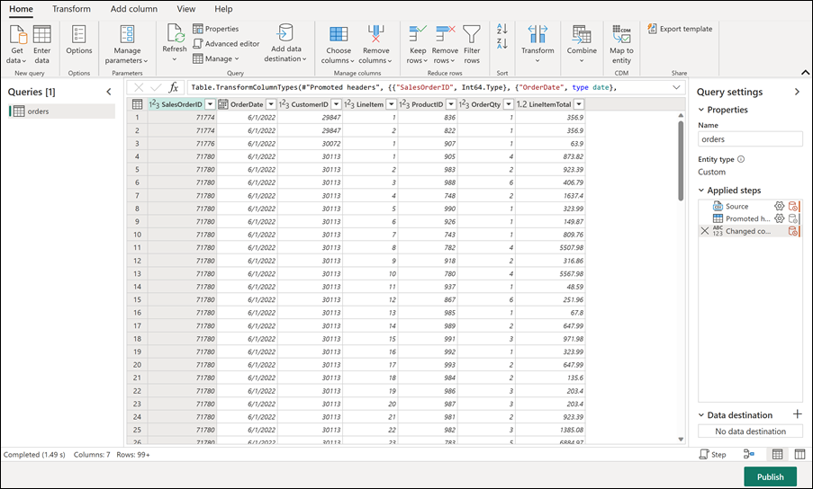

4. On the toolbar ribbon, select the **Add column** tab. Then select **Custom column** and create a new column named **MonthNo** that contains a number based on the formula `Date.Month([OrderDate])` - as shown here:

   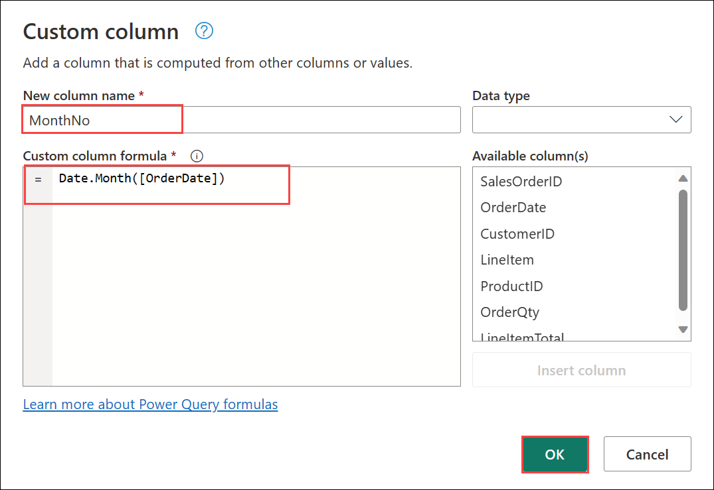

 Click on **OK**. The step to add the custom column is added to the query and the resulting column is displayed in the data pane:

   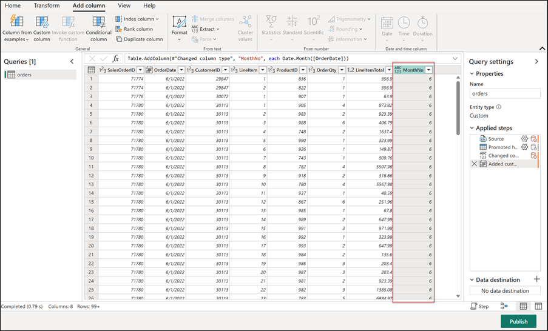

> **Tip:** In the Query Settings pane on the right side, notice the **Applied Steps** include each transformation step. At the bottom, you can also toggle the **Diagram flow** button to turn on the Visual Diagram of the steps.
>
> Steps can be moved up or down, edited by selecting the gear icon, and you can select each step to see the transformations apply in the preview pane.

## Task 4 : Add data destination for Dataflow

1. On the toolbar ribbon, select the **Home** tab. Then in the **Add data destination** drop-down menu, select **Lakehouse**.

   > **Note:** If this option is grayed out, you may already have a data destination set. Check the data destination at the bottom of the Query settings pane on the right side of the Power Query editor. If a destination is already set, you can change it using the gear.

2. In the **Connect to data destination** dialog box, edit the connection and sign in using your Power BI organizational account to set the identity that the dataflow uses to access the lakehouse.

   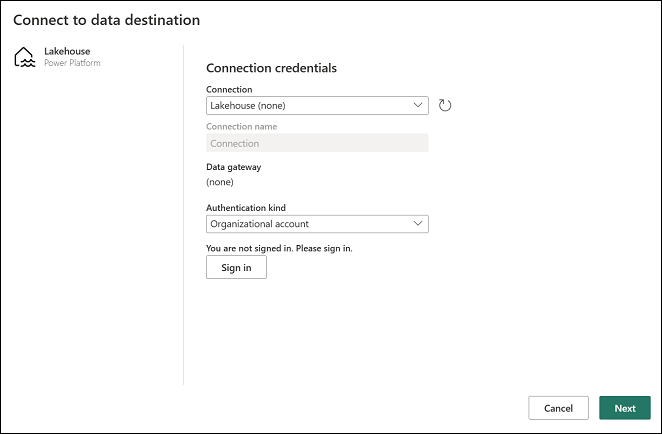

3. Select **Next** and in the list of available workspaces, find your workspace and select the lakehouse you created in it at the start of this exercise. Then specify a new table named **orders**:

   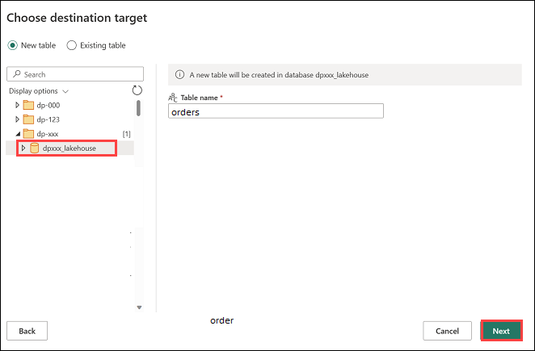

   > **Note:** On the **Destination settings** page, notice how OrderDate and MonthNo are not selected in the Column mapping and there is an informational message: *Change to date/time*.

    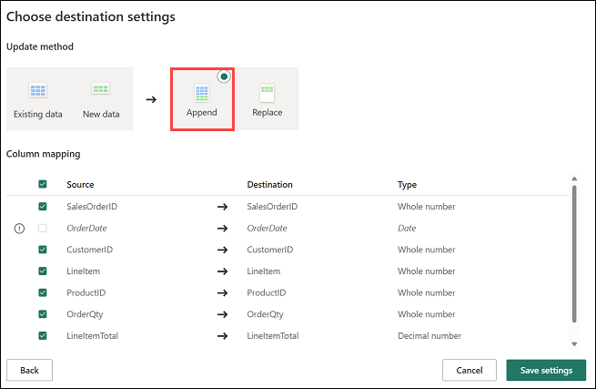

4. Cancel this action, then go back to OrderDate and MonthNo columns in Power Query online. Right-click on the column header and **Change Type**.

    - OrderDate = Date/Time
    - MonthNo = Whole number

5. Now repeat the process outlined earlier to add a lakehouse destination.

6. On the **Destination settings** page, select **Append**, and then save the settings.  The **Lakehouse** destination is indicated as an icon in the query in the Power Query editor.

   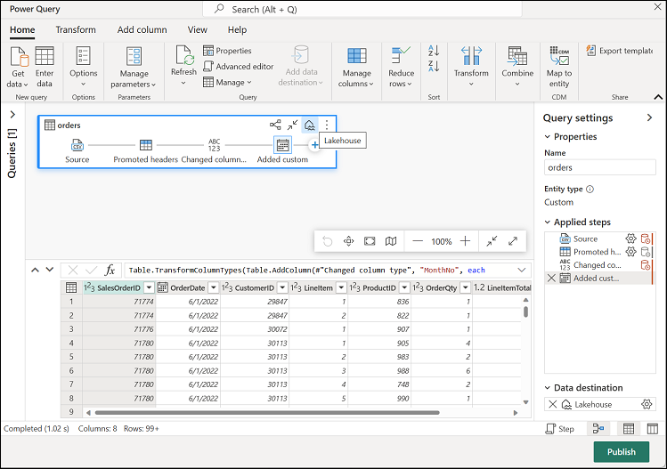

7. Select **Publish** to publish the dataflow. Then wait for the **Dataflow 1** dataflow to be created in your workspace.

8. Once published, you can right-click on the dataflow in your workspace, select **Properties**, and rename your dataflow.

## Task 5 : Add a dataflow to a pipeline

You can include a dataflow as an activity in a pipeline. Pipelines are used to orchestrate data ingestion and processing activities, enabling you to combine dataflows with other kinds of operation in a single, scheduled process. Pipelines can be created in a few different experiences, including Data Factory experience.

1. From your Fabric-enabled workspace, make sure you're still in the **Data Engineering** experience. Select **New**, **Data pipeline**, then when prompted, create a new pipeline named **Load data**.

   The pipeline editor opens.

   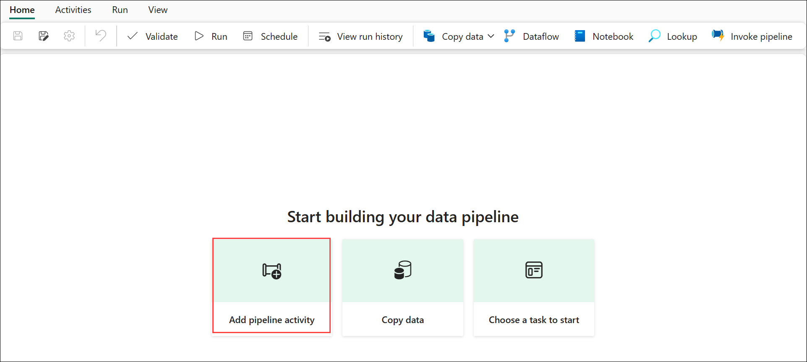

   > **Tip**: If the Copy Data wizard opens automatically, close it!

2. Select **Add pipeline activity**, and add a **Dataflow** activity to the pipeline.

3. With the new **Dataflow1** activity selected, on the **Settings** tab, in the **Dataflow** drop-down list, select **Dataflow 1** (the data flow you created previously)

   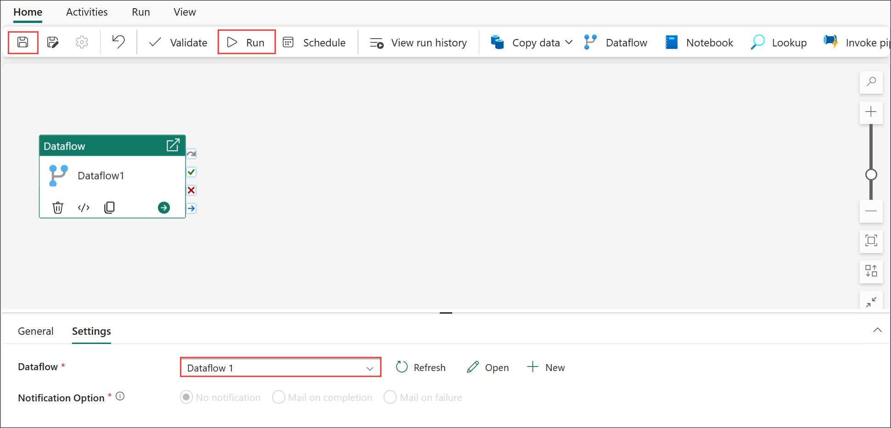

4. On the **Home** tab, save the pipeline using the **&#128427;** (*Save*) icon.
5. Use the **&#9655; Run** button to run the pipeline, and wait for it to complete. It may take a few minutes.

   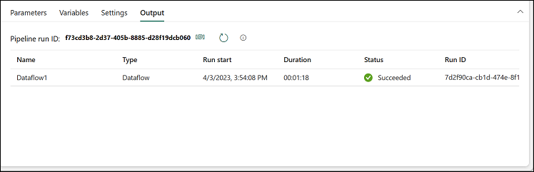

6. In the menu bar on the left edge, select your lakehouse.
7. In the **...** menu for **Tables**, select **refresh**. Then expand **Tables** and select the **orders** table, which has been created by your dataflow.

   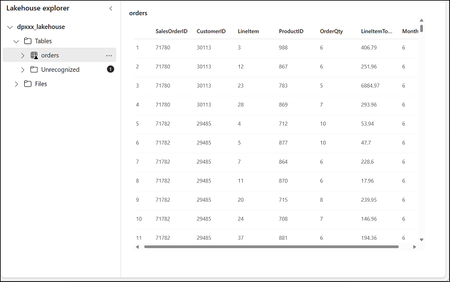

> **Tip**: Use the Power BI Desktop *Dataflows connector* to connect directly to the data transformations done with your dataflow.
>
> You can also make additional transformations, publish as a new dataset, and distribute with intended audience for specialized datasets.
>
>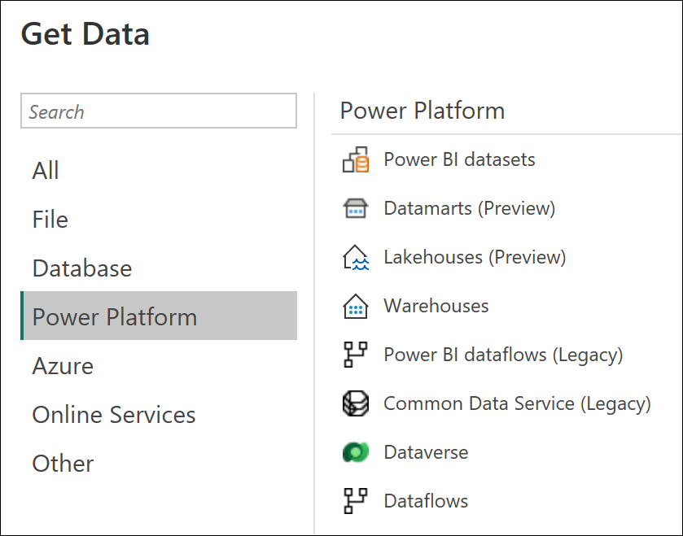

## Summary

In this exercise, you have created a lakehouse and a Dataflows (Gen2) to ingest, transform, and standardize data.

