# Exercise 1 : Create and use a Dataflow (Gen2) in Microsoft Fabric 

### Estimated Duration: 120 Minutes

In this exercise, you will use Dataflows (Gen2) to ingest, transform, and standardize data. You will set up data ingestion processes, apply necessary transformations, and create standardized datasets for analysis. This exercise will help you understand how to efficiently prepare and manage data using Dataflows (Gen2).

## Objectives:

- Task 1 : Create a workspace
- Task 2 : Create a lakehouse
- Task 3 : Create a Dataflow (Gen2) to ingest data
- Task 4 : Add data destination for Dataflow
- Task 5 : Add a dataflow to a pipeline

## Task 1 : Create a workspace

In this task, you’ll create a dedicated workspace in Microsoft Fabric with the trial features enabled. This workspace will serve as the foundation for building and managing data solutions, including lakehouses, dataflows, and pipelines.

1. On the LabVM desktop, click to open **Microsoft Edge**.

      

1. Open **Microsoft Fabric** by entering `https://app.fabric.microsoft.com` in your browser.

1. On the **"Enter your email, we'll check if you need to create a new account."** screen, enter your email **(1)** and click **Submit (2)** to proceed with signing in. 

   * Email/Username: <inject key="AzureAdUserEmail"></inject> 

      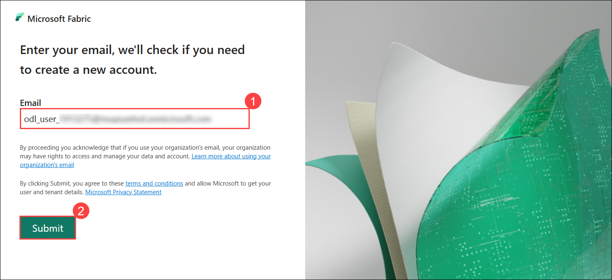

   * Password: <inject key="AzureAdUserPassword"></inject> and click on **Yes**.

     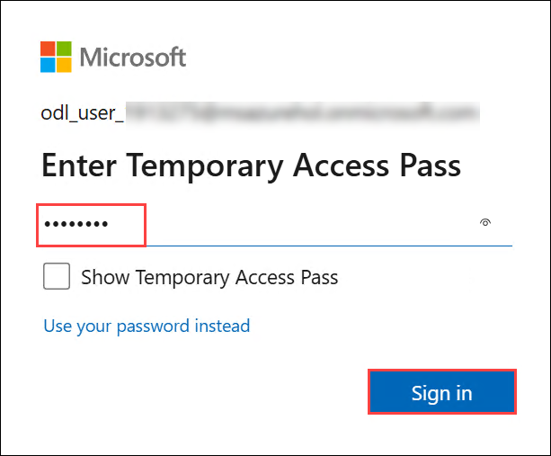

1. On the **Stay signed in?** pop-up, click **No**.

      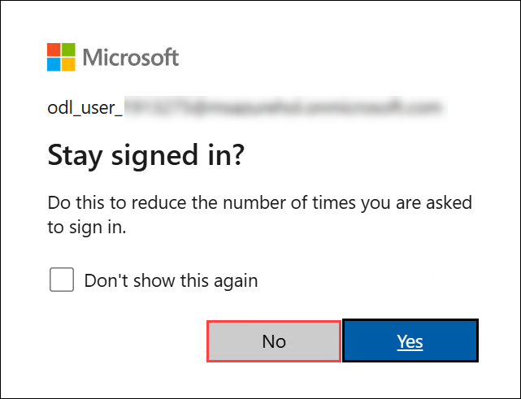
 
1. On the **Welcome to the Fabric view** window, click on **Cancel**.

      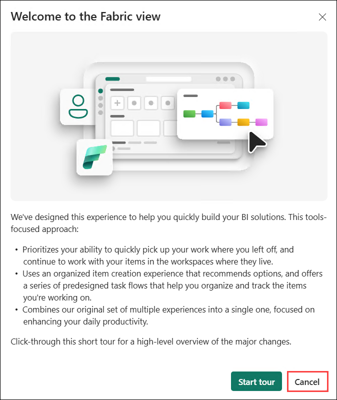

1. On the **Microsoft Fabric (Free) license assigned** pop-up, click **OK**.

      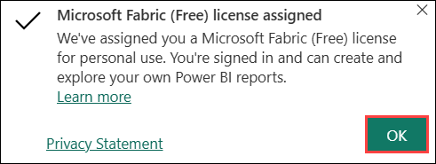

2. Once signed in, click on **Fabric (1)** in the bottom-left corner and then select **Power BI (2)** from the menu.

      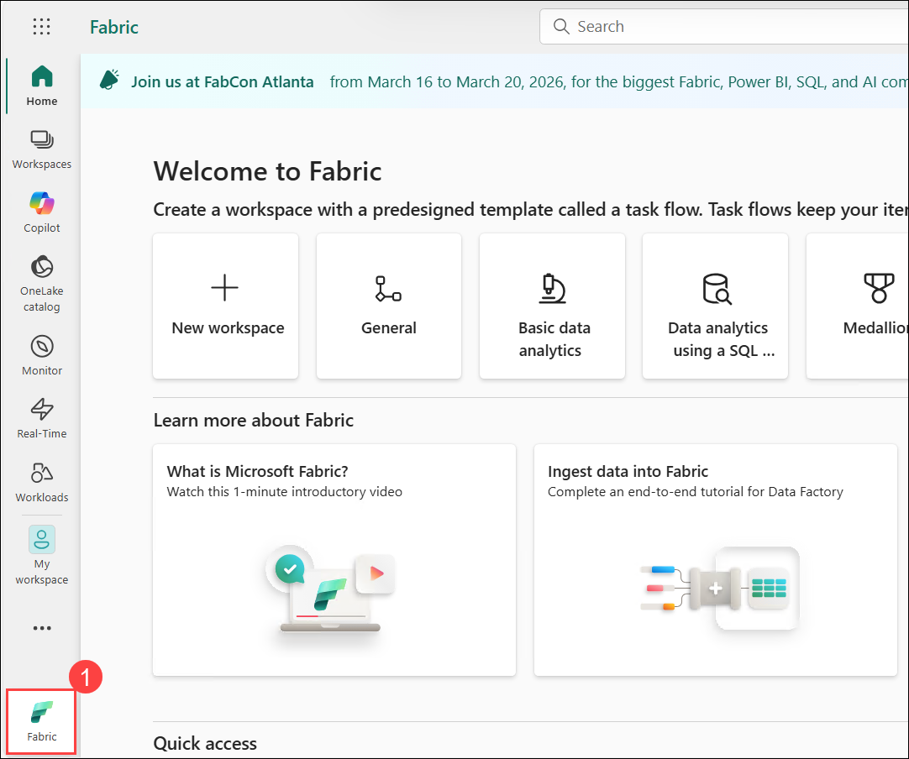

      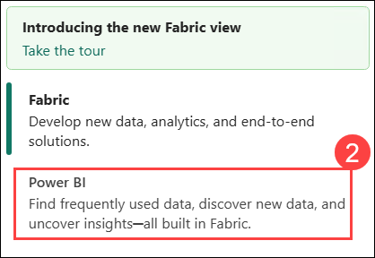

4. 1. On the **Power BI homepage**, click on the **Profile icon (1)** on the top right, and then click on **Free trial (2)**.
    
   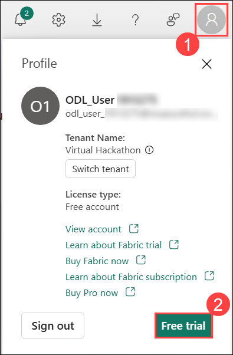
     
5. On the **Activate your 60-day free Fabric trial capacity** pop-up window, click **Activate**. 

   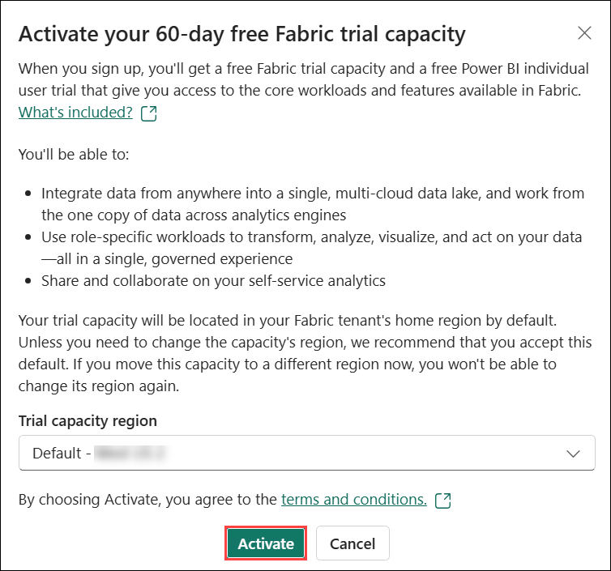
   
6. On the **Successfully upgraded to Microsoft Fabric** pop-up, click **OK**.

   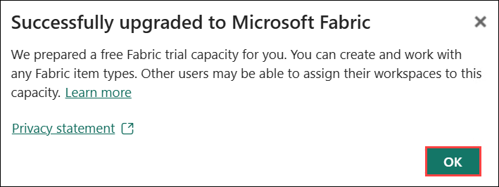

1. Close the **"Invite teammates to try Fabric to extend your trial"** window when it appears.

      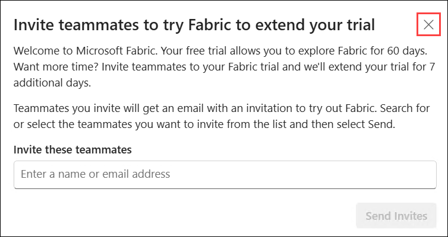
   
7. On the dashboard, on the top menu you can see **Trial Status 59 days left**.

      

      >**Note**: You now have a **Fabric (Preview) trial** that includes a **Power BI trial** and a **Fabric (Preview) trial capacity**.

8. In the left menu bar, click on **Workspaces (1)**, then select **+ New Workspace (2)**.

      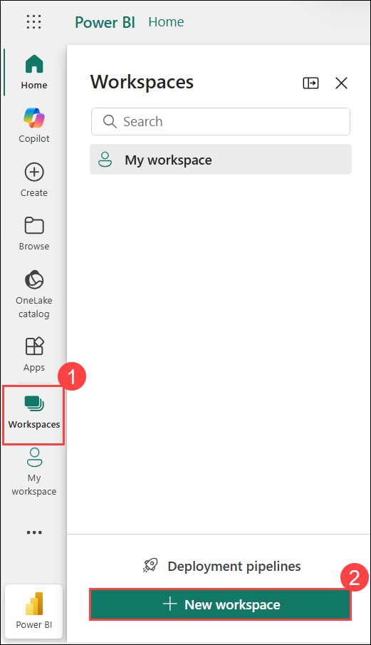

9. Create a new workspace named **dp_fabric-<inject key="Deployment ID" enableCopy="false"/> (1)**, select **Trial (2)** as the licensing mode under **Advanced**, and click **Apply (3)** to proceed.

      

1. On the **Introducing task flows (preview)** pop-up, click **Got it**.

      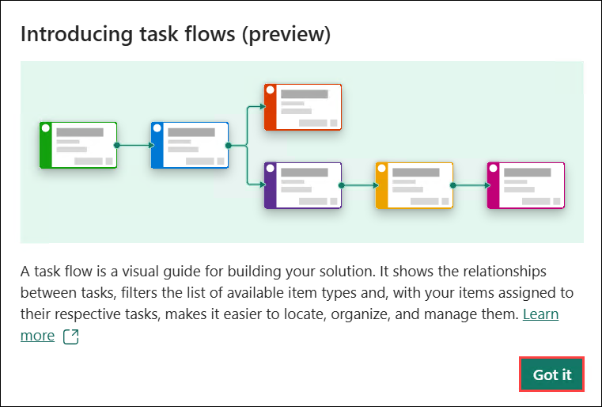

10. When your new workspace opens, it should be empty, as shown here:

    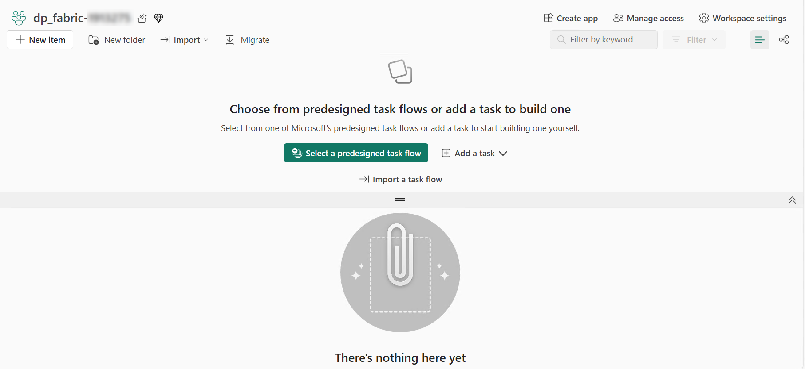  
 
>**Congratulations** on completing the Task! Now, it's time to validate it. Here are the steps:
> - Hit the Validate button for the corresponding task. If you receive a success message, you have successfully validated the lab. 
> - If not, carefully read the error message and retry the step, following the instructions in the lab guide.
> - If you need any assistance, please contact us at cloudlabs-support@spektrasystems.com.
  
<validation step="61a34bd9-1fc1-47db-b51c-4720f310133d" />

## Task 2 : Create a lakehouse

In this task, you’ll create a Lakehouse within your Fabric workspace to serve as a centralized storage layer for structured and unstructured data, enabling scalable data ingestion and analytics.

1. Select **+ New item (1)**, search for **Lakehouse(2)**, and then choose **Lakehouse(3)** from the results.

      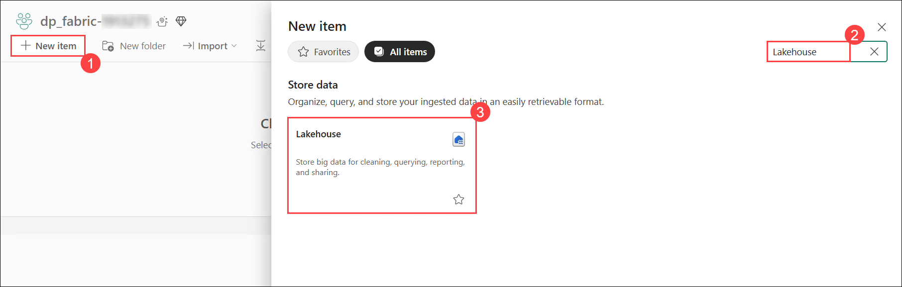

3. In the **New lakehouse** pop-up, enter the Name as  **dp_lakehouse (1)** and click on **Create (2)**.

    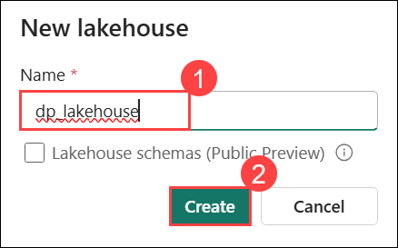
   
>**Congratulations** on completing the Task! Now, it's time to validate it. Here are the steps:
> - Hit the Validate button for the corresponding task. If you receive a success message, you have successfully validated the lab. 
> - If not, carefully read the error message and retry the step, following the instructions in the lab guide.
> - If you need any assistance, please contact us at cloudlabs-support@spektrasystems.com.

<validation step="38c64afd-7502-4783-8169-0e5730914f65" />

## Task 3 : Create a Dataflow (Gen2) to ingest data

In this task, you’ll create a Dataflow Gen2 to ingest data into a Lakehouse using an ETL process. This setup enables structured data transformation and prepares the dataset for efficient storage and analysis within the Fabric environment.

1. From the left menu bar, select the workspace **dp_fabric-<inject key="Deployment ID" enableCopy="false"/>(1)**, then click **+ New item (2)**. 
   
2. Search for **Dataflow Gen2 (3)** and select it **Dataflow Gen2 (4)** under Get data.  

      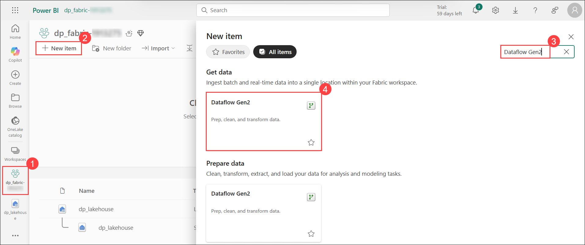

1. Enter the below-mentioned details to create the Dataflow and click on **Create (3)**.

   - **Name:** Keep as default **(1)**
   - **Enable Git integration, deployment pipelines, and Public API Scenarios:** Uncheck **(2)**

      

   After a few seconds, the Power Query editor for your new dataflow will open.

1. From the center **Get data** pane, select **Import from a Text/CSV file**.

      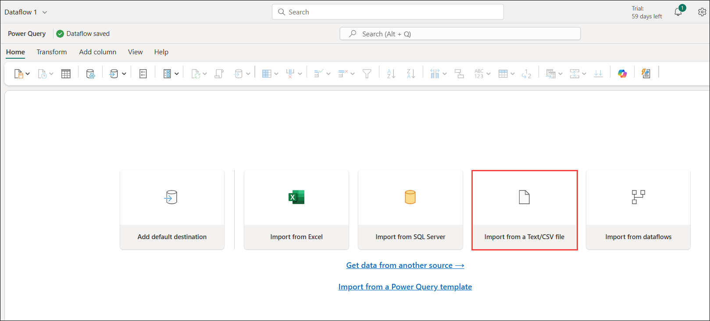

5. Create a new data source with the following settings and click on **Next (7)** :
 
    - **Link to file**: Selected **(1)**
    - **File path or URL**: `https://raw.githubusercontent.com/MicrosoftLearning/dp-data/main/orders.csv` **(2)**
    - **Connection**: Create new connection **(3)**
    - **Data gateway**: (none) **(4)**
    - **Authentication kind**: Anonymous **(5)**
    - **Privacy Level** : None **(6)**

      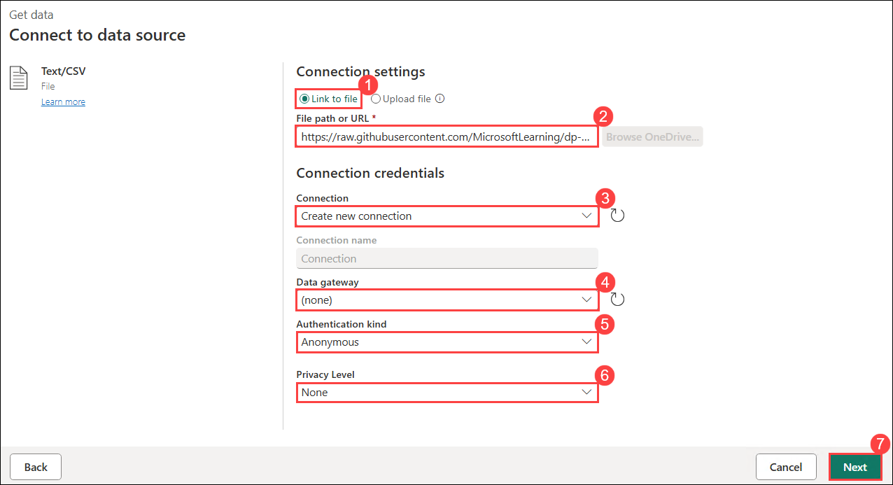

6. On the *Preview file data*, click on **Create**.

      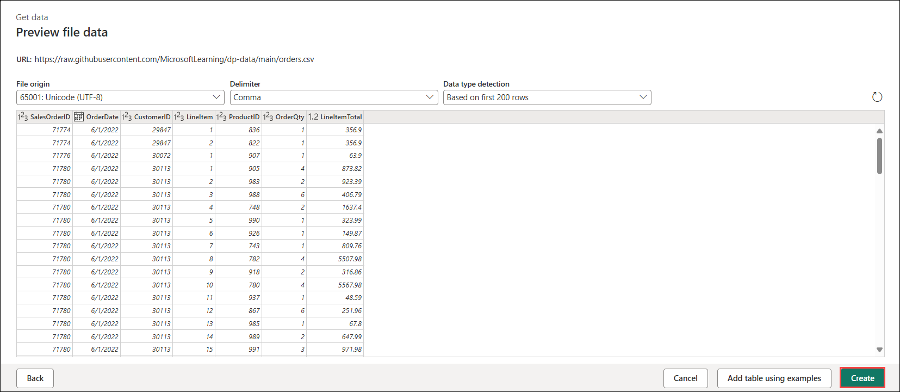

6. The Power Query editor shows the data source and an initial set of query steps to format the data, as shown here:

      

7. On the toolbar ribbon, select the **Add column (1)** tab. Then select **Custom column (2)**.

      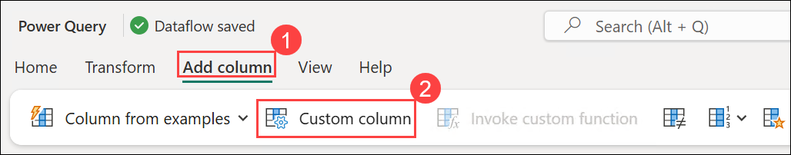
   
8. On the Custom column pane, create a new column with Name **MonthNo (1)** and enter the formula **Date.Month([OrderDate]) (2)** in the **Custom column formula** box and then click **OK (3)**.

      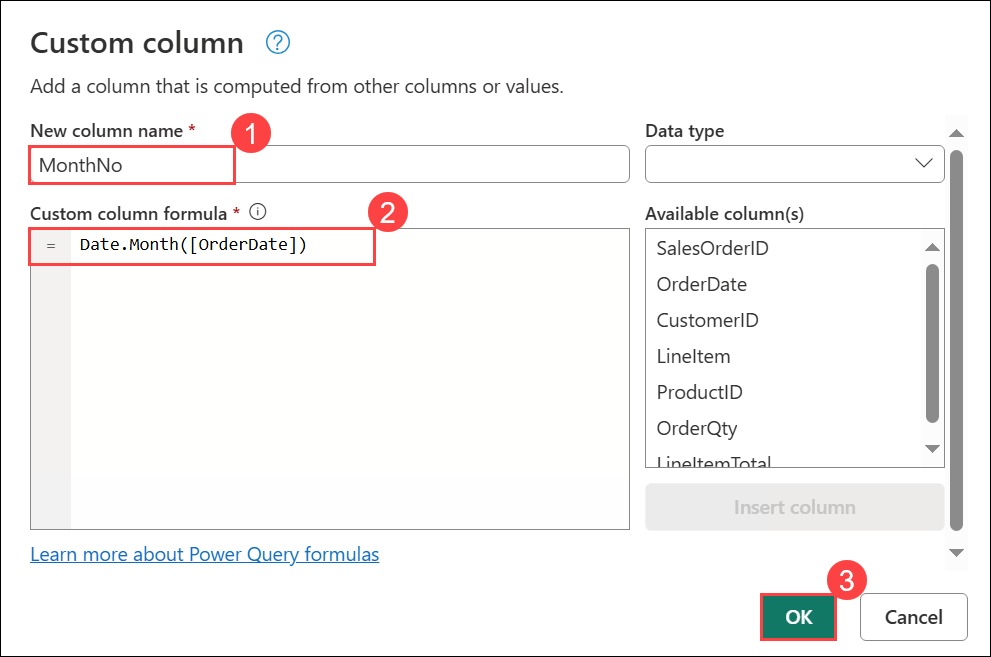

9. The step to add the custom column is added to the query and the resulting column is displayed in the data pane:

      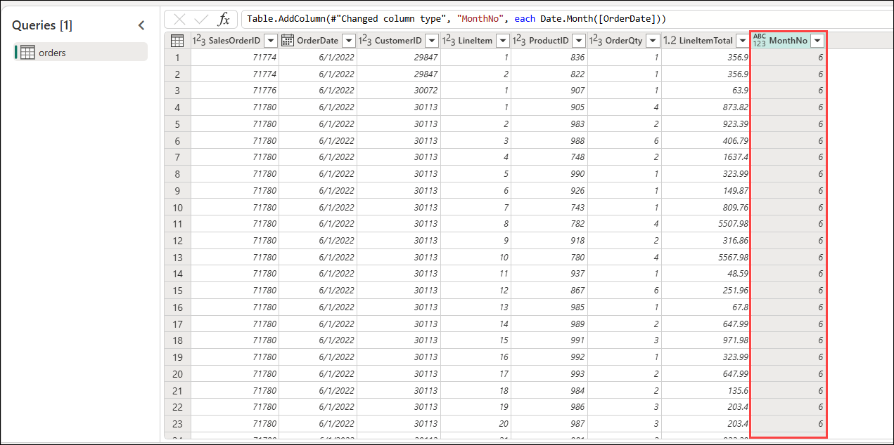

## Task 4 : Add data destination for Dataflow

In this task, you’ll configure a data destination for a dataflow to enable seamless integration with a Lakehouse. This setup ensures that transformed data is efficiently stored and accessible for downstream analytics and reporting.

1. On the toolbar ribbon, navigate to the **Home (1)** tab. Within the Home tab, open the **Query (2)** dropdown, then select the **Add data destination (3)** option, and choose **Lakehouse (4)** from the list.

      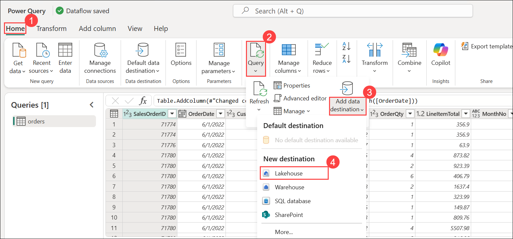

      >**Note:** Click the **Expand the ribbon** icon to access the full menu.

      .png)

      > **Note:** If this option is grayed out, you may already have a data destination set. Check the data destination at the bottom of the Query settings pane on the right side of the Power Query editor. If a destination is already set, you can change it using the gear.

2. In the **Connect to data destination** dialog box, keep all the values as default and click **Next**.

      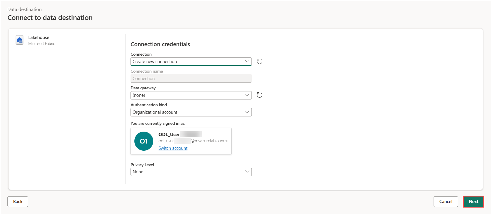

3. Select the **dp_fabric-<inject key="DeploymentID" enableCopy="false"/>** Workspace. Choose the **dp_lakehouse (1)** then specify the new table name as **orders (2)**, and then click **Next (3)**.

      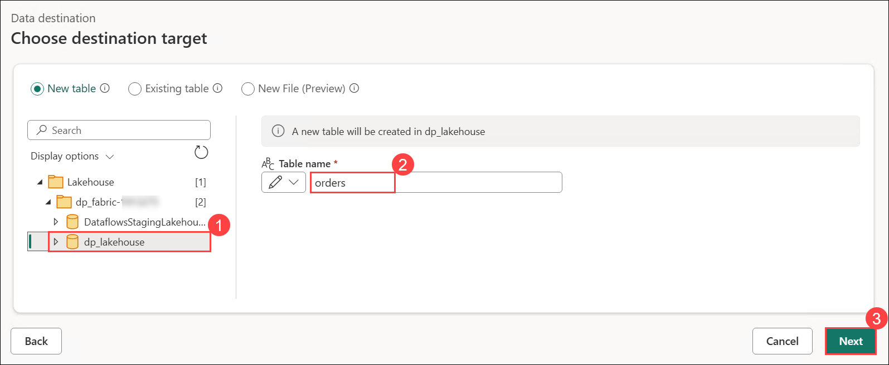

1. On the Destination settings page, observe that **MonthNo (1)** is not selected in the Column mapping, and an informational message is displayed. Click **Cancel (2)**.

      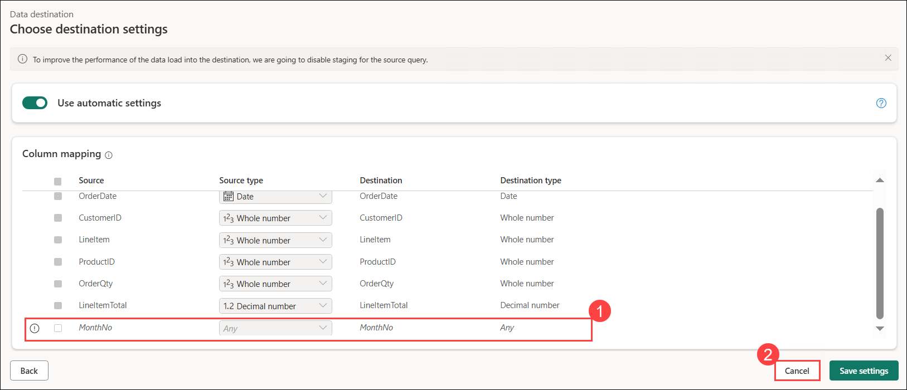

4. Go back to **MonthNo (1)** columns in Power Query online. Right-click on the column header and **Change Type (2)**.

      - MonthNo = **Whole number (3)**

        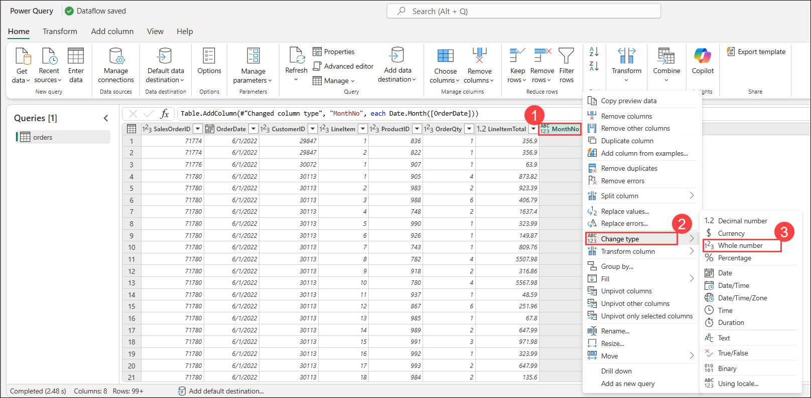

5. Click on the **Add data destination (1)** and then select **Lakehouse (2)** under New destination.

      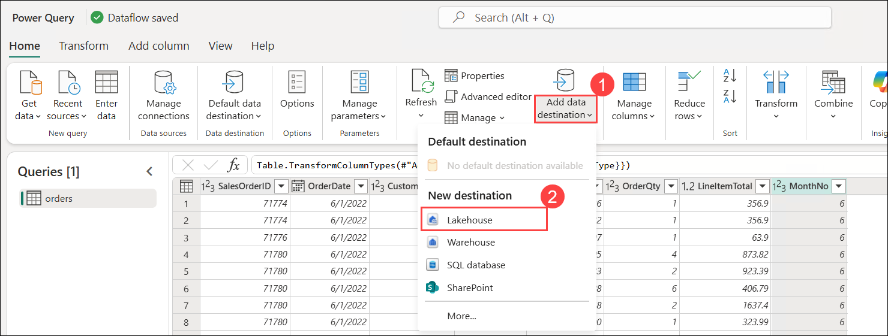

1. Choose the existing destination that we previously created, select **Lakehouse (none) (1)** and click on **Next (2)**.

      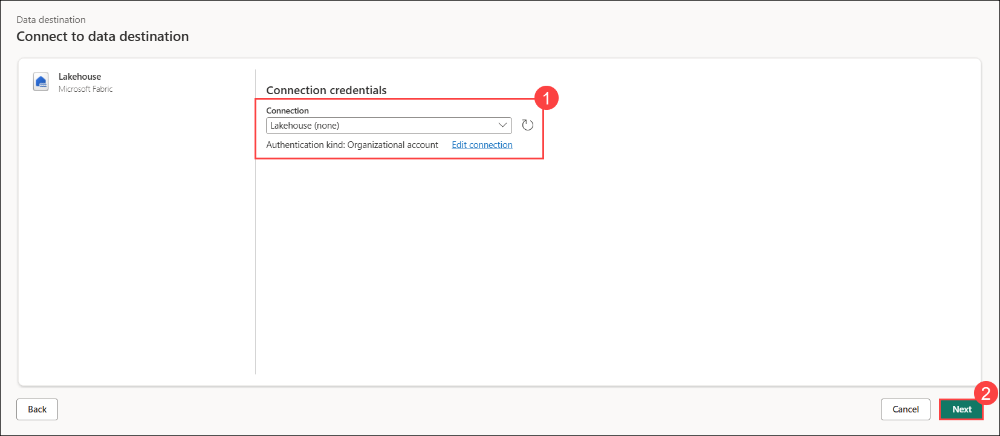

1. Select the lakehouse created at the beginning of this exercise, **dp_lakehouse (1)**, along with the corresponding table **orders (2)**. Then, click **Next (3)** to proceed.

      

6. On the **Choose destination settings** page, disable **Use automatic settings (1)**. Under the Update method section, select **Append (2)**, and then click **Save settings (3)** to apply the changes. 

      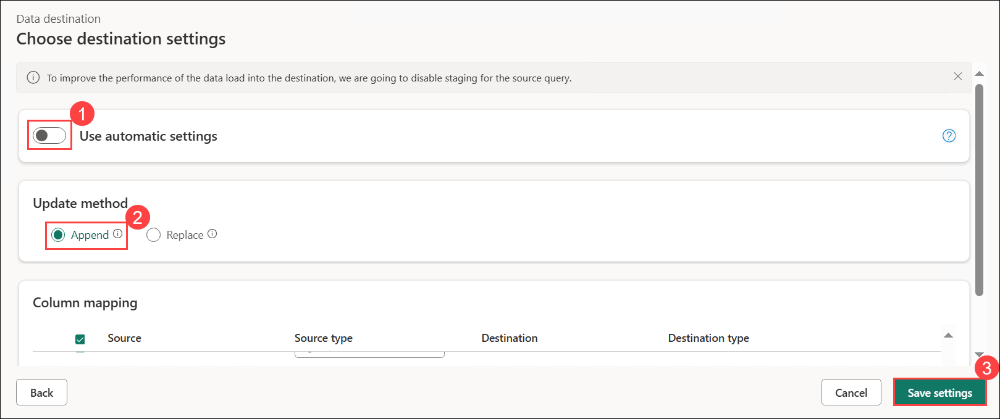

7. The **Lakehouse** destination is indicated as an icon in the query in the Power Query editor.
   
      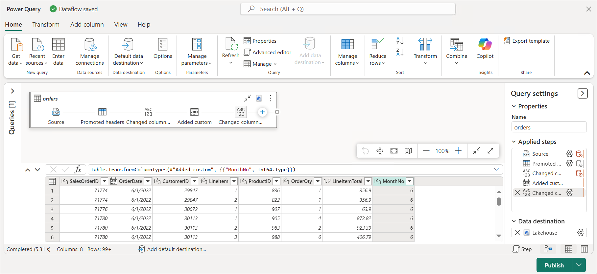

      >**Note** : To view the visual query, click on **Diagram view** icon from the bottom right corner as shown below:

      >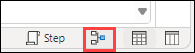

8. Click **Publish** at the bottom right to publish the dataflow. Then, wait for the **Dataflow 1** to be created in your workspace.

      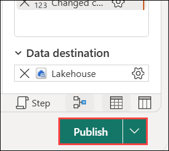

> **Congratulations** on completing the task! Now, it's time to validate it. Here are the steps
> - Hit the Validate button for the corresponding task. If you receive a success message, you can proceed to the next task. 
> - If not, carefully read the error message and retry the step, following the instructions in the lab guide.
> - If you need any assistance, please contact us at cloudlabs-support@spektrasystems.com. We are available 24/7 to help you out.
    
<validation step="0957818c-b310-4ba7-9c56-70042c49ede3" />

## Task 5 : Add a dataflow to a pipeline

In this task, you’ll add a dataflow to a pipeline to streamline the data processing workflow and enable automated data transformations.

1. From the left pane, select the Fabric workspace **dp_fabric-<inject key="Deployment ID" enableCopy="false"> (1)**, click **+ New item (2)**. In the New Item pane, search for **Pipeline (3)**, and then select **Pipeline (4)** under the Get data section.

      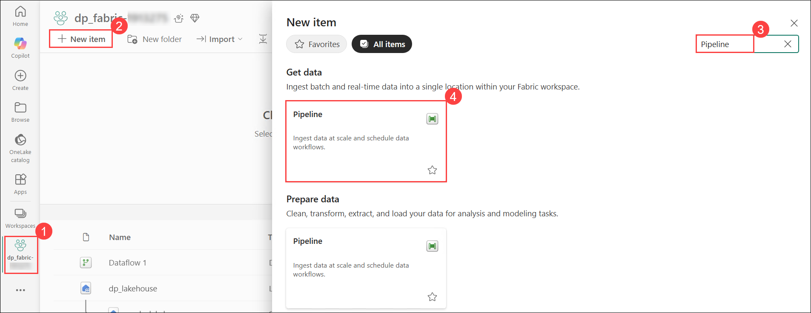

1. Name the new pipeline **Load Orders Pipeline (1)** and click **Create (2)** to proceed.

      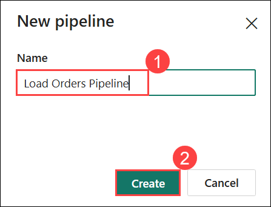

      > **Note**: If the Copy Data wizard opens automatically, close it!

3. Click on the **Pipeline activity (1)**, and select **Dataflow (2)** activity.

      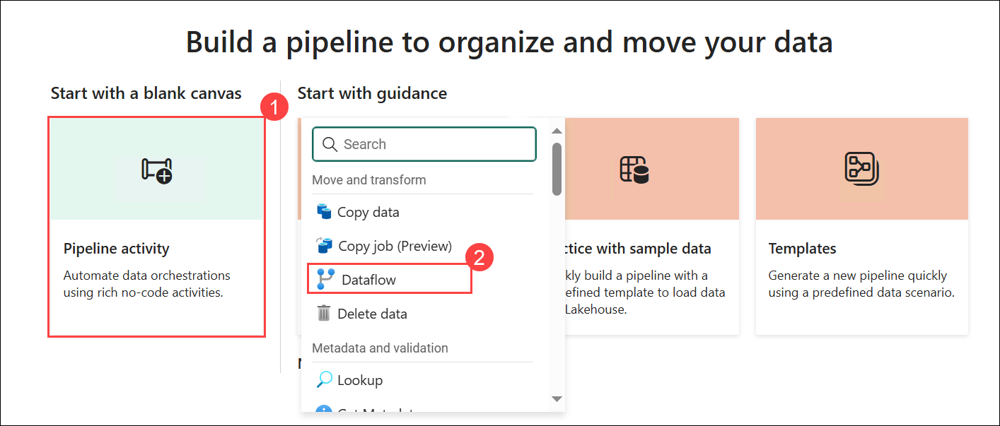

4. With the new **Dataflow1** activity selected, go to the **Settings (1)** tab in the bottom. In the **Workspace** drop-down list, choose **dp_fabric-<inject key="DeploymentID" enableCopy="false"/> (2)** and in **Dataflow** drop-down list, select **Dataflow 1 (3)** (the data flow you created previously).

      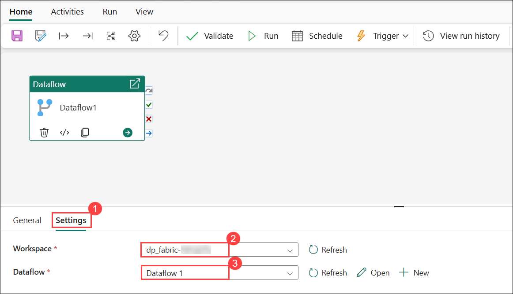

5. On the **Home** tab, save the pipeline by clicking the **&#128427; Save** icon.

      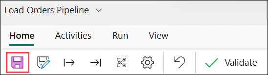

1. Use the **&#9655; Run** button to run the pipeline, and wait for it to complete. It may take a few minutes.

      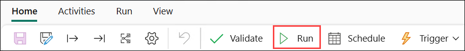

      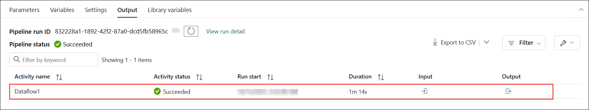

1. From the left navigation pane, select **dp_fabric-<inject key="DeploymentID" enableCopy="false"/>** and then select **dp_lakehouse (2)** Lakehouse .

      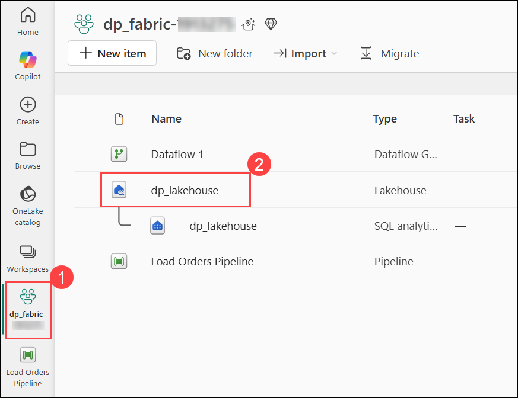

1. In the **Tables** section, click the **Ellipsis (...) (1)** and choose **Refresh (2)**. Then, confirm that the **orders (3)** table has been created by your dataflow.

      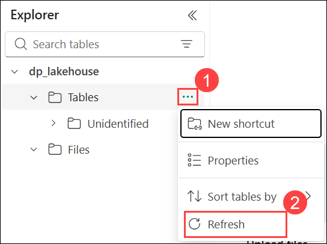

      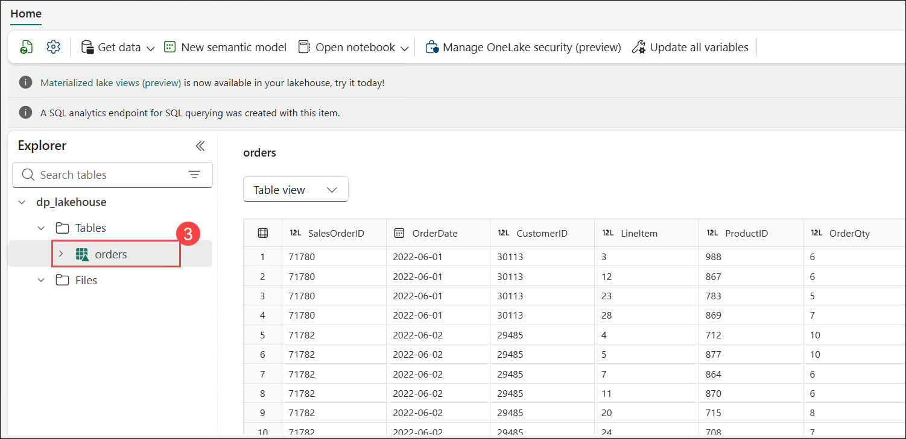

> **Congratulations** on completing the task! Now, it's time to validate it. Here are the steps
> - Hit the Validate button for the corresponding task. If you receive a success message, you can proceed to the next task. 
> - If not, carefully read the error message and retry the step, following the instructions in the lab guide.
> - If you need any assistance, please contact us at cloudlabs-support@spektrasystems.com. We are available 24/7 to help you out.

<validation step="6f702ff3-1450-4b7c-b44f-052a3a77f380" />

## Summary

In this exercise, you have learned how to use Dataflows (Gen2) to ingest, transform, and standardize data within Microsoft Fabric. You successfully set up data ingestion processes, applied necessary transformations, and created standardized datasets for analysis. By completing these tasks, you gained practical experience in preparing and managing data using Dataflows (Gen2) efficiently.

### You have successfully completed the Exercise 1. To continue, please click on Next >> to proceed to the next Exercise.

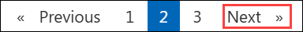
