# Exercise 1 : Create and use a Dataflow (Gen2) in Microsoft Fabric 

## Estimated Duration : 120 Minutes

In this exercise, you will use Dataflows (Gen2) to ingest, transform, and standardize data. You will set up data ingestion processes, apply necessary transformations, and create standardized datasets for analysis. This exercise will help you understand how to efficiently prepare and manage data using Dataflows (Gen2).

## Objectives:
- Task 1 : Create a workspace
- Task 2 : Create a lakehouse
- Task 3 : Create a Dataflow (Gen2) to ingest data
- Task 4 : Add data destination for Dataflow
- Task 5 : Add a dataflow to a pipeline

## Task 1 : Create a workspace

Before working with data in Fabric, create a workspace with the Fabric trial enabled.

1. Click on Microsoft Edge and sign into [Microsoft Fabric](https://app.fabric.microsoft.com) at `https://app.fabric.microsoft.com`

   * Email/Username: <inject key="AzureAdUserEmail"></inject> and click on **Submit**.

   * Password: <inject key="AzureAdUserPassword"></inject> and click on **Yes**.

     
   
2. After signing in, From the bottom left choose **Power BI** .

   

4. From the PowerBI home page, select **Account Manager** from the top-right corner to start the free **Microsoft Fabric trial** and click on **Free trial**.
    
   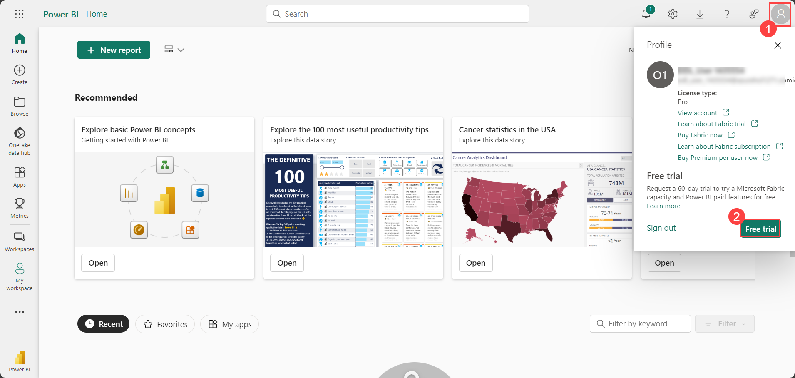
     
5. If prompted, agree to the terms and then select **Activate**. 

   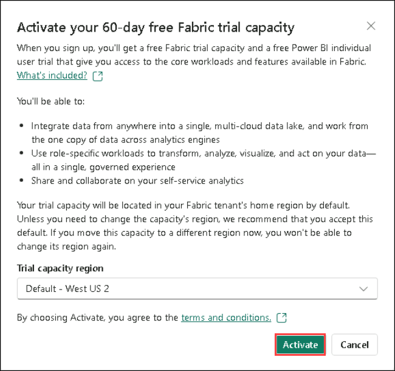
   
6. Once your trial capacity is ready, you receive a confirmation message. Select **Stay on current page** to begin working in Fabric.

   
   
7. On the dashboard, on the top menu you can see **Trial Status 59 days left**.

   

    >**Note**: You now have a **Fabric (Preview) trial** that includes a **Power BI trial** and a **Fabric (Preview) trial capacity**.

8. In the left menu bar, click on **Workspaces (1)**, then select **+ New Workspace (2)**.

9. Create a new workspace with a name **dp_fabric-<inject key="Deployment ID" enableCopy="false"/> (1)**, Choose a licensing mode as a **trial (2)** under **Advanced**. and click on **Apply (3)**.

   
    
10. When your new workspace opens, it should be empty, as shown here:

    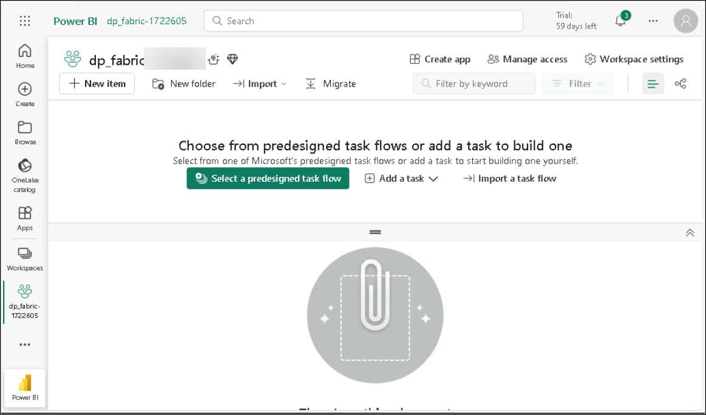

    > **Note**: If the prompt **"Introducing task flows (preview)"** appears, just click on **Got it**.   
 
>**Congratulations** on completing the Task! Now, it's time to validate it. Here are the steps:
> - Hit the Validate button for the corresponding task. If you receive a success message, you have successfully validated the lab. 
> - If not, carefully read the error message and retry the step, following the instructions in the lab guide.
> - If you need any assistance, please contact us at cloudlabs-support@spektrasystems.com.
  
<validation step="61a34bd9-1fc1-47db-b51c-4720f310133d" />

## Task 2 : Create a lakehouse

Now that you have a workspace, it's time to and create a data lakehouse into which you'll ingest data.

   
1. Select **+ New Item (1)**, search for **Lakehouse(2)**, and then choose **Lakehouse(3)** from the results.

      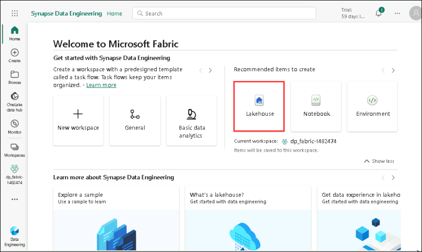

3. Create a new Lakehouse

    Name: Enter **dp_lakehouse** and click on **Create**.

    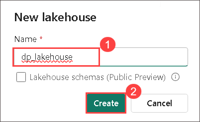
   
>**Congratulations** on completing the Task! Now, it's time to validate it. Here are the steps:
> - Hit the Validate button for the corresponding task. If you receive a success message, you have successfully validated the lab. 
> - If not, carefully read the error message and retry the step, following the instructions in the lab guide.
> - If you need any assistance, please contact us at cloudlabs-support@spektrasystems.com.

<validation step="38c64afd-7502-4783-8169-0e5730914f65" />

## Task 3 : Create a Dataflow (Gen2) to ingest data

Now that you have a lakehouse, you need to ingest some data into it. One way to do this is to define a dataflow that encapsulates an *extract, transform, and load* (ETL) process.

1. Select your workspace, **dp_fabric-<inject key="Deployment ID" enableCopy="false"/>(1)**, then click **+ New item** 

      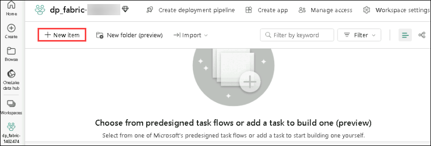
   
2. Search for **Dataflow Gen2** and select it.

      

      >**Note**: If the option is not visible as mentioned above, please follow the steps highlighted in the screenshot below.

3. After a few seconds, the Power Query editor for your new dataflow opens as shown here.

      

4. Select **Import from a Text/CSV file**.

      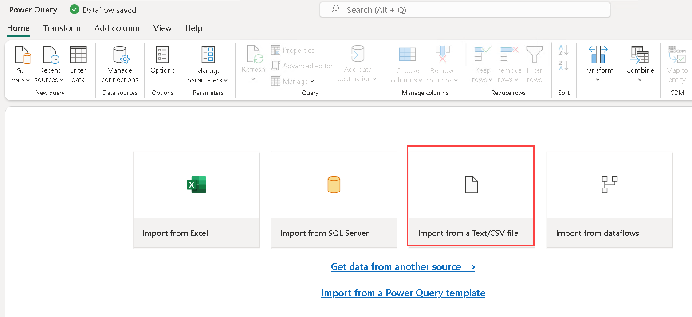

5. Create a new data source with the following settings and click on **Next (7)** :
 
    - **Link to file**: *Selected* (1)
    - **File path or URL**: `https://raw.githubusercontent.com/MicrosoftLearning/dp-data/main/orders.csv` (2)
    - **Connection**: Create new connection (3)
    - **data gateway**: (none) (4)
    - **Authentication kind**: Anonymous (5)
    - **Privacy level** : none (6)

      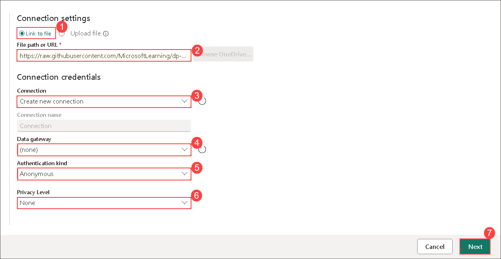
   
6. Create the data source. The Power Query editor shows the data source and an initial set of query steps to format the data, as shown here:

      

7. On the toolbar ribbon, select the **Add column (1)** tab. Then select **Custom column (2)**.

      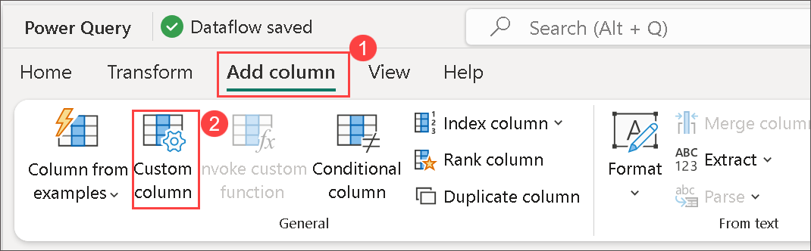
   
8. Create a new column named **MonthNo** that contains a number based on the formula `Date.Month([OrderDate])` - as shown here and 
   Click on **OK**.

      

9. The step to add the custom column is added to the query and the resulting column is displayed in the data pane:

      

      > **Tip:** In the Query Settings pane on the right side, notice the **Applied Steps** include each transformation step. At the bottom, you can also toggle the 
      **Diagram flow** button to turn on the Visual Diagram of the steps.
    
      > Steps can be moved up or down, edited by selecting the gear icon, and you can select each step to see the transformations apply in the preview pane.

## Task 4 : Add data destination for Dataflow

1. On the toolbar ribbon, select the **Home** tab. In the home tab, click on the dropdown for **Query (1)**, click on **Add data destination (2)** drop-down menu and select **Lakehouse (3)**.
   
     > **Note:** If this option is grayed out, you may already have a data destination set. Check the data destination at the bottom of the Query settings pane on the 
      right side of the Power Query editor. If a destination is already set, you can change it using the gear.
   
     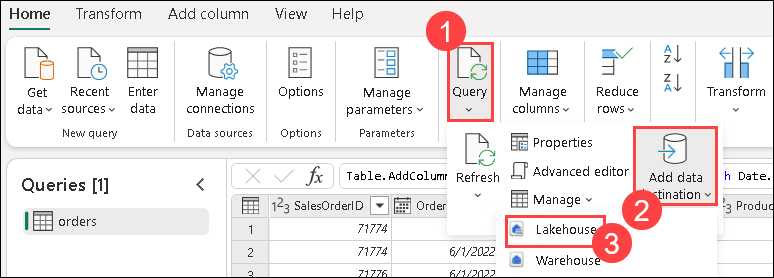

2. In the **Connect to data destination** dialog box, keep all the values as default and select **Next**.

      

3. In the list of available workspaces, find your workspace and select lakehouse you created in it at the start of this exercise. The associated table **orders** will automatically come up. Click on **Next**.

      

      > **Note:** On the **Destination settings** page, notice how OrderDate and MonthNo are not selected in the Column mapping and there is an informational message: *Change to date/time*.

4. Cancel this action, then go back to OrderDate and MonthNo columns in Power Query online. Right-click on the column header and **Change Type**.

      - OrderDate = Date/Time
      - MonthNo = Whole number

        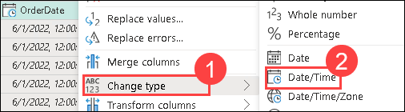

5. Now repeat the process outlined earlier to add a lakehouse destination.

   - Choose the existing destination that we previously created, select **Lakehouse (none) (1)** and click on **Next (2)**.

        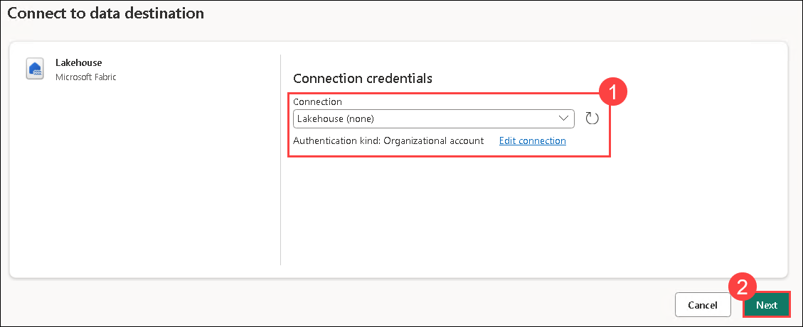

   - Select the lakehouse you created in it at the start of this exercise and the associated table **orders**.
   - Click on **Next**.

7. On the **Destination settings** page toggle off Use automatic settings, select **Append**, and then click on **Save Settings**.  

      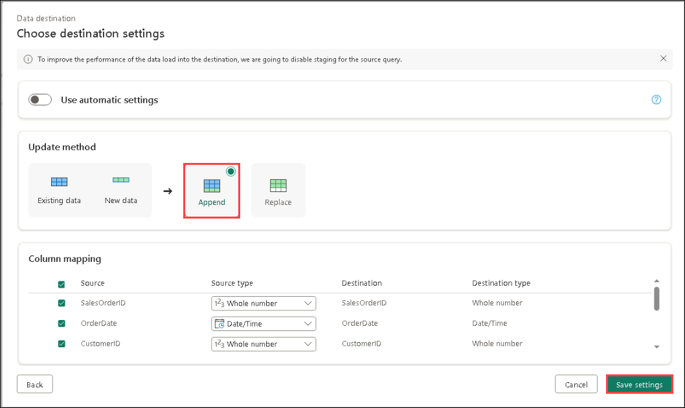

8. The **Lakehouse** destination is indicated as an icon in the query in the Power Query editor.
   
      

      >**Note** : to view the visual query, select the icon from below right corner as shown below :

      >

9. Select **Publish** from the bottom right to publish the dataflow. Then wait for the **Dataflow 1** dataflow to be created in your workspace.

      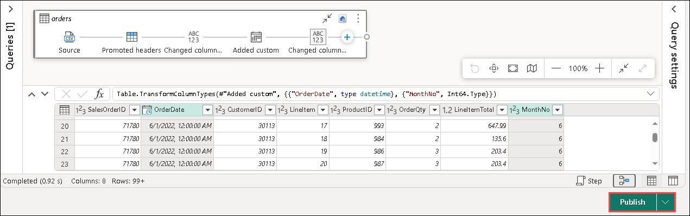

> **Congratulations** on completing the task! Now, it's time to validate it. Here are the steps
> - Hit the Validate button for the corresponding task. If you receive a success message, you can proceed to the next task. 
> - If not, carefully read the error message and retry the step, following the instructions in the lab guide.
> - If you need any assistance, please contact us at cloudlabs-support@spektrasystems.com. We are available 24/7 to help you out.
    
<validation step="0957818c-b310-4ba7-9c56-70042c49ede3" />

## Task 5 : Add a dataflow to a pipeline

You can include a dataflow as an activity in a pipeline. Pipelines are used to orchestrate data ingestion and processing activities, enabling you to combine dataflows with other kinds of operation in a single, scheduled process. Pipelines can be created in a few different experiences, including Data Factory experience.

1. In the Fabric workspace **dp_fabric-<inject key="Deployment ID" enableCopy="false"/>(1)**, click on **+ New Item (2)**, search for **Data Pipeline (3)**, and select **Data Pipeline (4)**. Then, create a new pipeline and name it **Load Orders Pipeline**.

      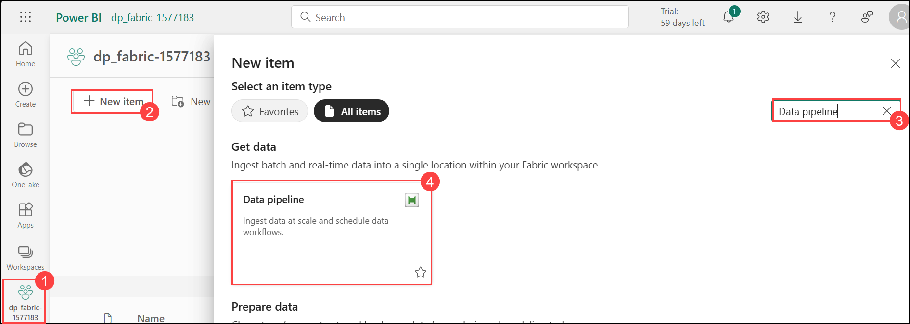

      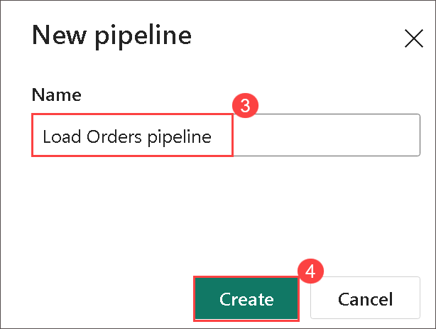

      > **Note**: If the Copy Data wizard opens automatically, close it!

3. Select **Pipeline activity (1)**, and add a **Dataflow (2)** activity to the pipeline.

      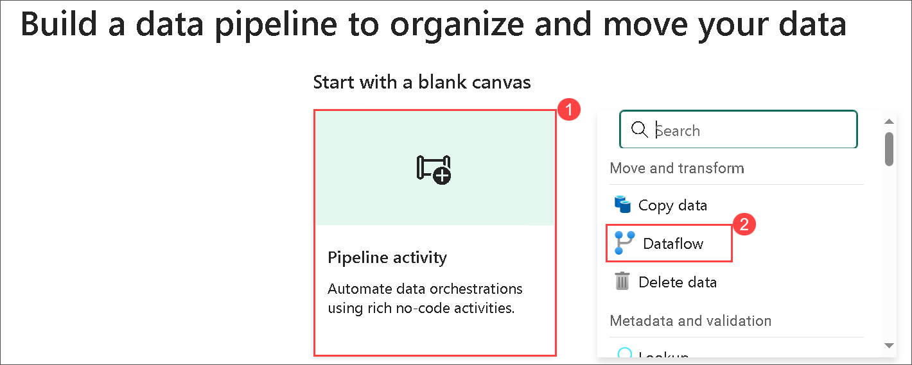

4. With the new **Dataflow1** activity selected, on the **Settings** tab, in the **Dataflow** drop-down list, select **Dataflow 1** (the data flow you created previously)

      

5. On the **Home** tab, save the pipeline using the **&#128427;** (*Save*) icon.

6. Use the **&#9655; Run** button to run the pipeline, and wait for it to complete. It may take a few minutes.

      

8. Navigate back to the lakehouse . In the **ellipses** menu for **Tables**, select **refresh**. Then expand **Tables** and select the **orders** table, which has been created by your dataflow.

      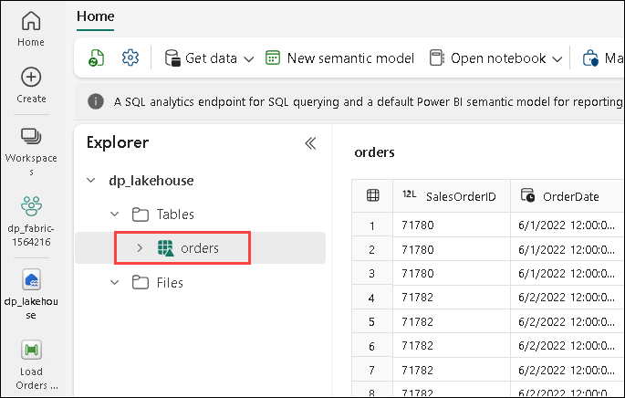

      > **Note**: Use the Power BI Desktop *Dataflows connector* to connect directly to the data transformations done with your dataflow.
      > You can also make additional transformations, publish as a new dataset, and distribute with intended audience for specialized datasets.
      

> **Congratulations** on completing the task! Now, it's time to validate it. Here are the steps
> - Hit the Validate button for the corresponding task. If you receive a success message, you can proceed to the next task. 
> - If not, carefully read the error message and retry the step, following the instructions in the lab guide.
> - If you need any assistance, please contact us at cloudlabs-support@spektrasystems.com. We are available 24/7 to help you out.

<validation step="6f702ff3-1450-4b7c-b44f-052a3a77f380" />

### Summary

In this exercise, you have learned how to use Dataflows (Gen2) to ingest, transform, and standardize data within Microsoft Fabric. You successfully set up data ingestion processes, applied necessary transformations, and created standardized datasets for analysis. By completing these tasks, you gained practical experience in preparing and managing data using Dataflows (Gen2) efficiently.

### Review

In this lab you have completed the following tasks:

 - Set up a workspace.
 - Create a lakehouse.  
 - Develop a Dataflow (Gen2) for data ingestion and specify a data destination.  
 - Integrate the Dataflow into a pipeline.

### You have successfully completed the lab. To continue, please click on "Next" to proceed to the next lab.
