# Exercise 2: Analyze data in a Data Warehouse

### Estimated Duration: 120 Minutes

In this exercise, you will analyze data within a relational data warehouse using Microsoft Fabric. Utilize SQL for querying and create detailed visualizations to derive actionable insights. 

## Objectives:

- Task 1: Create a Data Warehouse
- Task 2: Create tables and insert data
- Task 3: Define a Data Model
- Task 4: Query data Warehouse tables
- Task 5: Create a View
- Task 6: Create a visual query
- Task 7: Visualize your data

## Task 1: Create a Data Warehouse

In this task, you will design and implement a data warehouse by organizing data from multiple sources, creating ETL processes, and optimizing for performance. The goal is to enable efficient querying and reporting while ensuring security, compliance, and scalability.

1. From the bottom left, make sure **Power BI** is selected. 

     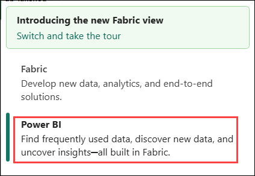

2. From the left pane, select the workspace **dp_fabric-<inject key="Deployment ID" enableCopy="false"> (1)**. Within the selected workspace, click **+ New item (2)**. In the New item pane on the right, use the search bar to find **Warehouse (3)**, then select **Warehouse (4)** from the Store data section.

   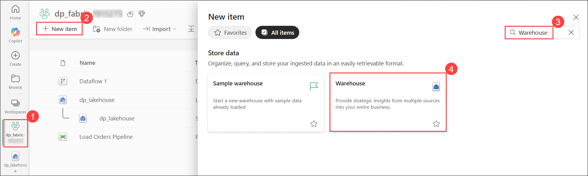

3. Name the Warehouse as **Data Warehouse-<inject key="Deployment ID" enableCopy="false"/> (1)** and click on **Create (2)**.

   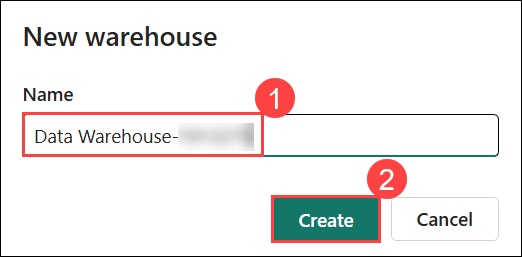

## Task 2: Create tables and insert data

In this task, you will create database tables by defining their structure with appropriate columns and constraints. Afterwards, you'll insert data into the tables, ensuring it is ready for querying and further operations.

1. In the Data warehouse, under the **Build a warehouse** select the **T-SQL**.

   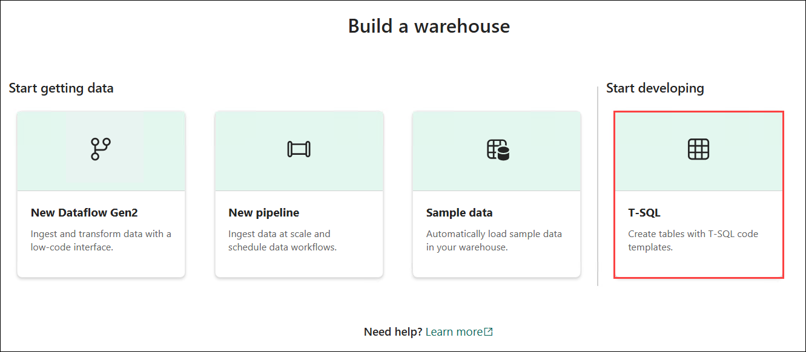

1. Paste **(1)** the SQL code provided below into **SQL query 1** and use the **&#9655; Run (2)** button to run the SQL script.

    ```sql
   CREATE TABLE dbo.DimProduct
   (
       ProductKey INTEGER NOT NULL,
       ProductAltKey VARCHAR(25) NULL,
       ProductName VARCHAR(50) NOT NULL,
       Category VARCHAR(50) NULL,
       ListPrice DECIMAL(5,2) NULL
   );
   GO
    ```

   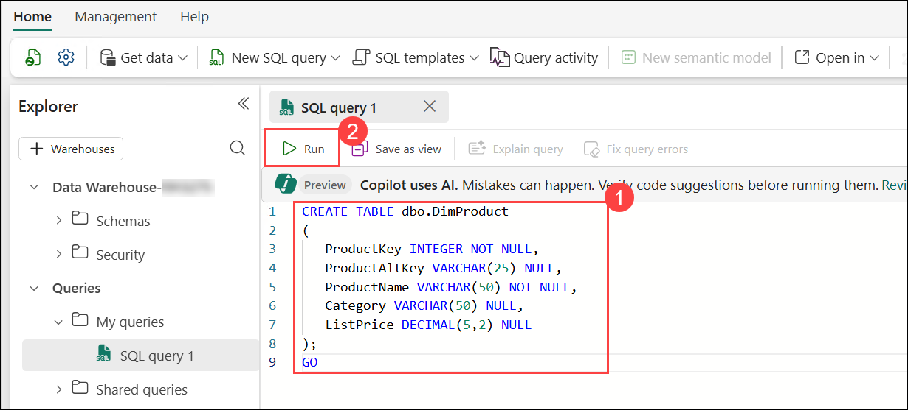

1. In the **Explorer** pane, expand **Schemas (1)** > **dbo (2)** > **Tables (3)** and verify that the **DimProduct (4)** table has been created.

    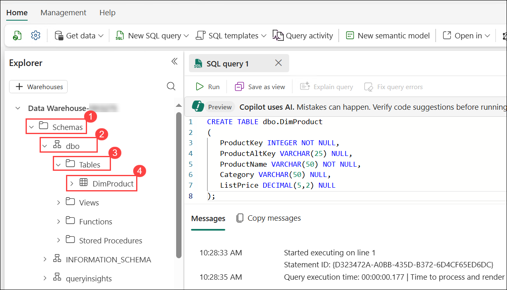

4. On the **Home** menu tab, use the **New SQL Query (1)** button and from the drop-down select **New SQL Query (2)**  to create a new query, and enter the following INSERT statement:

    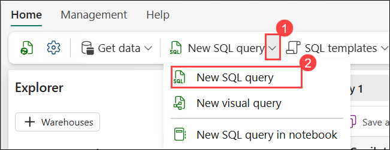

    ```sql
   INSERT INTO dbo.DimProduct
   VALUES
   (1, 'RING1', 'Bicycle bell', 'Accessories', 5.99),
   (2, 'BRITE1', 'Front light', 'Accessories', 15.49),
   (3, 'BRITE2', 'Rear light', 'Accessories', 15.49);
   GO
    ```

5. **Run** the new query to insert three rows into the **DimProduct** table.

    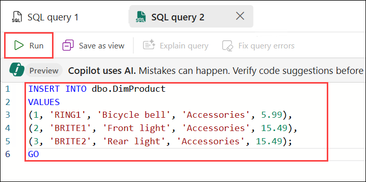

6. In the **Explorer** pane, select the **DimProduct** table and verify that the three rows have been added to the table.

     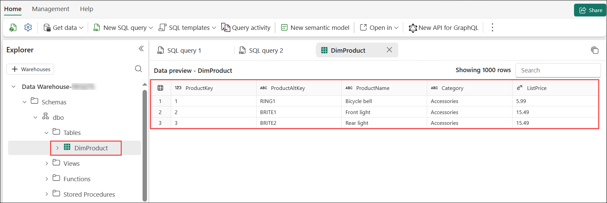

7. On the **Home (1)** menu tab, use the **New SQL Query (2)** button to create a new query.

1. Copy this URL `https://raw.githubusercontent.com/MicrosoftLearning/dp-data/main/create-dw.txt` and paste it in a new tab in the browser, and then copy and paste **(3)** the entire Transact-SQL code into the new query pane. Then click on **Run (4)**.

    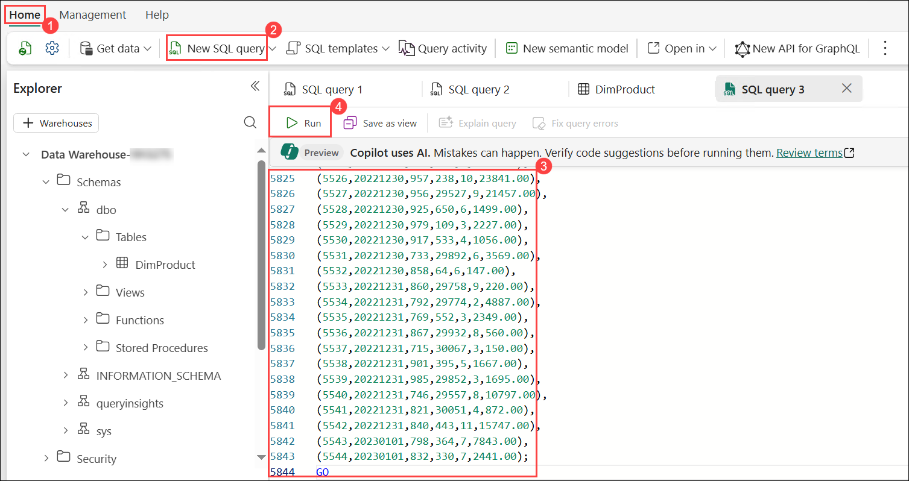
   
    >**Note:** Scroll down and ensure that the last line ends with a semicolon (;) and includes the GO command.

9. In the **Explorer** pane, verify that the **dbo** schema in the data warehouse now contains the following four tables:

    - **DimCustomer**
    - **DimDate**
    - **DimProduct**
    - **FactSalesOrder**

        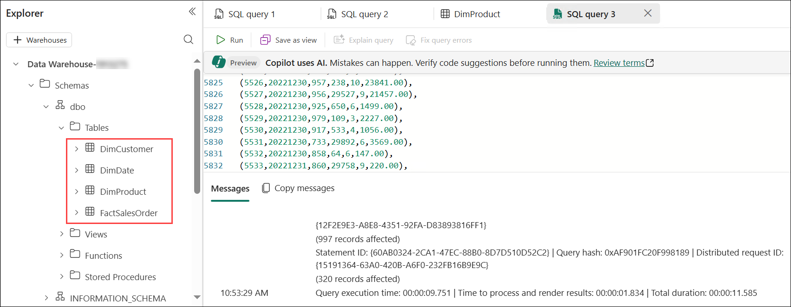

        > **Note:** If the schema takes a while to load, just refresh the browser page.

## Task 3: Define a Data Model

In this task, you will create a relational data warehouse consisting of fact and dimension tables, where fact tables hold numeric measures for analysis and dimension tables store entity attributes. You'll define relationships between tables in Microsoft Fabric to build a data model for efficient business performance analysis.

1. In the Data warehouse, from the top navigation pane, click on the **New semantic model**.

    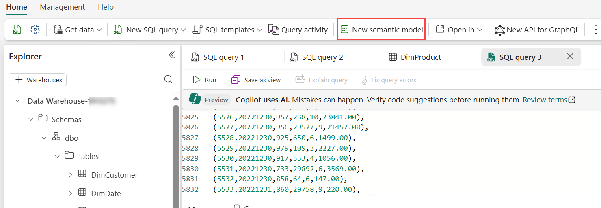

1. Provide the Direct Lake semantic model name as **Data Warehouse-<inject key="DeploymentID" enableCopy="false"/> (1)** and select **DimCustomer, DimDate, DimProduct, FactSalesOrder (2)** tables from the list. Then, click on **Confirm (3)**.

    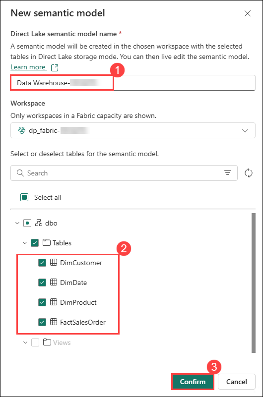

1. Go back to the **dp_fabric-<inject key="DeploymentID" enableCopy="false"/> (1)** workspace from the left navigation pane. Select the recently created semantic model named as **Data Warehouse-<inject key="DeploymentID" enableCopy="false"/> (2)**.

    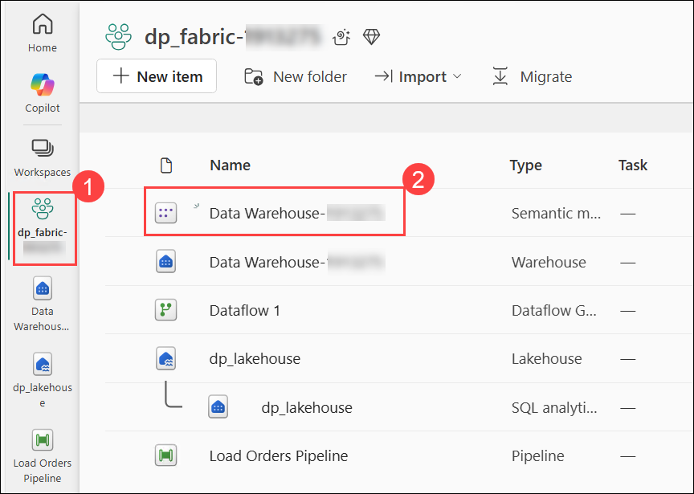

1. Click on **Open semantic model**.

    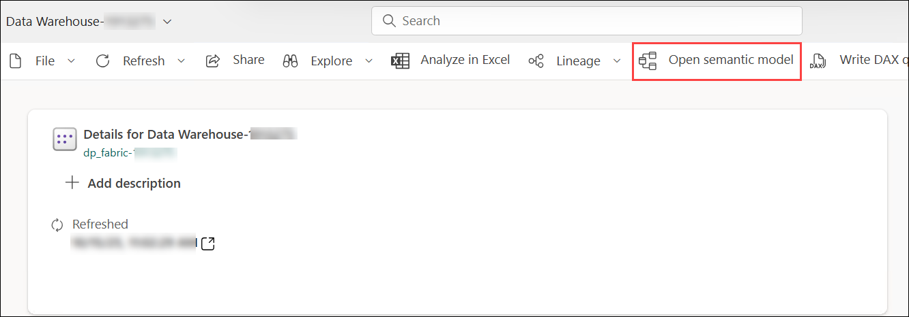

1. Click on the **Viewing (1)** menu in the top right corner, select **Editing (2)** to enable edit mode.

    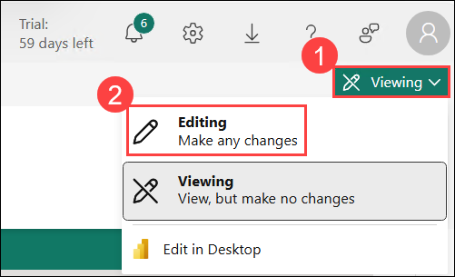

3. In the editing mode, rearrange the tables in your data warehouse so that the **FactSalesOrder** table is in the middle, like this:

    

1. Drag the **ProductKey** field from the **FactSalesOrder** table and drop it on the **ProductKey** field in the **DimProduct** table. Then confirm the following relationship details.
   
    - **From table (1)**: FactSalesOrder
    - **Column (2)**: ProductKey
    - **To table (3)**: DimProduct
    - **Column (4)**: ProductKey
    - **Cardinality (5)**: Many to one (*:1)
    - **Cross filter direction (6)**: Single
    - **Make this relationship active (7)**: Selected
    - **Assume referential integrity (8)**: Unselected
    - Click **Save (9)**.

        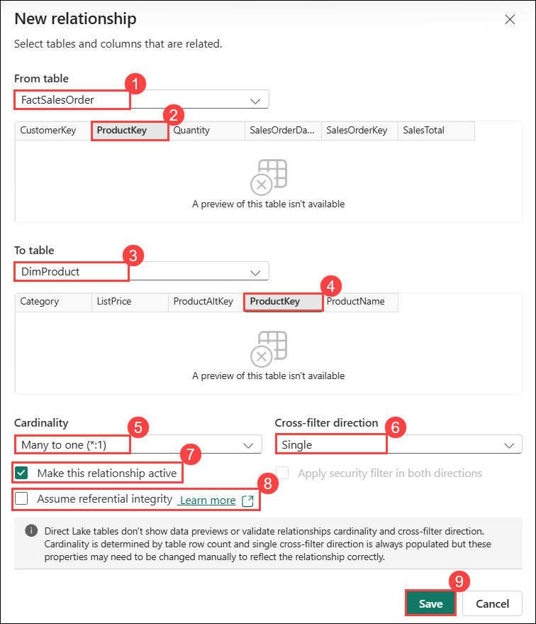

5. Repeat the process to create many-to-one relationships between the following tables:

    - **FactSalesOrder.CustomerKey** &#8594; **DimCustomer.CustomerKey**

    - **FactSalesOrder.SalesOrderDateKey** &#8594; **DimDate.DateKey**

    When all of the relationships have been defined, the model should look like this:

    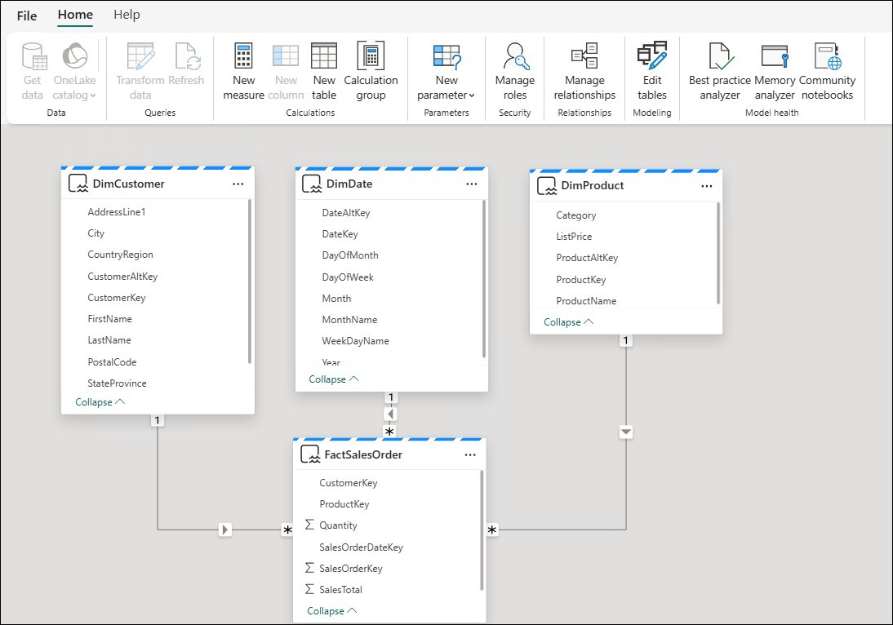

> **Congratulations** on completing the task! Now, it's time to validate it. Here are the steps
> - Hit the Validate button for the corresponding task. If you receive a success message, you can proceed to the next task. 
> - If not, carefully read the error message and retry the step, following the instructions in the lab guide.
> - If you need any assistance, please contact us at cloudlabs-support@spektrasystems.com. We are available 24/7 to help you out.

<validation step="d114c931-34ab-496c-ac20-062a1ced675f" />

## Task 4: Query data Warehouse tables

In this task, you will query data warehouse tables using SQL to retrieve and analyze data. Most queries will involve aggregating and grouping data with functions and GROUP BY clauses, as well as joining related fact and dimension tables using JOIN clauses.

### Query fact and dimension tables

Most queries in a relational data warehouse involve aggregating and grouping data (using aggregate functions and GROUP BY clauses) across related tables (using JOIN clauses).

1. Switch back to **Data Warehouse-<inject key="DeploymentID" enableCopy="false"/> (1)** from the left navigation pane, go to the top menu bar, and click on **New SQL Query (2)**. Then, paste and run the following code **(3)**:

    ```sql
   SELECT  d.[Year] AS CalendarYear,
            d.[Month] AS MonthOfYear,
            d.MonthName AS MonthName,
           SUM(so.SalesTotal) AS SalesRevenue
   FROM FactSalesOrder AS so
   JOIN DimDate AS d ON so.SalesOrderDateKey = d.DateKey
   GROUP BY d.[Year], d.[Month], d.MonthName
   ORDER BY CalendarYear, MonthOfYear;
    ```

    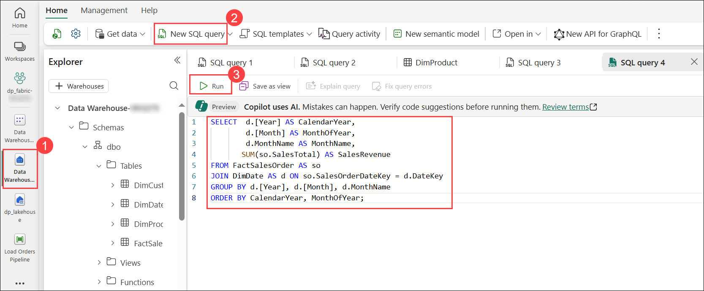

    >**Note:** The attributes in the time dimension enable you to aggregate the measures in the fact table at multiple hierarchical levels - in this case, year and month. This is a common pattern in data warehouses.

2. Modify the query as follows to add a second dimension to the aggregation.

    ```sql
   SELECT  d.[Year] AS CalendarYear,
           d.[Month] AS MonthOfYear,
           d.MonthName AS MonthName,
           c.CountryRegion AS SalesRegion,
          SUM(so.SalesTotal) AS SalesRevenue
   FROM FactSalesOrder AS so
   JOIN DimDate AS d ON so.SalesOrderDateKey = d.DateKey
   JOIN DimCustomer AS c ON so.CustomerKey = c.CustomerKey
   GROUP BY d.[Year], d.[Month], d.MonthName, c.CountryRegion
   ORDER BY CalendarYear, MonthOfYear, SalesRegion;
    ```

3. Run the modified query and review the results, which now include sales revenue aggregated by year, month, and sales region.

    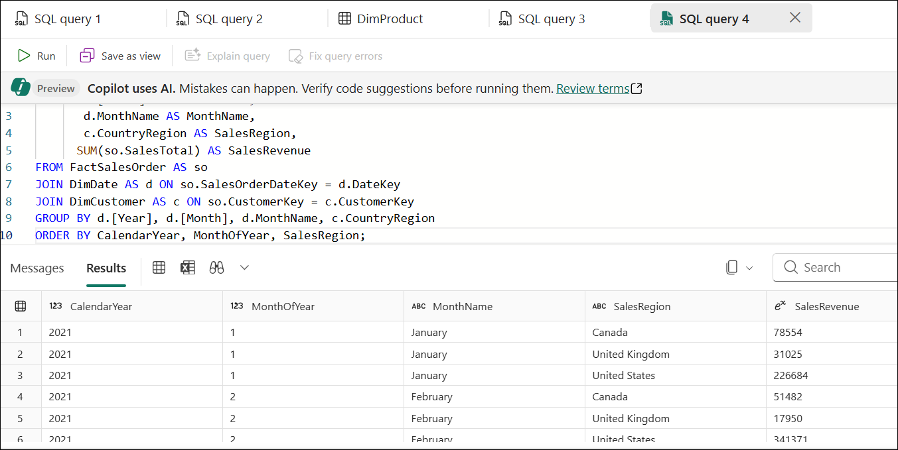

## Task 5: Create a View

In this task, you will create a view in the data warehouse to encapsulate SQL logic for easier querying and data abstraction. A Microsoft Fabric data warehouse offers similar capabilities to relational databases, allowing you to create views and stored procedures to streamline complex queries and improve data access efficiency.

1. Modify and **Run** the query you created previously as follows to create a view (note that you need to remove the ORDER BY clause to create a view).

    ```sql
   CREATE VIEW vSalesByRegion
   AS
   SELECT  d.[Year] AS CalendarYear,
           d.[Month] AS MonthOfYear,
           d.MonthName AS MonthName,
           c.CountryRegion AS SalesRegion,
          SUM(so.SalesTotal) AS SalesRevenue
   FROM FactSalesOrder AS so
   JOIN DimDate AS d ON so.SalesOrderDateKey = d.DateKey
   JOIN DimCustomer AS c ON so.CustomerKey = c.CustomerKey
   GROUP BY d.[Year], d.[Month], d.MonthName, c.CountryRegion;
    ```

    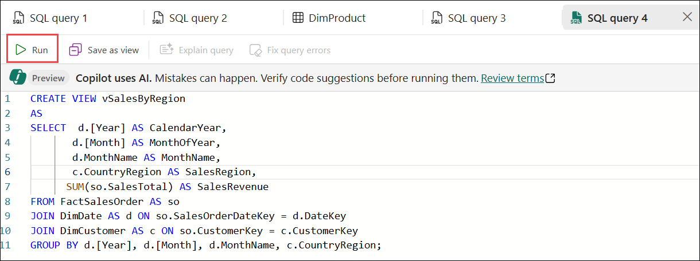

2. After execution, a view will be created. Click the **Ellipsis (...) (1)** next to the **Views** folder and select **Refresh (2)** to update the data warehouse schema. Then, verify that the new view **vSalesByRegion (3)** appears in the **Explorer** pane.

    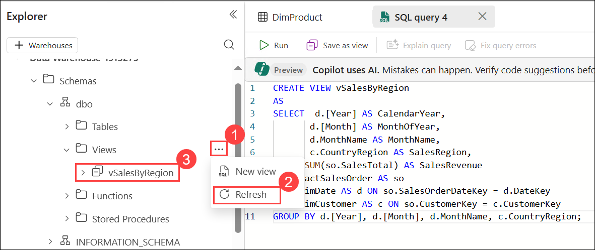

3. Create a new SQL query and run the following SELECT statement:

    ```SQL
   SELECT CalendarYear, MonthName, SalesRegion, SalesRevenue
   FROM vSalesByRegion
   ORDER BY CalendarYear, MonthOfYear, SalesRegion;
    ```

    

## Task 6: Create a visual query

In this task, you will create a visual query using the graphical query designer to query data warehouse tables without writing SQL code. Similar to Power Query online, this no-code approach allows you to perform data transformations, and for more complex tasks, you can leverage Power Query's M language.

1. On the **Home** menu, from the **New SQL query (1)** drop-down, select **New visual query (2)**.

     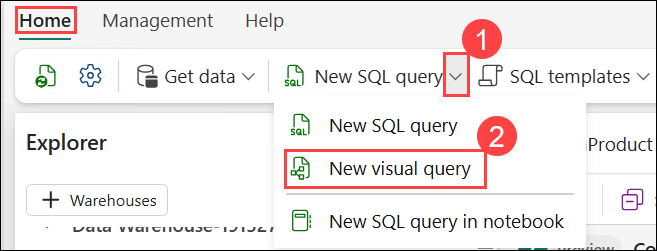

1. From Tables, drag **FactSalesOrder** onto the **canvas**. Notice that a preview of the table is displayed in the **Preview** pane below.

1. And then, drag **DimProduct** onto the **canvas**. We now have two tables in our query.

    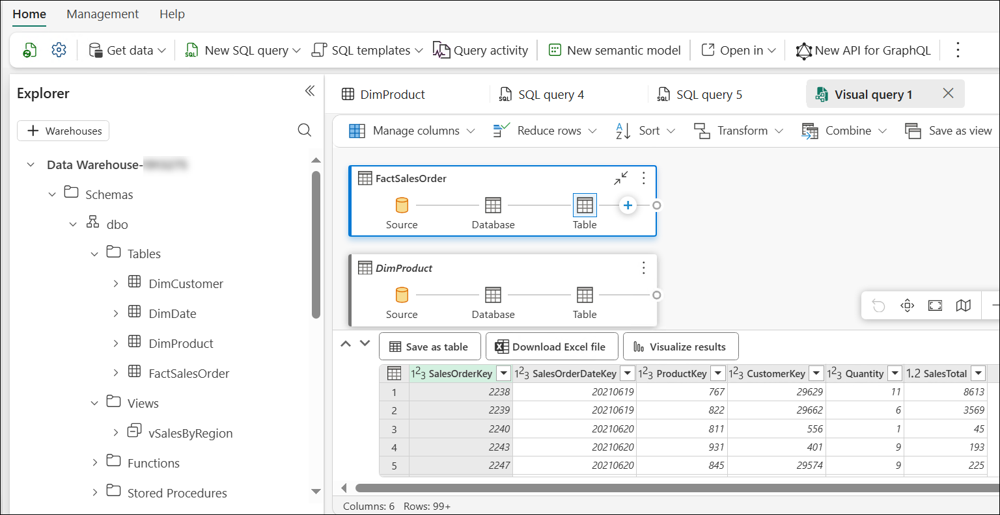

4. Use the **(+) (1)** button on the **FactSalesOrder** table on the canvas to **Merge queries (2)**.

     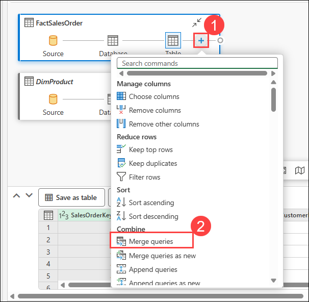

      > **Note:** If the + option is not visible, click on the three dots (i.e., the Actions button) to view the required options. 

5. In the **Merge queries** window, select **DimProduct (1)** as the right table for merge. Select **ProductKey (2)** in both queries, leave the default **Left outer (3)** Join kind, and click **OK (4)**.

     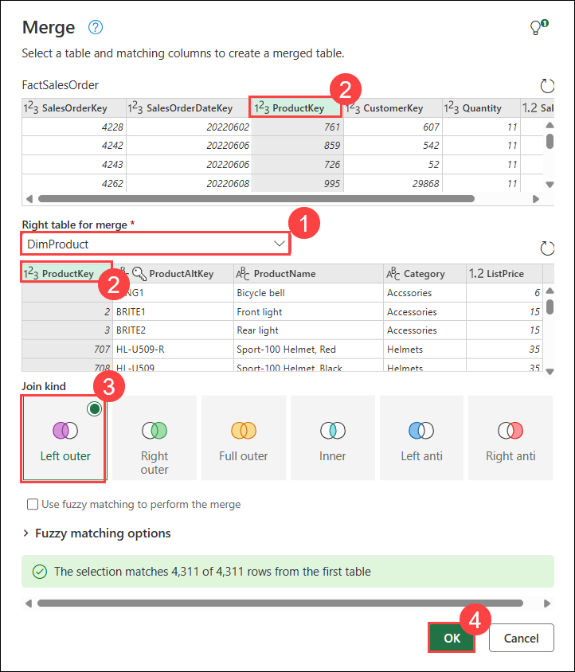

6. In the **Preview**, note that the new **DimProduct** column has been added to the FactSalesOrder table. Expand the column by clicking the **double arrow (1)** to the right of the column name. Select **ProductName (2)** and click **OK (3)**.

    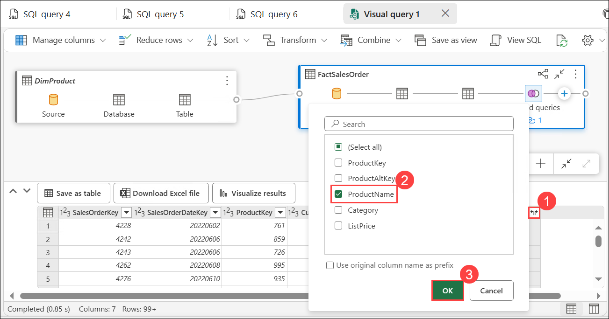

7. If you're interested in looking at data for a single product, per a manager's request, you can now use the **ProductName** column to filter the data in the query. Filter the **ProductName** column to look at **Cable Lock (1)** data only and click on **OK (2)**.

   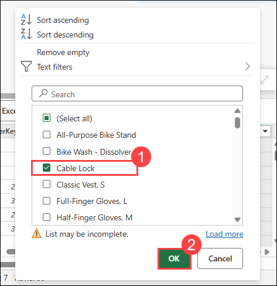

    >**Note:** If you can't find the cable lock, click on **Load More**. 

8. From here, you can analyze the results of this single query by selecting **Visualize results** or **Open in Excel**. You can now see exactly what the manager was asking for, so we don't need to analyze the results further.

## Task 7: Visualize your data

In this task, you will visualize your data from a single query or your data warehouse to gain insights and present findings effectively. Before creating visualizations, it's important to hide any columns or tables that may clutter the report and are not user-friendly for report designers.

1. Navigate back to the fabric workspace **dp_fabric-<inject key="DeploymentID" enableCopy="false"/> (1)** and click on **Data Warehouse-<inject key="DeploymentID" enableCopy="false"/> (2)** semantic model to open it.

   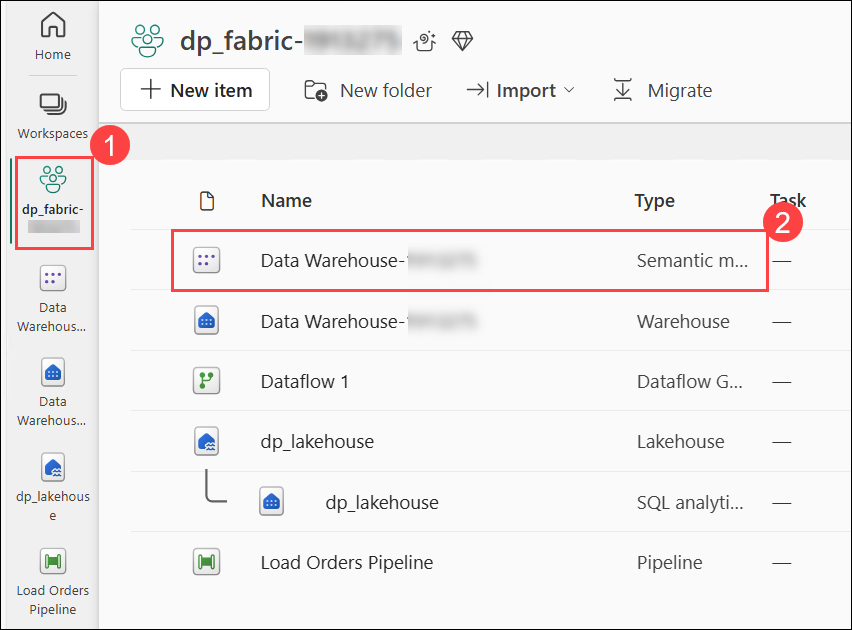

1. On the **Data Warehouse details** page, click **Open semantic model** to launch the semantic model editor.  

   

1. Click the **Viewing (1)** dropdown and change it to **Editing (2)** to switch modes.

    

1. Hide the unnecessary columns in your Fact and Dimension tables by **right-clicking (1)** on the column and selecting **Hide in report view (2)**. This action does not delete the columns from the model; it simply removes them from visibility on the report canvas.
   
    - From FactSalesOrder
        - **SalesOrderDateKey**
        - **CustomerKey**
        - **ProductKey**

           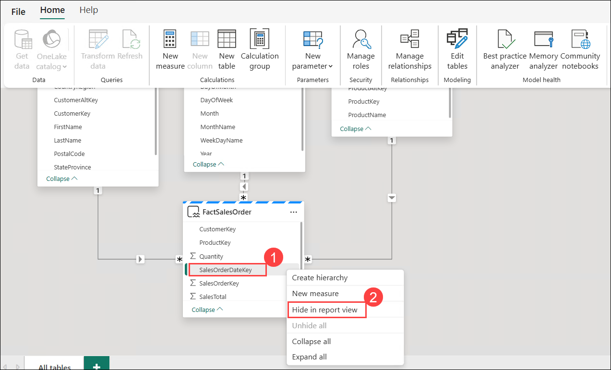
   
    - From DimCustomer
        - **CustomerKey**
        - **CustomerAltKey**
   
    - From DimDate
        - **DateKey**
        - **DateAltKey**
   
    - From DimProduct
        - **ProductKey**
        - **ProductAltKey** 

4.  From the **File (1)** tab, select **Create new report (2)**. This will open a new window, where you can create a Power BI report.

    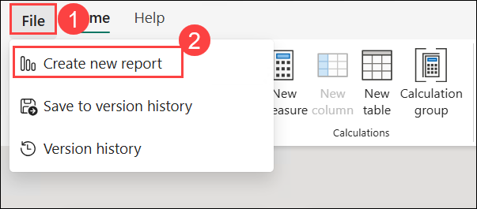

5. In the **Data** pane, expand **FactSalesOrder**. You’ll notice that the columns you previously hid are no longer displayed. 

    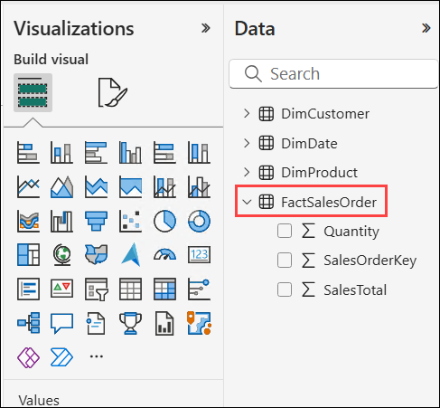

6. Select **SalesTotal**. This will add the column to the **Report canvas**. Because the column is a numeric value, the default visual is a **column chart**.

    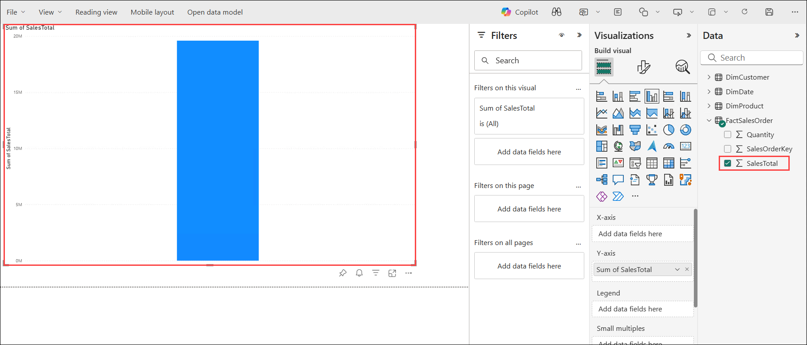

7. Ensure that the column chart on the canvas is active (with a gray border and handles), and then select **Category** from the **DimProduct** table to add a category to your column chart.

    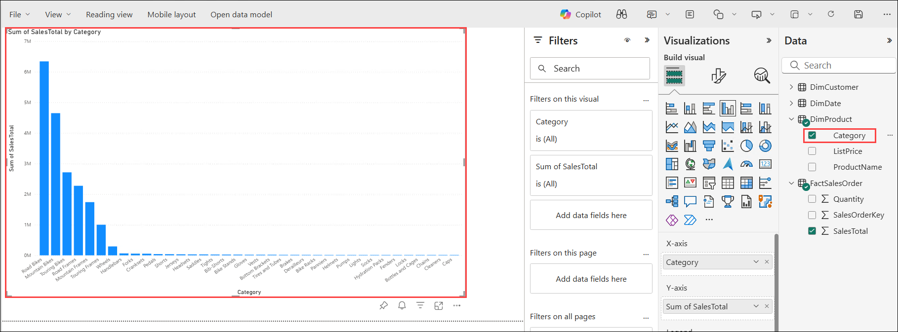

8. In the **Visualizations** pane, change the chart type from a column chart to a **Clustered bar chart (1)**. Then resize the chart **(2)** as necessary to ensure that the categories are readable.

    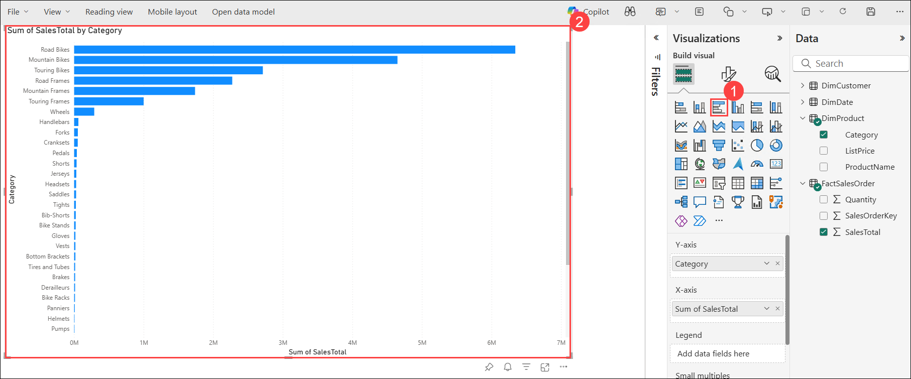

9. In the **Visualizations** pane, select the **Format your visual (1)** tab and in the **General (2)** sub-tab, in the **Title** section, change the **Text** to **Total Sales by Category (3)**.

    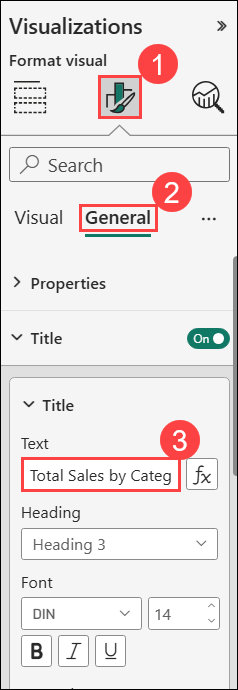

1. In the **File (1)** menu, select **Save (2)**. select **dp_fabric-<inject key="DeploymentID" enableCopy="false"/> (3)**, enter a name as **Sales Report (4)**, and click the **Save (5)** button.

    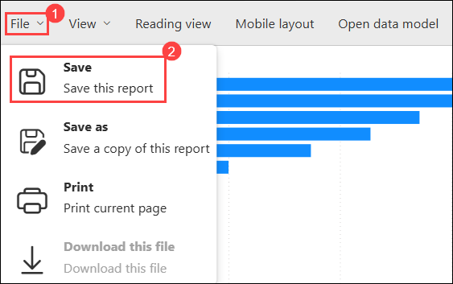

    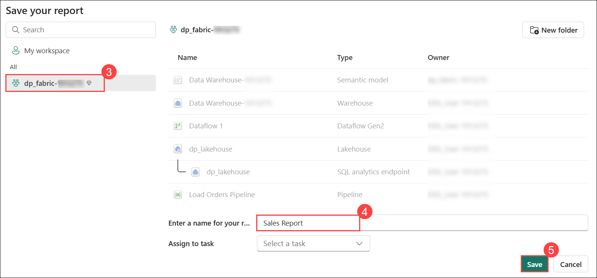

1. In the menu hub on the left pane, navigate back to your **workspace**. Notice that you now have three items saved in your workspace: your data warehouse, its semantic model (default), and the report you created.

    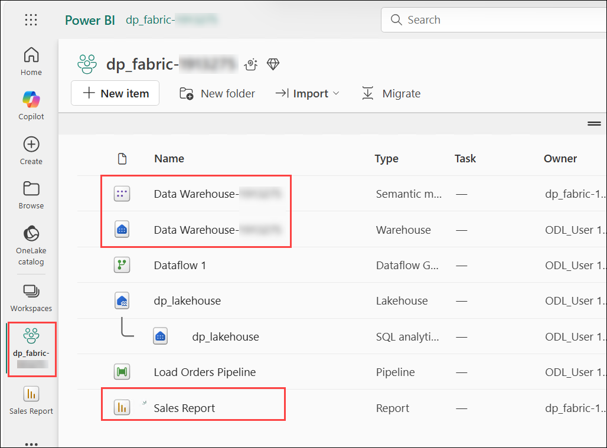

## Summary

In this exercise, you analyzed data in a Microsoft Fabric data warehouse. You created a data warehouse, defined tables, inserted data, and built relationships between fact and dimension tables. Using SQL, you queried and aggregated data for insights. You also created a view to streamline queries and used the visual query designer for no-code data exploration. Finally, you visualized the data in a Power BI report, learning how to effectively analyze and present warehouse data for decision-making.

### Conclusion

By completing this **Get Started With Data Warehouses And Ingesting Data With Dataflows Gen2 With Microsoft Fabric** hands-on lab, you have gained practical experience with core capabilities of Microsoft Fabric for enterprise data management and analytics. In **Exercise 1**, you learned how to ingest, transform, and standardize data using Dataflows Gen2, preparing it for analysis in a Lakehouse. In **Exercise 2**, you explored data warehousing by creating tables, building relationships, executing SQL queries, and visualizing insights through Power BI. Together, these exercises provided a comprehensive understanding of how to manage, analyze, and present data effectively within the Fabric ecosystem, empowering you to support data-driven decision-making in your organization.

### You have successfully completed the Hands-on lab!
