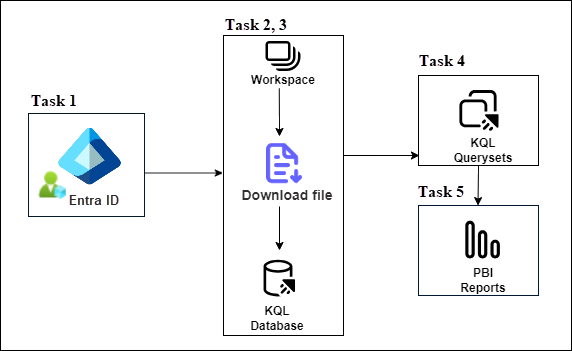
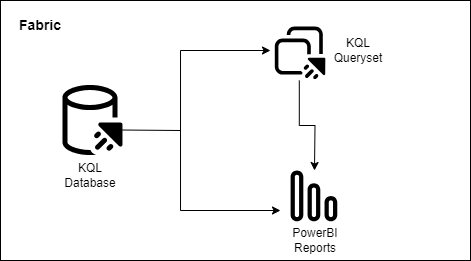
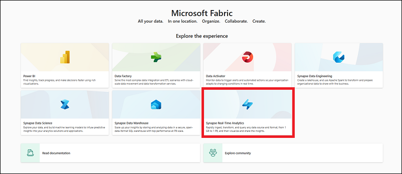
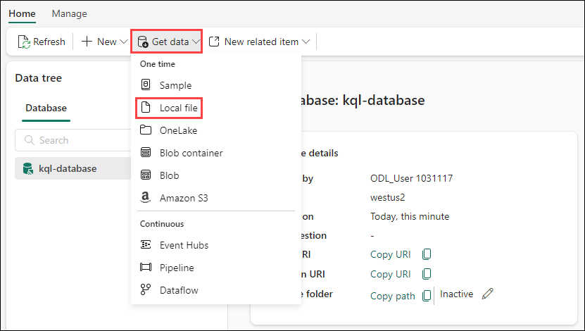

# Lab 1: Get started with Real-Time Analytics in Microsoft Fabric

## Overview

Microsoft Fabric provides an end-to-end platform for data solutions, including real-time data analytics. Synapse Real-Time Analytics in Fabric uses a KQL Database to provide table storage and Kusto Query Language (KQL) which is a powerful tool for analyzing data. This structure provides an efficient way to find insights and patterns from textual or structured data. Moreover, KQL is optimized for data that includes a time series component, such as real-time data from log files or streaming services. With Real-Time Analytics, you can focus and scale up your analytics solution while democratizing data for the needs for your entire data organization.

### _Architecture Diagram_



## Get started with Real-Time Analytics in Microsoft Fabric

Microsoft Fabric provides a runtime that you can use to store and query data by using Kusto Query Language (KQL). Kusto is optimized for data that includes a time series component, such 
as real-time data from log files or IoT devices.

In Fabric, you only need a source and a Kusto database to start streaming data in and out of Fabric and writing your queries using KQL. Microsoft Fabric also provides KQL Querysets that 
can be shared within the tenant and Power BI using what's known as quick create.

   

This lab takes approximately **30** minutes to complete.

> **Note**: You'll need a Microsoft Fabric license to complete this exercise.

## Task 1: Assign Fabric Administrator Role

1. In the Azure portal, type **Microsoft Entra ID (1)** in the search box and select **Microsoft Entra ID (2)** from the results.

   

2. Navigate to **Roles and administrators (1)**.

   

3. In the **Roles and administrators** page, type **Fabric Administrator (1)** in the search box and select **Fabric Administrator (2)** from the results.

   

4. This will take you to the **Fabric Administrator | Assignments** page where you will have to assign yourself the **Fabric Administrator role**. Now, click on **+ Add assignments (1)**.

   

5. Make sure to **check the box (1)** next to your username, confirm if it is **Selected (2)** and click on **Add (3)**.

   

6. You can confirm the **Fabric Administrator** role has been added successfully by **Refresh (1)** Fabric Administrators | Assignments page. After **confirming (2)** it has been added successfully, navigate back to **Home (3)**.

   

## Task 2 : Create a workspace

Before working with data in Fabric, create a workspace with the Fabric trial enabled.

1. Sign into [Microsoft Fabric](https://app.fabric.microsoft.com) at `https://app.fabric.microsoft.com`.

   

1. In the Power BI tab, provide the **Email/Username:** <inject key="AzureAdUserEmail"></inject> and select **Submit**.

   

1. Complete the sign in process by clicking on **Continue**

   
   
1. Enter a 10 digit phone number and select **Get started**. Select **Get started** once more. You will be redirected to Power BI. If prompted provide the **Password:** <inject key="AzureAdUserPassword"></inject>
   
   
   
1. Leave the Microsoft Edge browser window open.

1. Select **Account manager (1)**, and click on **Start trial (2)**.

   

1. A new prompt will appear asking you to **Upgrade to a free Microsoft Fabric trial**, click on **Start trial (1)**.

   

   >**Note:** On the **Successfully upgraded to Microsoft Fabric** pop-up, select **Stay on current page**.

1. Now, open **Account manager (1)** again, and verify **Trial Status (2)**.


7. In the menu bar on the left, select **Workspaces** (the icon looks similar to &#128455;).

   

8. Create a new workspace with a name **dp_fabric-<inject key="Deployment ID" enableCopy="false"/>**, expand  **Advanced:** and Under **License mode**, select **Trial capacity (1)** and click on **Apply (2)** to create and open the workspace.
   
9. When your new workspace opens, it should be empty, as shown here:

    
 
10. At the bottom left of the Power BI portal, select the **Power BI** icon and switch to the **Microsoft Fabric** experience.

## Task 3 : Download file for KQL database

Now that you have a workspace, it's time to switch to the *Synapse Real-Time Analytics* experience in the portal and download the data file you're going to analyze.

1. Download the data file for this exercise from [https://raw.githubusercontent.com/MicrosoftLearning/dp-data/main/sales.csv](https://raw.githubusercontent.com/MicrosoftLearning/dp-data/main/sales.csv), saving it as **sales.csv** on your local computer (or lab VM if applicable)

   OR If you are using the lab virtual machine (lab VM) provided to you, you can get the file from the **C:\LabFiles\dp-data-main** directory.

2. Return to browser window with **Microsoft Fabric** Experience.

## Task 4 : Create a KQL database

Kusto query language (KQL) is used to query static or streaming data in a table that is defined in a KQL database. To analyze the sales data, you must create a table in a KQL database and ingest the data from the file.

1. In the **Microsoft Fabric** experience portal, select the **Synapse Real-Time Analytics** experience image as shown here:

    

2. On the **Home** page for the **Real-Time Analytics** experience, select **KQL database** and create a new database with a name as **kql-database**.

    

3. When the new database has been created, select the option to Get Data from **Local File**. Then use the wizard to import the data into a new table by selecting the following options:

    
    
    - **Destination**:
        - **Database**: *The database you created is already selected*
        - **Table**: *Create a new table named* **sales** by clicking on the + sign to the left of ***New table***

        

        - You will now see the **Drag files here or a Browse for files** hyperlink appear in the same window.

        

        - Browse or drag your **sales.csv** onto the screen and wait for the Status box to change to a green check box and then select **Next**

        

        - In this screen you'll see that your column headings are in teh first row although the system detected them, we still need to move the slider above these lines **First row is column header** in order to get keep from getting any errors.
        
        

        - Once you select this slider you will see everything looks good to go, select the **Finish** button on the bottom right of the panel.

        

        - Wait for the steps in the summary screen to complete which include:
            - Create table (sales)
            - create mapping (sales_mapping)
            - Data queuing
            - Ingestion
        - Select the **Close** button

        

> **Note**: In this example, you imported a very small amount of static data from a file, which is fine for the purposes of this exercise. In reality, you can use Kusto to analyze much larger volumes of data; including real-time data from a streaming source such as Azure Event Hubs.

## Task 5 : Use KQL to query the sales table

Now that you have a table of data in your database, you can use KQL code to query it.

1. Make sure you have the **sales** table highlighted. From the menu bar, select the **Query table** drop-down, and from there select **Show any 100 records** .

2. A new pane will open with the query and its result. 

3. Modify the query as follows:

    ```kusto
   sales
   | where Item == 'Road-250 Black, 48'
    ```

4. Run the query. Then review the results, which should contain only the rows for sales orders for the *Road-250 Black, 48* product.

5. Modify the query as follows:

    ```kusto
   sales
   | where Item == 'Road-250 Black, 48'
   | where datetime_part('year', OrderDate) > 2020
    ```

6. Run the query and review the results, which should contain only sales orders for *Road-250 Black, 48* made after 2020.

7. Modify the query as follows:

    ```kusto
   sales
   | where OrderDate between (datetime(2020-01-01 00:00:00) .. datetime(2020-12-31 23:59:59))
   | summarize TotalNetRevenue = sum(UnitPrice) by Item
   | sort by Item asc
    ```

8. Run the query and review the results, which should contain the total net revenue for each product between January 1st and December 31st 2020 in ascending order of product name.

9. Select **Save as KQL queryset** and save the query as **Revenue by Product**.

## Task 6 : Create a Power BI report from a KQL Query set

You can use your KQL Queryset as the basis for a Power BI report.

1. In the query workbench editor for your query set, run the query and wait for the results.

2. Select **Build Power BI report** and wait for the report editor to open.

3. In the report editor, in the **Data** pane, expand **Kusto Query Result** and select the **Item** and **TotalRevenue** fields.

4. On the report design canvas, select the table visualization that has been added and then in the **Visualizations** pane, select **Clustered bar chart**.

    

5. In the **Power BI** window, in the **File** menu, select **Save**. Then save the report as **Revenue by Item.pbix** in the workspace where your lakehouse and KQL database are defined using a **Non-Business** sensitivity label.
6. Close the **Power BI** window, and in the bar on the left, select the icon for your workspace.

    Refresh the Workspace page if necessary to view all of the items it contains.

7. In the list of items in your workspace, note that the **Revenue by Item** report is listed.

## Clean up resources

In this exercise, you have created a lakehouse, a KQL database to analyze the data uploaded into the lakehouse. You used KQL to query the data and create a query set, which was then used to create a Power BI report.

If you've finished exploring your KQL database, you can delete the workspace you created for this exercise.

1. In the bar on the left, select the icon for your workspace.
2. In the **...** menu on the toolbar, select **Workspace settings**.
3. In the **Other** section, select **Remove this workspace** and select **Delete**.
