# Lab 1: Get Started with Real-Time Analytics in Microsoft Fabric

### Estimated Duration: 100 Minutes

Microsoft Fabric provides an end-to-end platform for data solutions, including real-time data analytics. Synapse Real-Time Analytics in Fabric uses a KQL Database to provide table storage and Kusto Query Language (KQL), which is a powerful tool for analyzing data. This structure provides an efficient way to find insights and patterns from textual or structured data. Moreover, KQL is optimized for data that includes a time series component, such as real-time data from log files or streaming services. With Real-Time Analytics, you can focus and scale up your analytics solution while democratizing data for the needs of your entire data organization.

## Lab Objectives

You will be able to complete the following tasks:

- Task 1: Create a workspace and download a file for the KQL database
- Task 2: Create a KQL database
- Task 3: Use KQL to query the sales table
- Task 4: Create a Power BI report from a KQL Query set

## Task 1: Create a workspace

This task will guide you through creating a workspace in Microsoft Fabric.

1. In the menu bar on the left, select **Workspaces (1)** (the icon looks similar to &#128455;) and click on **+ New workspace (2)**.

   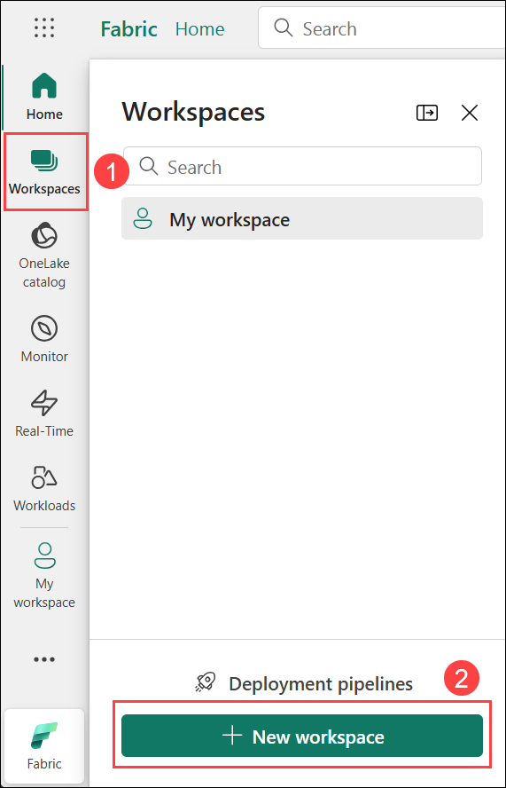

1. Create a new workspace named **dp_fabric-<inject key="Deployment ID" enableCopy="false"/> (1)**. Expand **Advanced (2)**, then under **License mode**, select **Trial (3)** and click **Apply (4)** to create and open the workspace.
   
   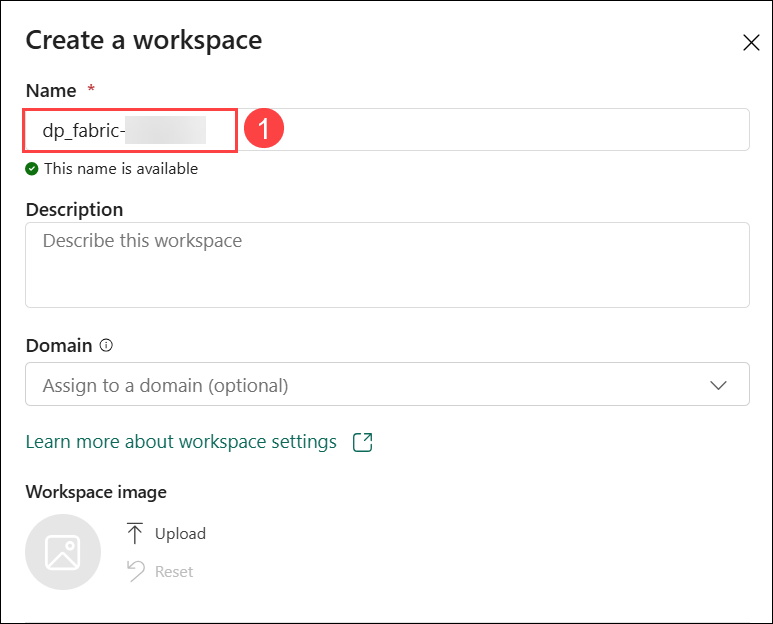

   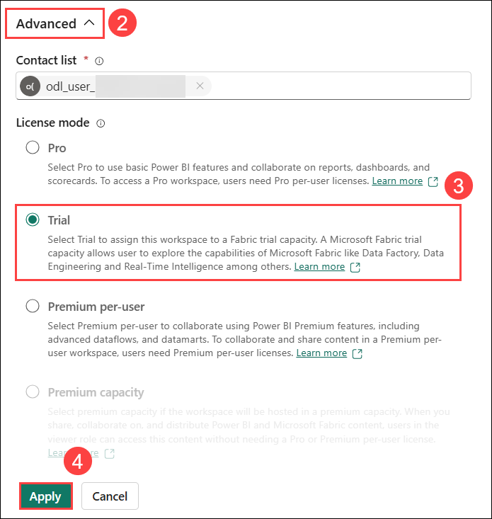

   >**Note:** If you see a pop-up saying **"Upgrade to a paid Power BI license"**, click on **"Try free"** to proceed with the trial.

   .png)

1. When your new workspace opens, it should be empty, as shown here:

   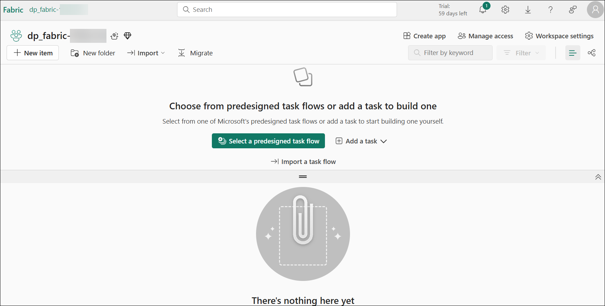
 
## Task 3: Download file for KQL database and create a KQL database

In this task, you will learn how to download a file for a KQL database and create a KQL database in Microsoft Fabric for querying and analyzing data efficiently.

Now that you have a workspace, download the data file for analysis. Using *Kusto Query Language (KQL)*, you can query static or streaming data in a table within a KQL database. To analyze sales data, create a table in the database and ingest the downloaded file.

1. Download the **sales.csv** data file for this exercise from **[Sales.csv](https://raw.githubusercontent.com/MicrosoftLearning/dp-data/main/sales.csv)** and save it on your local computer or lab VM. **Alternatively**, if you are using the provided lab virtual machine (lab VM), you can find the file in the **C:\LabFiles\dp-data-main** directory.

1. Return to the browser window with the **Microsoft Fabric** experience.

1. Navigate to **dp_fabric-<inject key="Deployment ID" enableCopy="false"/>** workspace from the hub menu bar on the left.

    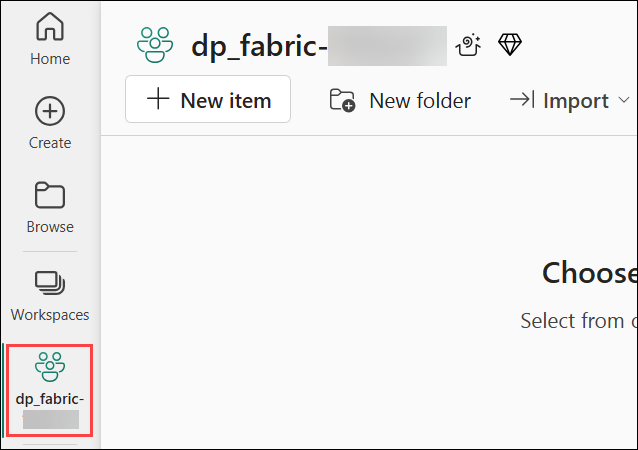

1. In the **dp_fabric-<inject key="Deployment ID" enableCopy="false"/>** page, click on **+ New item (1)** and in the search bar serch for **Eventhouse (2)** and select **Eventhouse (3)**.
   
   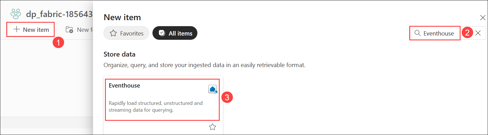

1. Enter **Eventhouse-<inject key="Deployment ID" enableCopy="false"/> (1)** as the name and click **Create (2)**.

    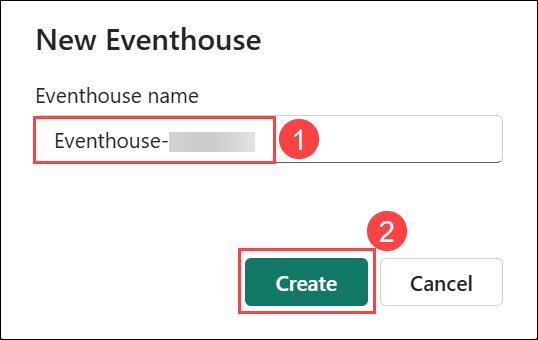

1. When the **Welcome to Eventhouse** pop-up appears, select **Get started**.

    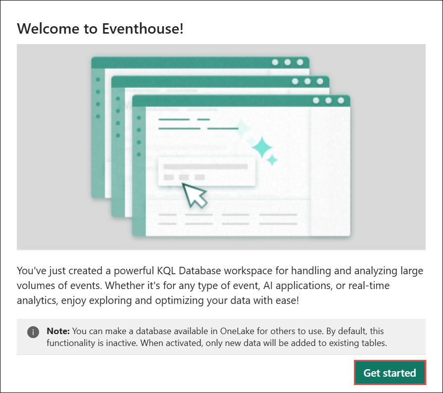

1. When the new eventhouse has been created, right-click on it **(1)**, select the option **Get data (2)**, then **Local file (3)**. 

    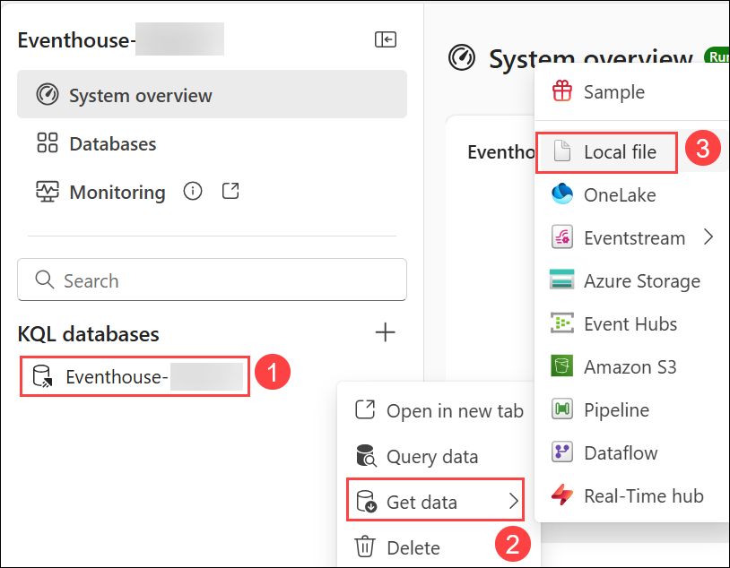

1. Then use the wizard to import the data into a new table by selecting the following options: 

    - **Select or create a destination table:**
        - **Database:** *The database you created is already selected*
        - **Table:** *Create a new table named* **sales** by clicking on the **+** **sign** to the left of ***New table***

          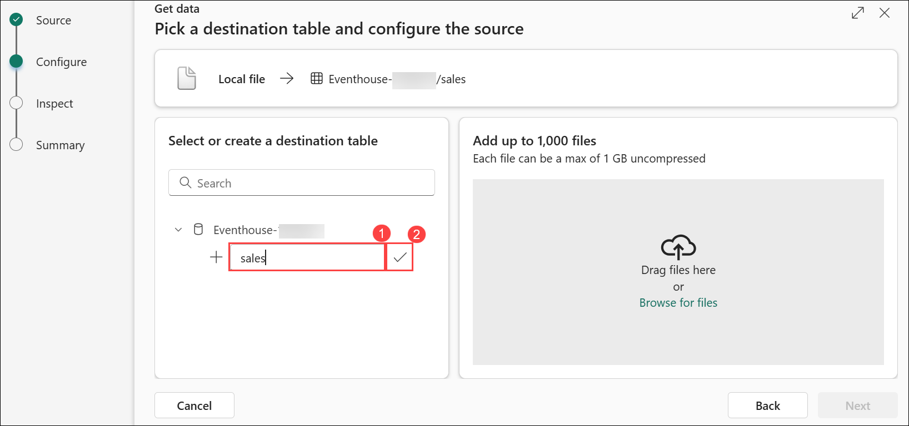

        - You will now see the **Drag files here or Browse for files** hyperlink appear in the same window.

          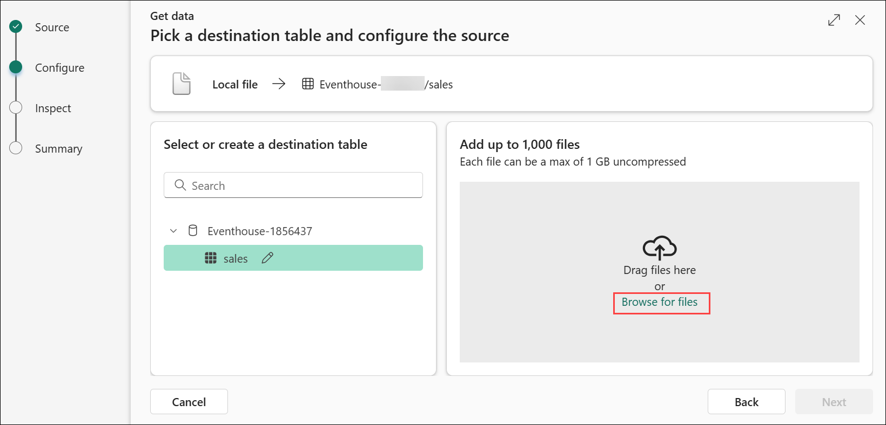

        - Browse or drag your **sales.csv** onto the screen and wait for the Status box to change to a green check box, and then select **Next**

          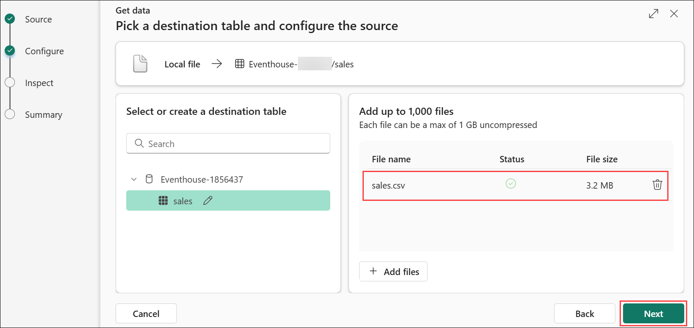

        - In the screen below, you'll notice that the column headings are in the first row. Although the system has detected them, we still need to move the **First row is column header (1)** slider above these lines to prevent any errors. Once you adjust the slider, everything should appear correctly. Finally, click the **Finish (2)** button in the bottom right corner of the panel to proceed.

          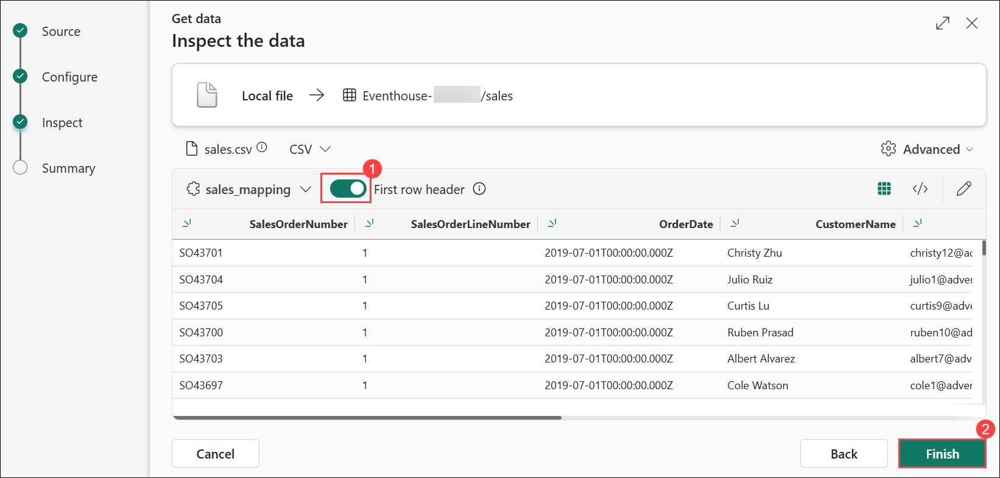

        - Wait for the steps in the summary screen to complete, which include **(1):**
            - Create table (sales)
            - Create mapping (sales_mapping)
            - Data queuing
            - Blob ingestion
        - Select the **Close (2)** button

          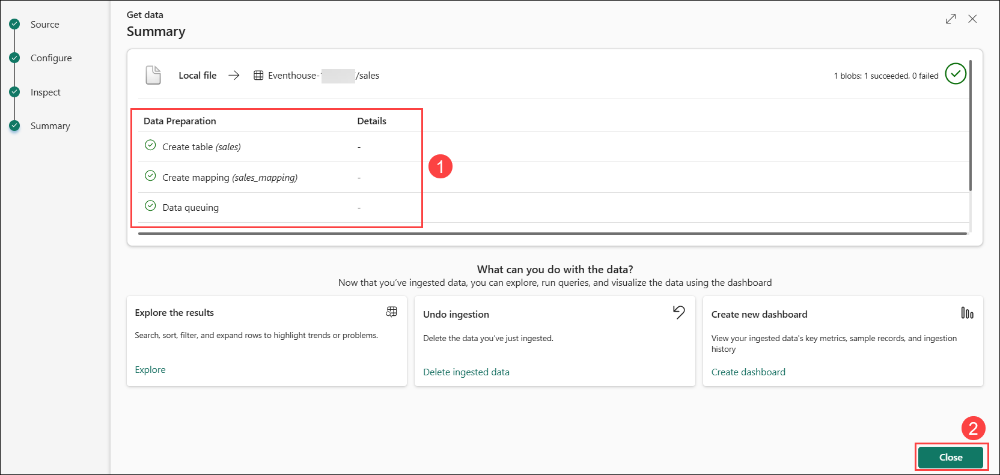

> **Note:** In this task, you imported a very small amount of static data from a file, which is fine for the purposes of this task. In reality, you can use Kusto to analyze much larger volumes of data, including real-time data from a streaming source such as Azure Event Hubs.

## Task 4: Use KQL to query the sales table

This task will walk you through using KQL (Kusto Query Language) to query the Sales table and analyze data efficiently in Microsoft Fabric.

Now that you have a table of data in your database, you can use KQL code to query it.

1. Right-click on the **sales (1)** table, select the **Query with code (2)**, and then **Show any 100 records**.

   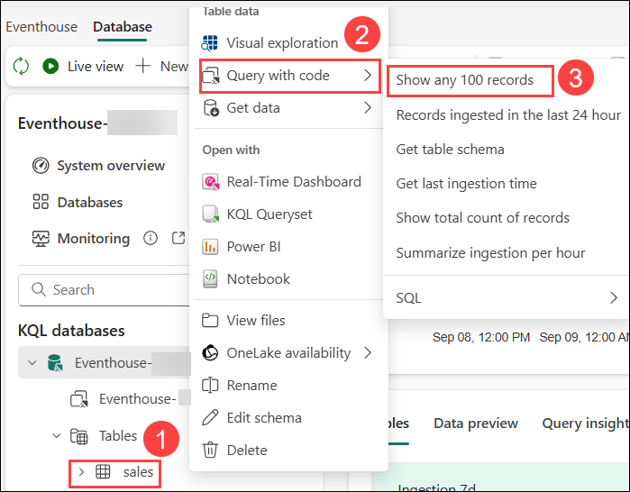

1. A new pane will open with the query and its result. 

1. Modify the query as follows:

    ```kusto
   sales
   | where Item == 'Road-250 Black, 48'
    ```

1. Run the query. Then review the results, which should contain only the rows for sales orders for the *Road-250 Black, 48* product.

1. Modify the query as follows:

    ```kusto
   sales
   | where Item == 'Road-250 Black, 48'
   | where datetime_part('year', OrderDate) > 2020
    ```

1. Run the query and review the results, which should contain only sales orders for *Road-250 Black, 48* made after 2020.

1. Modify the query as follows:

    ```kusto
   sales
   | where OrderDate between (datetime(2020-01-01 00:00:00) .. datetime(2020-12-31 23:59:59))
   | summarize TotalNetRevenue = sum(UnitPrice) by Item
   | sort by Item asc
    ```
1. Run the query and review the results, which should contain the total net revenue for each product between January 1st and December 31st 2020, in ascending order of product name.

1. Navigate to **dp_fabric-<inject key="Deployment ID" enableCopy="false"/> (1)** workspace from the hub menu bar on the left. Select **Eventhouse-<inject key="Deployment ID" enableCopy="false"/> (2)** KQL Database from the list.

    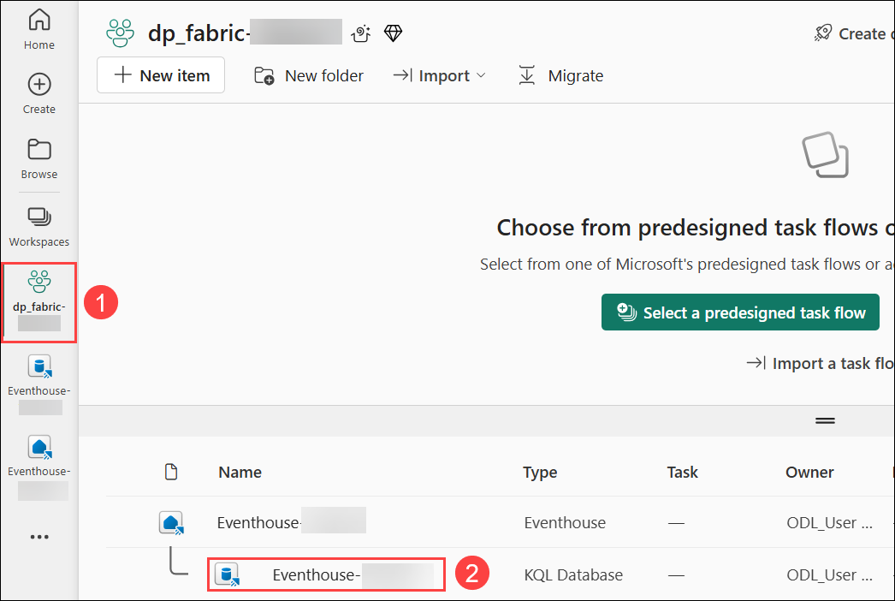

1. Select the **KQL queryset (1)**, click on **Edit (2)**.

   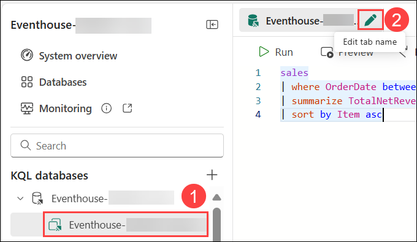

11. Change the name of the KQL queryset to **Revenue by Product**.

    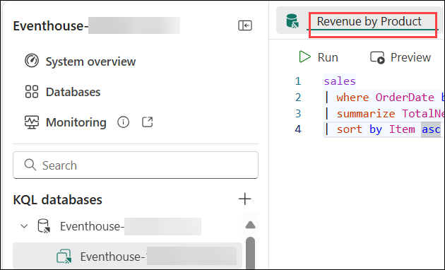

## Task 5: Create a Power BI report from a KQL Query set

This task will guide you through visualizing and analyzing data effectively by creating a Power BI report using a KQL query set. You will learn how to transform query results into insightful reports and dashboards.

You can use your KQL Queryset as the basis for a Power BI report.

1. On the **Revenue by Product** KQL Queryset select **More (1)** then **Create Power BI report (2)**. Wait for the report editor to open.

    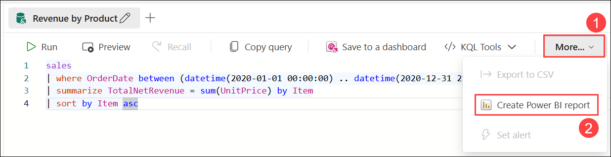

1. In the report editor, in the **Data** pane, expand **Kusto Query Result (1)** and select the **Item** and **TotalNetRevenue** **(2)** fields.

    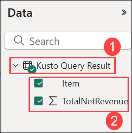

1. On the report design canvas, select the table visualization that has been added and then in the **Visualizations** pane, select **Clustered bar chart**.

    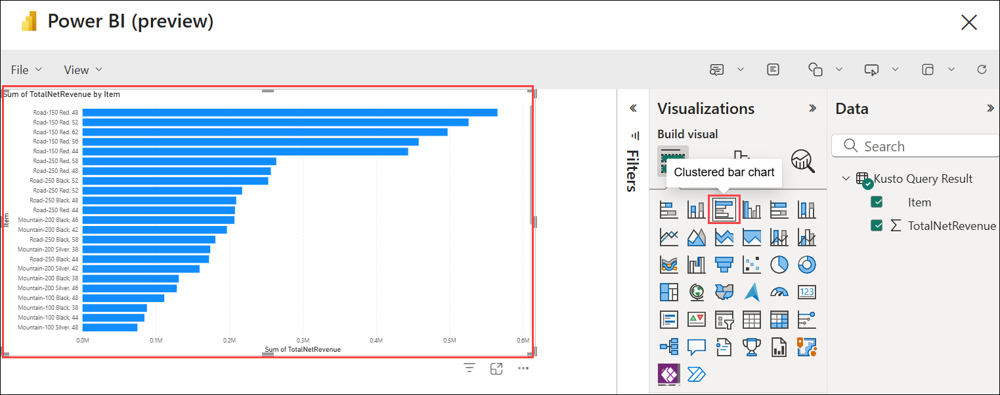

1. In the **Power BI** window, in the **File (1)** menu, select **Save (2)**. 

   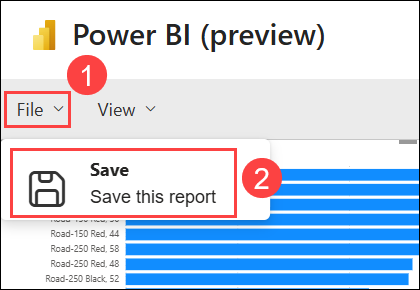

1. Save the report as **Revenue by Item (1)** in the workspace **dp_fabric-<inject key="Deployment ID" enableCopy="false"/> (2)**. Then select **Continue (3)**.
  
    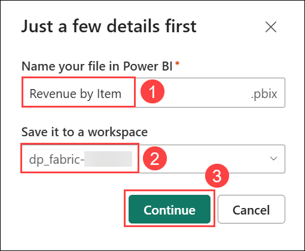
    
1. Close the **Power BI** window, and in the bar on the left, select the icon for your workspace.

     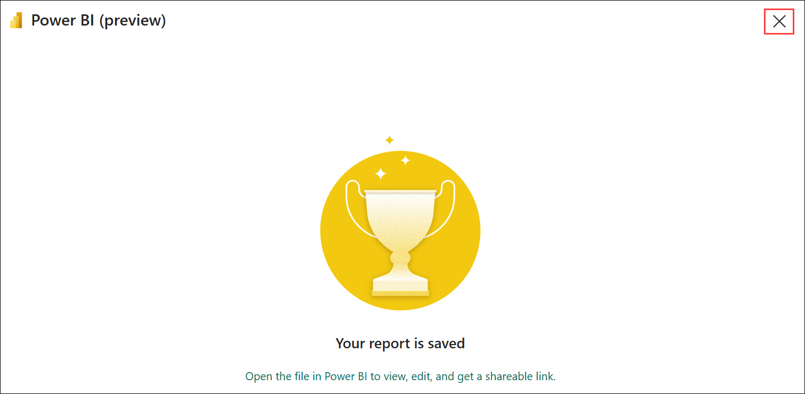

    Refresh the Workspace page if necessary to view all of the items it contains.

1. In the list of items in your workspace, note that the **Revenue by Item** report is listed.
   
## Summary:

In this lab, you have the opportunity to explore Microsoft Fabric as a platform for real-time analytics using Synapse Real-Time Analytics and Kusto Query Language (KQL). You will learn to assign the Fabric Administrator role, create a workspace, set up a KQL database, query data, and generate a Power BI report from KQL queries. This lab demonstrates how to efficiently analyze real-time data using KQL, particularly for time-series data like logs and streaming services.

You have completed the following tasks:

- Created a workspace
- Downloaded file for KQL database and created a KQL database
- Used KQL to query the sales table
- Created a Power BI report from a KQL Query set

## References:

- [Microsoft Fabric Documentation](https://learn.microsoft.com/en-us/fabric/)
- [Kusto Query Language (KQL) Overview](https://learn.microsoft.com/en-us/azure/data-explorer/kusto/query/)
- [Power BI Documentation](https://learn.microsoft.com/en-us/power-bi/)

Now, click on **Next >>** from the lower right corner to move on to the next page.


