# Get Started with Real-Time Analytics and Data Science with Microsoft Fabric

## Lab Overview

In this lab, you will create a complete data science workflow using Microsoft Fabric. You'll start by activating the trial, creating a workspace, and uploading churn data into a Lakehouse. Using Notebooks, you'll explore the dataset and train machine learning models with Scikit-learn. MLflow will be used to track and compare experiment runs, and you’ll generate visual charts to compare model accuracy. Finally, you'll save the best model, end the Spark session, and clean up your workspace.

## Lab Objectives

You will be able to complete the following tasks:

- Task 1: Create a workspace
- Task 2: Create a Lakehouse and upload files
- Task 3: Create a Notebook
- Task 4: Load data into a data frame
- Task 5: Train a Machine Learning model
- Task 6: Use MLflow to search and view your experiments
- Task 7: Explore your experiments
- Task 8: Save the model
- Task 9: Save the Notebook and end the Spark session

## Task 1: Create a workspace

This task will guide you through creating a workspace in Microsoft Fabric.

1. On the Microsoft Fabric portal, from the left-hand menu, select **Workspaces (1)** (the icon looks similar to &#128455;) At the bottom of the Workspaces pane, click on **+ New workspace (2)**.

   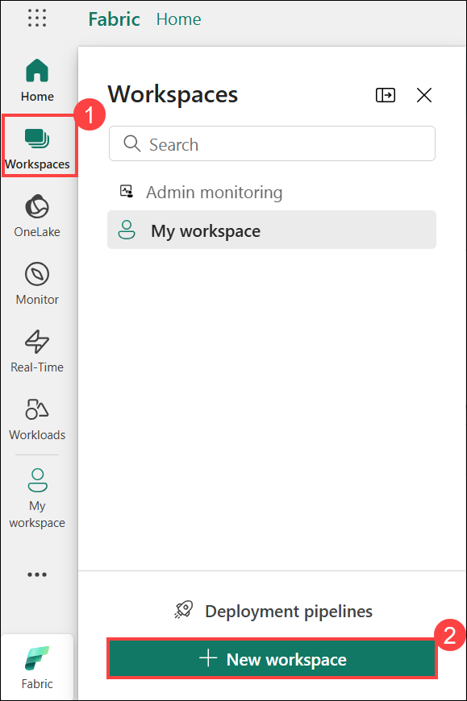

1. On the **Create a workspace** pane, enter the Name as **dp_fabric-<inject key="Deployment ID" enableCopy="false"/> (1)**. Expand the **Advanced** section **(2)**, then under **License mode**, select **Trial** **(3)** and click **Apply** **(4)** to create and open the workspace.
   
   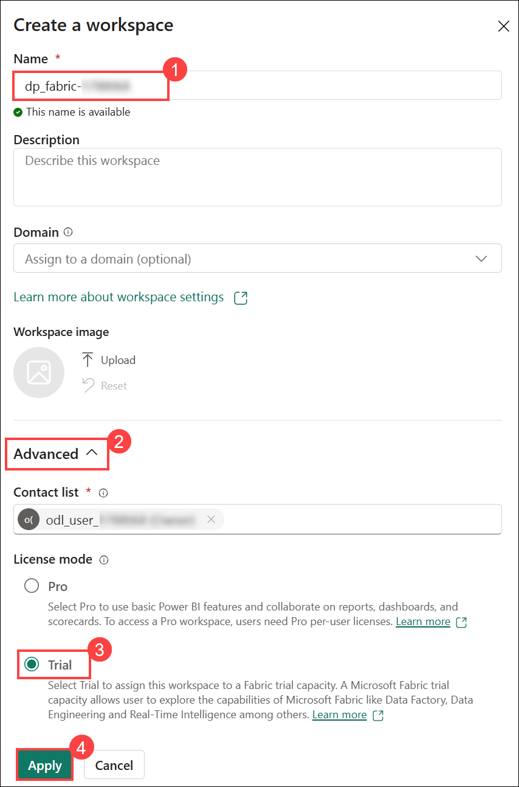

   >**Note:** If you see a pop-up saying **"Upgrade to a paid Power BI license"**, click on **"Try free"** to proceed with the trial.

   .png)

1. Once the workspace is created, it will open automatically. You’ll see an empty workspace with the message **"There's nothing here yet"**, confirming the workspace is ready for use.

   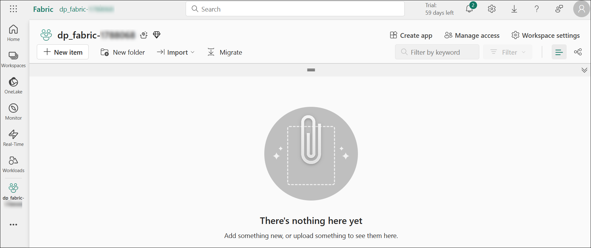
 
## Task 2: Create a Lakehouse and upload files

This task will guide you through setting up a Lakehouse in Microsoft Fabric, where you will upload files for efficient data storage and processing.

Now that you have a workspace, it's time to switch to the *Data science* experience in the portal and create a data lakehouse for the data files you're going to analyze.

1. On the left-hand menu of the home page, select the **dp_fabric-<inject key="Deployment ID" enableCopy="false"/>** workspace to open it.

    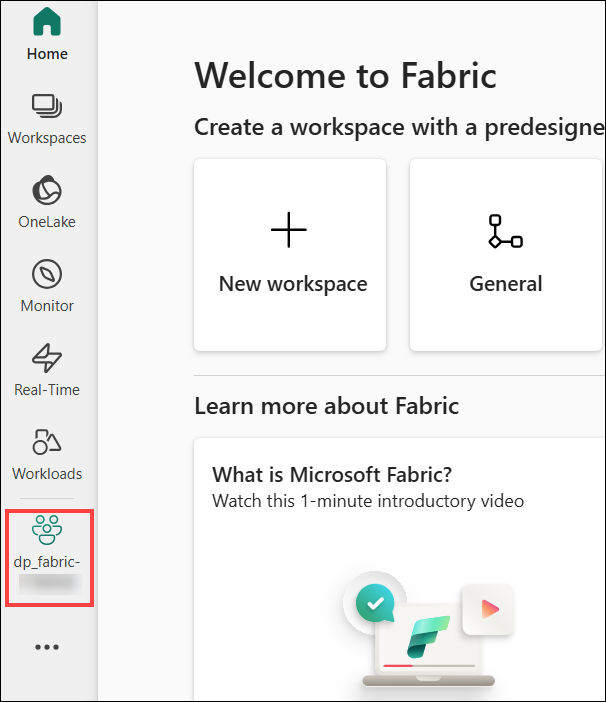

1. On the **dp_fabric-<inject key="Deployment ID" enableCopy="false"/>** workspace page, click on **+ New item (1)** and in the search bar serch for **Lakehouse (2)** and under Store data, select **Lakehouse (3)**.
   
   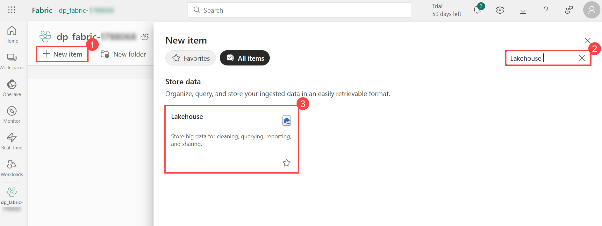

1. On the **New lakehouse** pane, Enter **Lakehouse<inject key="Deployment ID" enableCopy="false"/> (1)** in the Name field **(1)** and click **Create** **(2)**.

    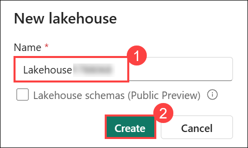

    >**Note:** After a minute or so, a new lakehouse with no **Tables** or **Files** will be created. You need to ingest some data into the data lakehouse for analysis. There are multiple ways to do this, but in this task, you'll simply download and extract a folder of text files from your local computer (or lab VM if applicable) and then upload them to your lakehouse.

1. Download the **churn.csv** file for this exercise from **[churn.csv](https://raw.githubusercontent.com/MicrosoftLearning/dp-data/main/churn.csv)** and save it on your local computer or lab VM. **Alternatively,** if you are using the provided lab virtual machine (lab VM), you can find the file in the **C:\LabFiles\dp-data-main** directory.

1. Return to the web browser tab containing your lakehouse, and under **Get data in your lakehouse**  select **Upload files**.

    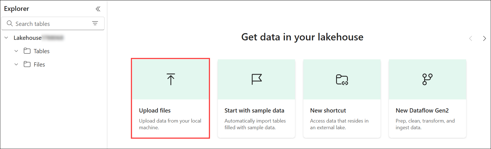

1. In the file explorer window, navigate to **C:\LabFiles\dp-data-main** **(1)**, select **churn.csv** **(2)**, and click **Open** **(3)**.

   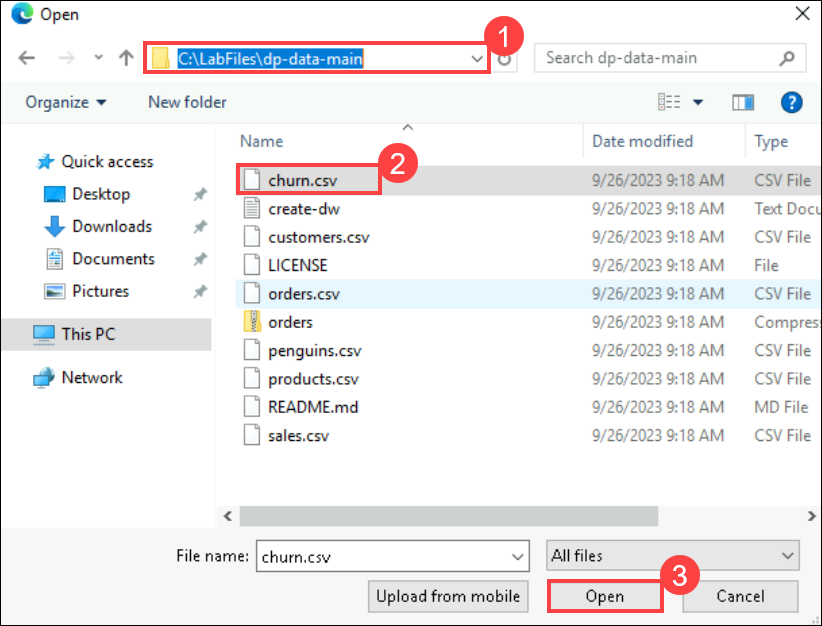

1. On the **Upload files** pane, verify that **churn.csv** is selected and click **Upload** **(4)** to add the file to the lakehouse.

   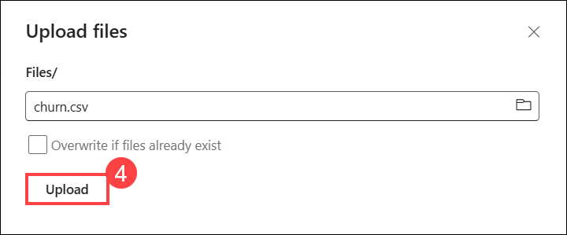

1. After the upload is complete, select **Files** **(1)** in the Explorer pane and verify that **churn.csv** **(2)** appears in the list.

   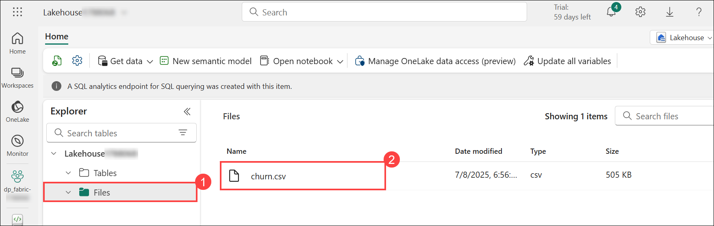

## Task 3: Create a Notebook

In this task, you will learn how to create a Notebook in Microsoft Fabric for interactive data exploration and analysis.

To train a model, you can create a *notebook*. Notebooks provide an interactive environment in which you can write and run code (in multiple languages) as *experiments*.

1. On the left-hand menu of the home page, select the **dp_fabric-<inject key="Deployment ID" enableCopy="false"/>** workspace to open it.

    

1. In the **dp_fabric-<inject key="Deployment ID" enableCopy="false"/>** page, click on **+ New item (1)** and in the search bar serch for **Notebook (2)** and under Get data, select **Notebook (3)**.

     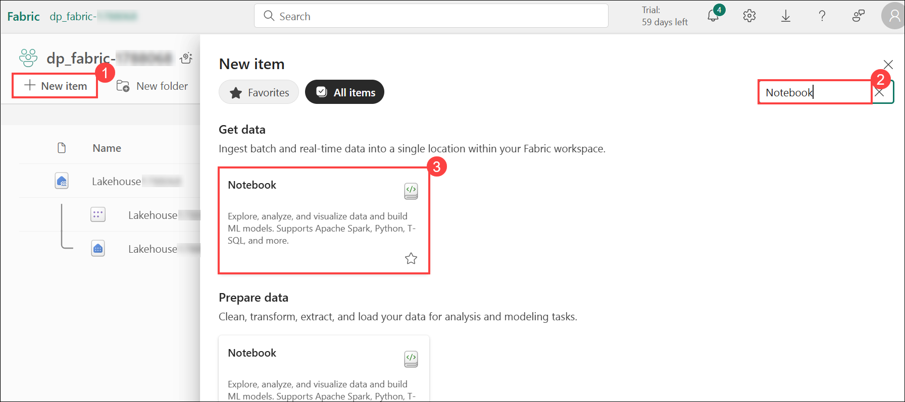

    After a few seconds, a new notebook containing a single *cell* will open. Notebooks are made up of one or more cells that can contain *code* or *markdown* (formatted text).

1. Select the first cell (which is currently a *code* cell), and then in the dynamic toolbar at its top-right, use the **M&#8595;** button to convert the cell to a *markdown* cell.

    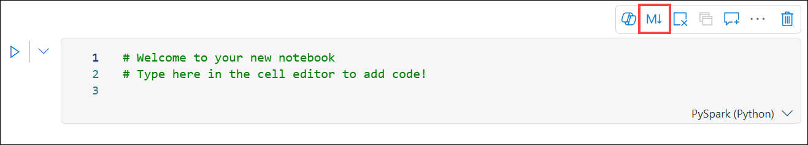

    When the cell changes to a markdown cell, the text it contains is rendered.

1. On the notebook cell, click the **&#128393;** (Edit) button to switch the cell to editing mode.

   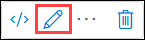

1. Delete the content and enter the following text:

    ```text
   # Train a machine learning model and track with MLflow

   Use the code in this notebook to train and track models.
    ```
    
## Task 4: Load data into a dataframe

You will explore how to import data into a DataFrame in Microsoft Fabric for processing and analysis in this task.

Now you're ready to run code to prepare data and train a model. To work with data, you'll use *dataframes*. Dataframes in Spark are similar to Pandas dataframes in Python and provide a common structure for working with data in rows and columns.

1. On the **Notebook 1** page, click on **Data items (1)** in the Explorer panel, then select **Add data items (2)** and choose **Existing data sources (3)** from the dropdown menu.

   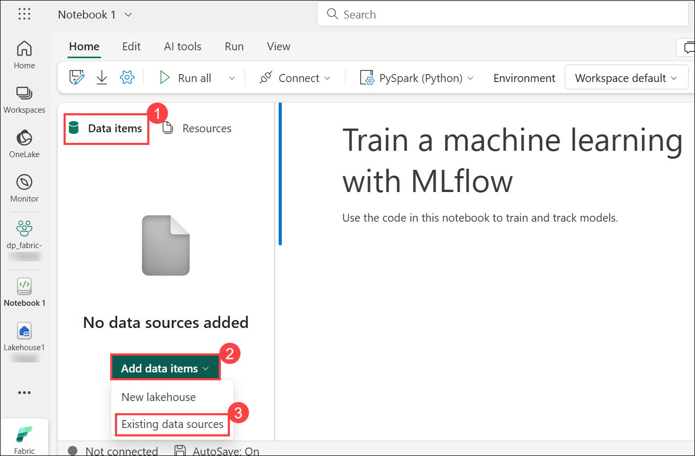

1. On the **OneLake catalog** window, select the **lakehouse (1)** you created earlier and click on **Connect (2)**.

   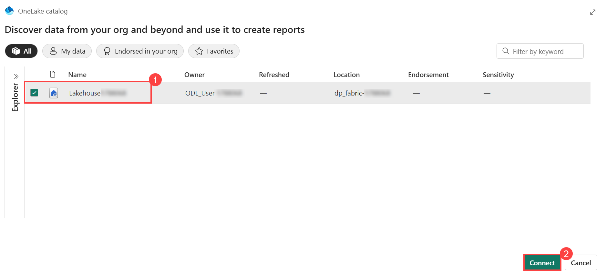

1. On the **Notebook 1** interface, click on the **Files (1)** folder to display the CSV file next to the notebook editor. Then, open the ellipsis **(...)** menu for **churn.csv (2)** and select **Load data (3)** -> **Pandas (4)**.

    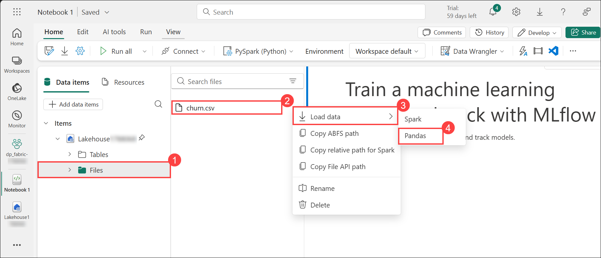

1. Add a new code cell with the following code to load and display the churn dataset:

    ```python
   import pandas as pd
   # Load data into pandas DataFrame from "/lakehouse/default/" + "Files/churn.csv"
   df = pd.read_csv("/lakehouse/default/" + "Files/churn.csv")
   display(df)
    ```

    > **Tip:** You can hide the pane containing the files on the left by using its **<< icon**. Doing so will help you focus on the notebook.

      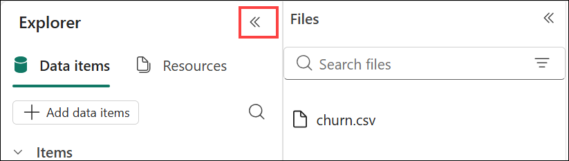

1. Use the **&#9655; Run cell** button on the left of the cell to run it.

   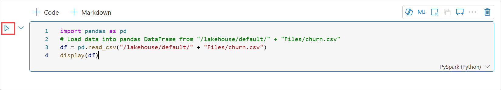

    > **Note:** Since this is the first time you've run any Spark code in this session, the Spark pool must be started. This means that the first run in the session can take a minute or so to complete. Subsequent runs will be quicker.

1. After the cell has finished executing, review the output below the cell, which should look similar to this:

    |Index|CustomerID|years_with_company|total_day_calls|total_eve_calls|total_night_calls|total_intl_calls|average_call_minutes|total_customer_service_calls|age|churn|
    | -- | -- | -- | -- | -- | -- | -- | -- | -- | -- | -- |
    |1|1000038|0|117|88|32|607|43.90625678|0.810828179|34|0|
    |2|1000183|1|164|102|22|40|49.82223317|0.294453889|35|0|
    |3|1000326|3|116|43|45|207|29.83377967|1.344657937|57|1|
    |4|1000340|0|92|24|11|37|31.61998183|0.124931779|34|0|
    | ... | ... | ... | ... | ... | ... | ... | ... | ... | ... | ... |

    The output shows the rows and columns of customer data from the churn.csv file.

## Task 5: Train a Machine Learning model

In this task, you will learn how to train a Machine Learning model in Microsoft Fabric using a dataset to make predictions and gain insights.

Now that you've loaded the data, you can use it to train a machine learning model and predict customer churn. You'll train a model using the Scikit-Learn library and track the model with MLflow. 

1. Click the **+ Code** icon below the cell output to add a new code cell to the notebook.

   

1. Enter the following code in it. If the **+ Code** icon isn't visible, hover your mouse below the cell to make it appear.

    ```python
   from sklearn.model_selection import train_test_split

   print("Splitting data...")
   X, y = df[['years_with_company','total_day_calls','total_eve_calls','total_night_calls','total_intl_calls','average_call_minutes','total_customer_service_calls','age']].values, df['churn'].values
   
   X_train, X_test, y_train, y_test = train_test_split(X, y, test_size=0.30, random_state=0)
    ```

    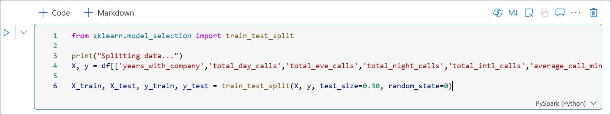

1. Run the code cell you added, and note you're omitting 'CustomerID' from the dataset, and splitting the data into a training and test dataset.
   
1. Add a new code cell to the notebook, enter the following  code, and run it to set the experiment:
    
    ```python
   import mlflow
   experiment_name = "experiment-churn"
   mlflow.set_experiment(experiment_name)
    ```
    
    The code creates an MLflow experiment named `experiment-churn`. Your models will be tracked in this experiment.

    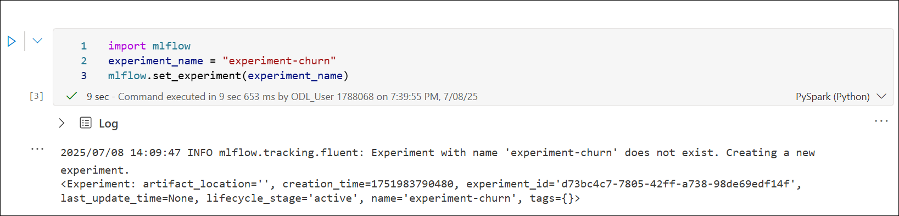

1. Add another new code cell to the notebook, enter the following code, and run it to train the model and log the run with MLflow:

    ```python
   from sklearn.linear_model import LogisticRegression
   
   with mlflow.start_run():
       mlflow.autolog()

       model = LogisticRegression(C=1/0.1, solver="liblinear").fit(X_train, y_train)

       mlflow.log_param("estimator", "LogisticRegression")
    ```
    
    The code trains a classification model using Logistic Regression. Parameters, metrics, and artifacts are automatically logged with MLflow. Additionally, you're logging a parameter called `estimator`, with the value `LogisticRegression`.

    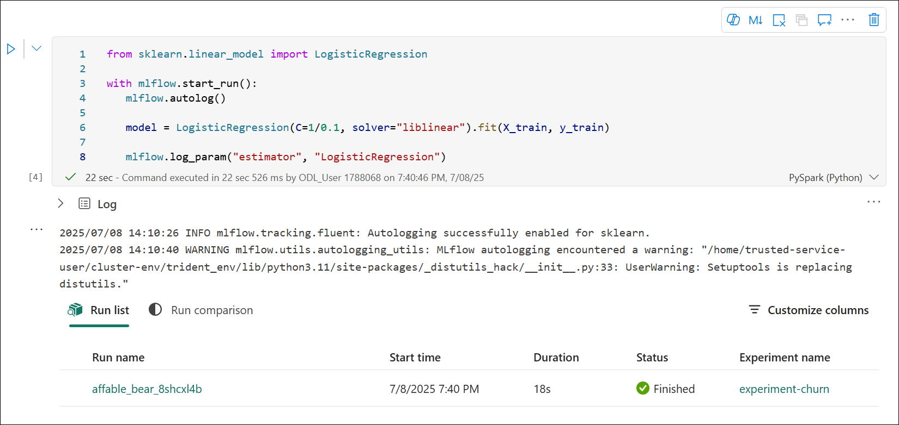

1. Add another new code cell to the notebook, enter the following code, and run it to train a Decision Tree model and log the run with MLflow:

    ```python
   from sklearn.tree import DecisionTreeClassifier
   
   with mlflow.start_run():
       mlflow.autolog()

       model = DecisionTreeClassifier().fit(X_train, y_train)
   
       mlflow.log_param("estimator", "DecisionTreeClassifier")
    ```

    The code trains a classification model using a Decision Tree Classifier. Parameters, metrics, and artifacts are automatically logged with MLflow. Additionally, you're logging a parameter called `estimator`, with the value `DecisionTreeClassifier`.

    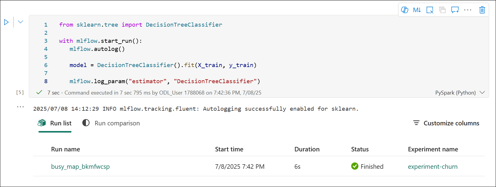

## Task 6: Use MLflow to search and view your experiments

You will learn how to use MLflow to search and view your machine learning experiments in Microsoft Fabric for tracking and managing model performance.

When you've trained and tracked models with MLflow, you can use the MLflow library to retrieve your experiments and their details.

1. To list all experiments, add a new code cell with the following code and run it:

    ```python
   import mlflow
   experiments = mlflow.search_experiments()
   for exp in experiments:
       print(exp.name)
    ```

   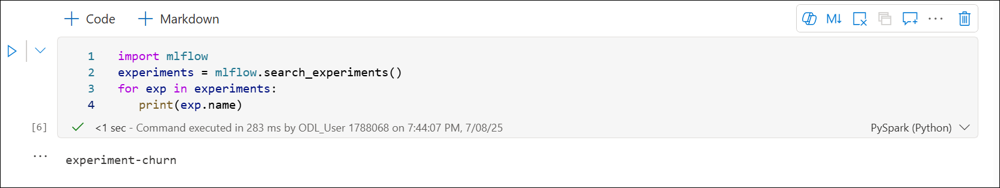

1. To retrieve a specific experiment by its name, add a new code cell with the following code and run it:

    ```python
   experiment_name = "experiment-churn"
   exp = mlflow.get_experiment_by_name(experiment_name)
   print(exp)
    ```

    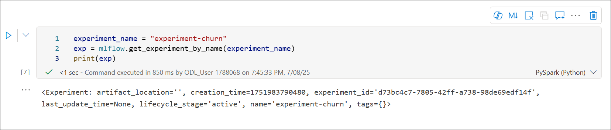

1. To retrieve all runs of an experiment using its name, add a new code cell with the following code and run it:

    ```python
   mlflow.search_runs(exp.experiment_id)
    ```

    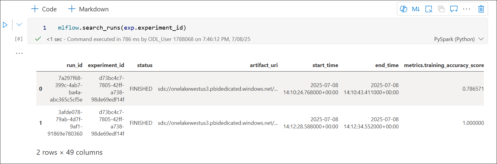

1. To more easily compare job runs and outputs, you can configure the search to order the results. For example, the following cell orders the results by `start_time`, and only shows a maximum of `2` results: 

    ```python
   mlflow.search_runs(exp.experiment_id, order_by=["start_time DESC"], max_results=2)
    ```

    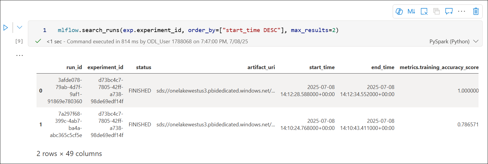

1. Finally, you can plot the evaluation metrics of multiple models next to each other to easily compare models:

    ```python
   import matplotlib.pyplot as plt
   
   df_results = mlflow.search_runs(exp.experiment_id, order_by=["start_time DESC"], max_results=2)[["metrics.training_accuracy_score", "params.estimator"]]
   
   fig, ax = plt.subplots()
   ax.bar(df_results["params.estimator"], df_results["metrics.training_accuracy_score"])
   ax.set_xlabel("Estimator")
   ax.set_ylabel("Accuracy")
   ax.set_title("Accuracy by Estimator")
   for i, v in enumerate(df_results["metrics.training_accuracy_score"]):
       ax.text(i, v, str(round(v, 2)), ha='center', va='bottom', fontweight='bold')
   plt.show()
    ```

    The output should resemble the following image:

    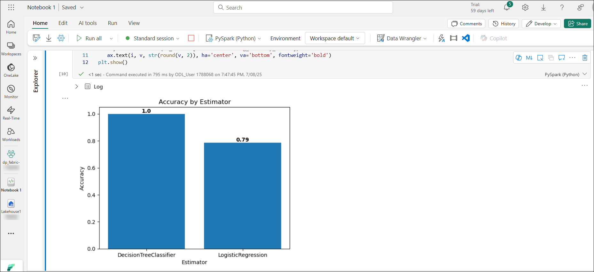

## Task 7: Explore your experiments

Learn how to analyze performance metrics and gain insights from your machine learning experiments in Microsoft Fabric. Explore various tools and techniques to evaluate and optimize your models effectively.

Microsoft Fabric will keep track of all your experiments and allow you to visually explore them.

1. On the left-hand navigation pane, click on **dp_fabric-<inject key="Deployment ID" enableCopy="false"/>** workspace to open it.
   
    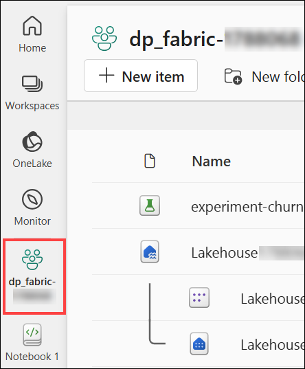

1. On the **dp_fabric-<inject key="Deployment ID" enableCopy="false"/>** workspace page, select the **experiment-churn** to open the experiment details.
   
    

    > **Tip:** If you don't see any logged experiment runs, refresh the page.

1. Review the **Run metrics** to explore how accurate your regression model is and assess its overall performance.

   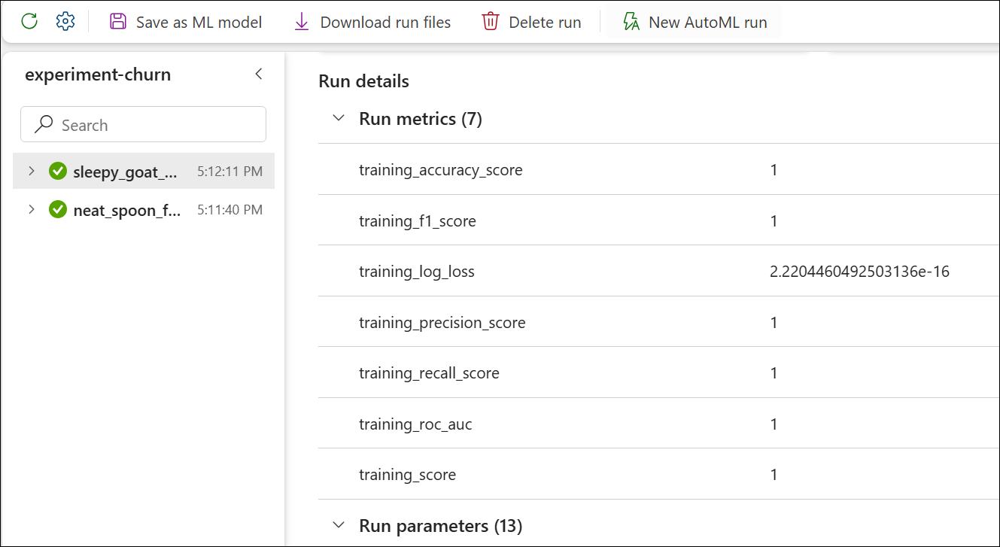

## Task 8: Save the model

In this task, you will learn how to save the trained Machine Learning model in Microsoft Fabric for future use and deployment.

After comparing machine learning models that you've trained across experiments, you can choose the best-performing model. To use the best-performing model, save the model and use it to generate predictions.

1. On the **experiment-churn** page, Select **Save as ML model** in the experiment ribbon.
   
   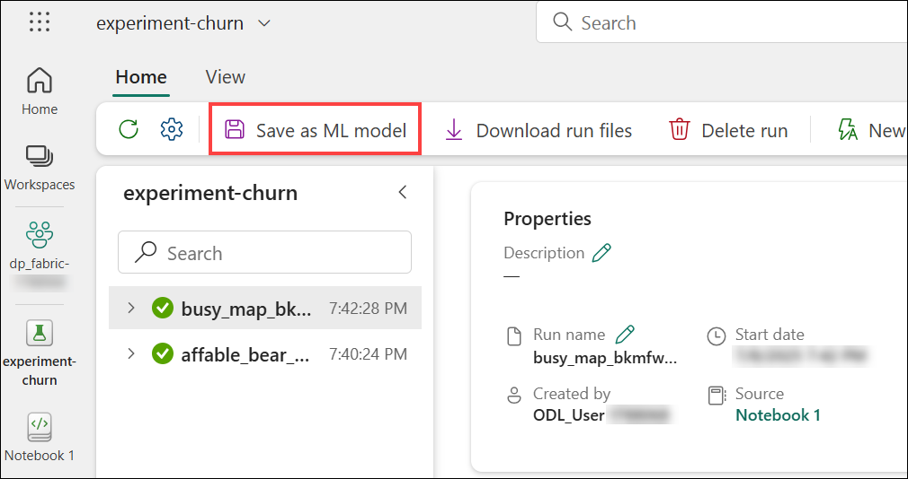

1. In the **Save as ML model** pop-up window, select **Create a new ML model (1)**, then Choose the **model** folder from the Select folder dropdown **(2)** . Enter **model-churn (3)** as the ML model name and click **Save (4)**. 

    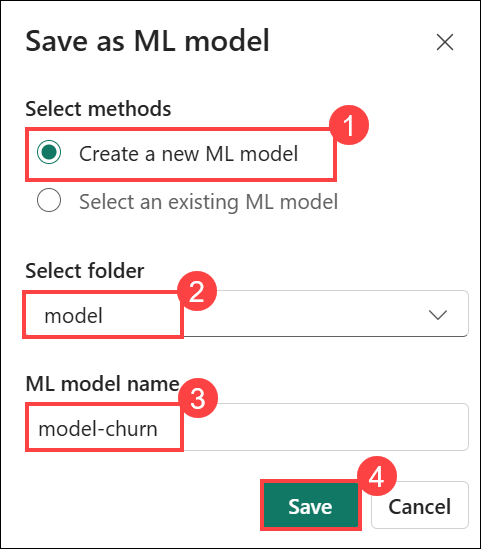

1. Select **View ML model** in the notification that appears at the top right of your screen when the model is created. You can also refresh the window. The saved model is linked under **ML model versions**.

   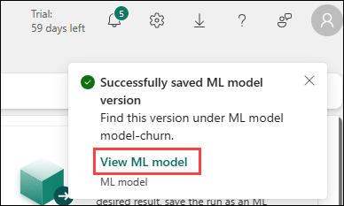

Note that the model, the experiment, and the experiment run are linked, allowing you to review how the model is trained.

## Task 9: Save the Notebook and end the Spark session

In this task, you will discover how to preserve your work by saving the Notebook and efficiently ending the Spark session in Microsoft Fabric to free up resources.

Now that you've finished training and evaluating the models, you can save the notebook with a meaningful name and end the Spark session.

1. On the notebook menu bar, click the ⚙️ **Settings (1)** icon to open the notebook settings pane. Set the **Name** of the notebook to **Train and compare models (2)**, then **close** the settings pane.

   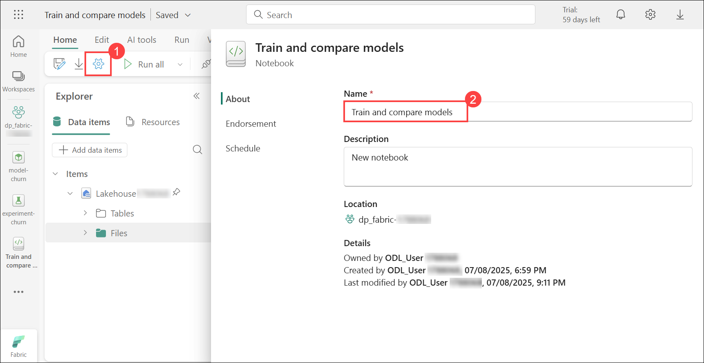

1. On the notebook menu, select **Stop session** to end the Spark session.

    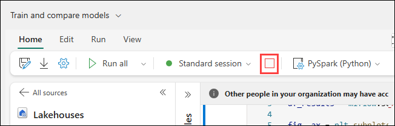

## Clean up resources

If you've finished exploring your model and experiments, you can delete the workspace you created for this exercise.

1. From the left-hand menu, click on **dp_fabric-<inject key="Deployment ID" enableCopy="false"/>** workspace to view all of the items it contains.

   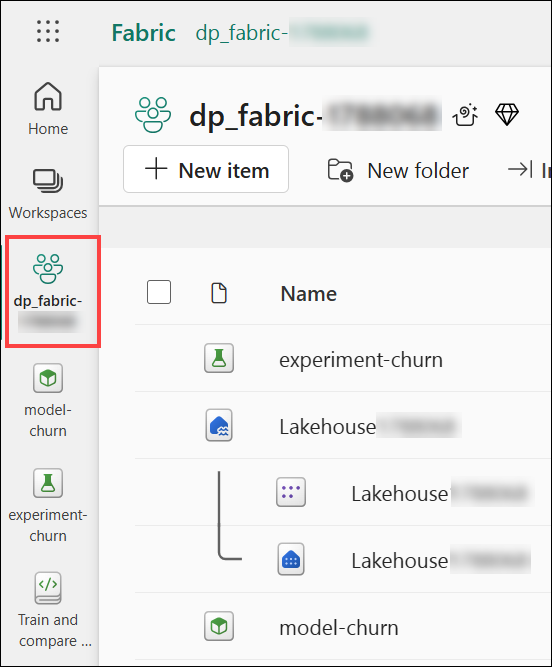

1. From the top right corner of the screen, click on **Workspace settings**.

   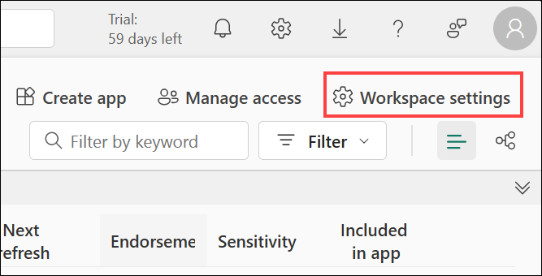

1. In the **Workspace settings**, under the **General** section, scroll down and click on **Remove this workspace** to delete it.

    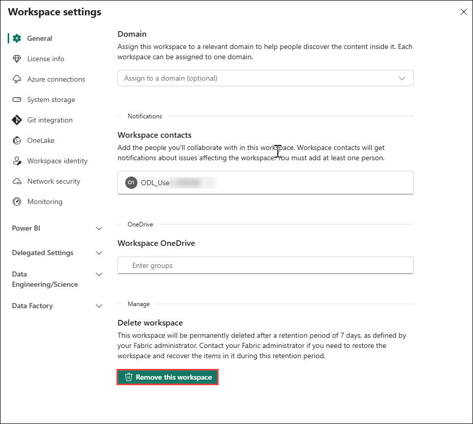

1. On the **Delete workspace?** pop-up, click **Delete**.

   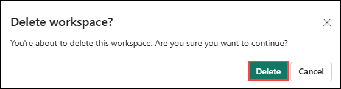

## Review:

In this lab, you have learned how to set up a data science workflow in Microsoft Fabric. You created a Lakehouse, uploaded data, and used Notebooks to explore and preprocess the data. You trained a machine learning model, tracked experiments using MLflow, and saved both the model and the Notebook. This hands-on experience demonstrated how Microsoft Fabric streamlines data science and AI development.

You have completed the following tasks:
 
- Create a workspace
- Created a Lakehouse and uploaded files
- Created a Notebook
- Loaded data into a dataframe
- Trained a Machine Learning model
- Used MLflow to search and view your experiments
- Explored your experiments
- Saved the model
- Saved the Notebook and ended the Spark session


## Congratulations! You have successfully completed this lab.
