# Lab 1: Get Started with Real-Time Analytics in Microsoft Fabric

#### Estimated Duration: 30 minutes

Microsoft Fabric provides an end-to-end platform for data solutions, including real-time data analytics. Synapse Real-Time Analytics in Fabric uses a KQL Database to provide table storage and Kusto Query Language (KQL) which is a powerful tool for analyzing data. This structure provides an efficient way to find insights and patterns from textual or structured data. Moreover, KQL is optimized for data that includes a time series component, such as real-time data from log files or streaming services. With Real-Time Analytics, you can focus and scale up your analytics solution while democratizing data for the needs for your entire data organization.

## Lab Objectives

You will be able to complete the following tasks:

- Task 1: Assign Fabric Administrator Role
- Task 2: Create a workspace and Download file for KQL database
- Task 3: Create a KQL database
- Task 4: Use KQL to query the sales table
- Task 5: Create a Power BI report from a KQL Query set

## Task 1: Assign Fabric Administrator Role

In this task, you will learn how to assign the Fabric Administrator role to manage permissions and access within Microsoft Fabric.

1. In the Azure portal, type **Microsoft Entra ID (1)** in the search box and select **Microsoft Entra ID (2)** from the results.

   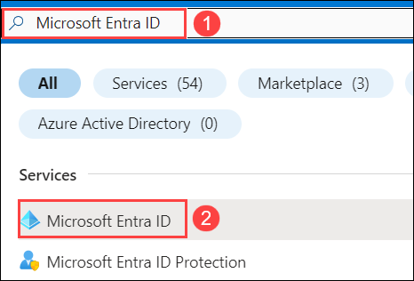

1. On the **Microsoft Entra ID** page, navigate to **Roles and administrators (1)**.

   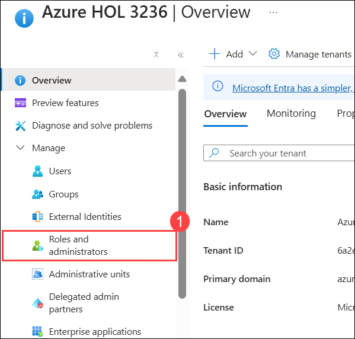

1. In the **Roles and administrators** page, type **Fabric Administrator (1)** in the search box and select **Fabric Administrator (2)** from the results.

   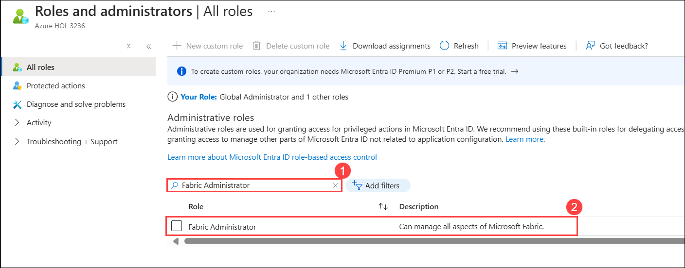

1. This will take you to the **Fabric Administrator | Assignments** page where you will have to assign yourself the **Fabric Administrator role**. Now, click on **+ Add assignments (1)**.

   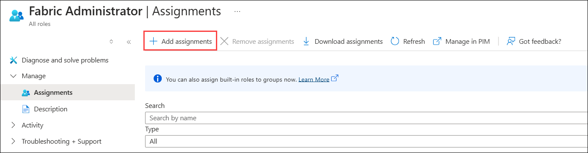

1. Make sure to **check the box (1)** next to  **<inject key="AzureAdUserEmail"></inject>**, confirm if it is **Selected (2)** and click on **Add (3)**.

   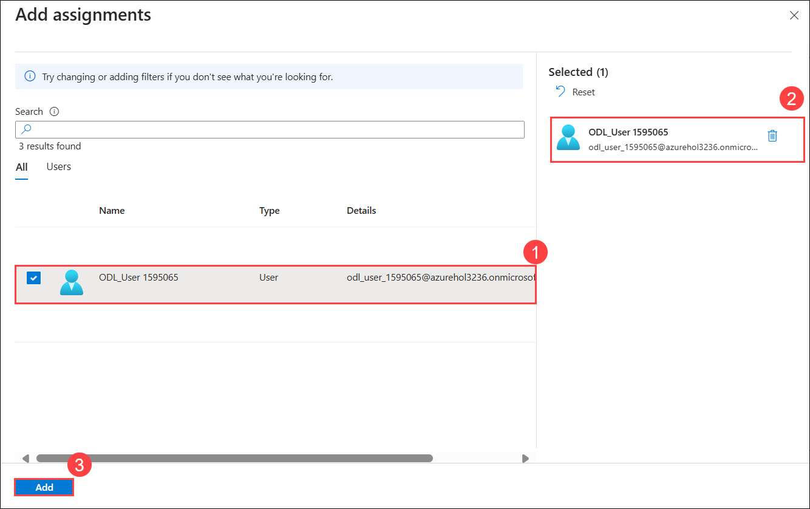

1. You can confirm the **Fabric Administrator** role has been added successfully by **Refresh** Fabric Administrators | Assignments page. After **confirming** it has been added successfully, navigate back to **Home**.

   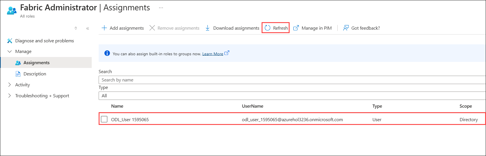

#### Congratulations! You have successfully completed this task. Please move on to the next task.

## Task 2 : Create a workspace

This task will guide you through creating a workspace in Microsoft Fabric.

1. Click on the **Microsoft Edge** browser in the virtual machine (VM) on the left, and navigate to [Microsoft Power BI Portal](https://app.powerbi.com). You will be navigated to the login page.

    > **Note:** If you're using the lab environment, it may sign you indirectly.

    > **Note:** If you are not using the lab environment and have an existing Power BI account, you may want to use the browser in private / incognito mode.

1. In the Power BI tab, provide the **Email/Username: <inject key="AzureAdUserEmail"></inject> (1)** and select **Submit (2)**.

   

1. Complete the sign in process by clicking on **Continue**

   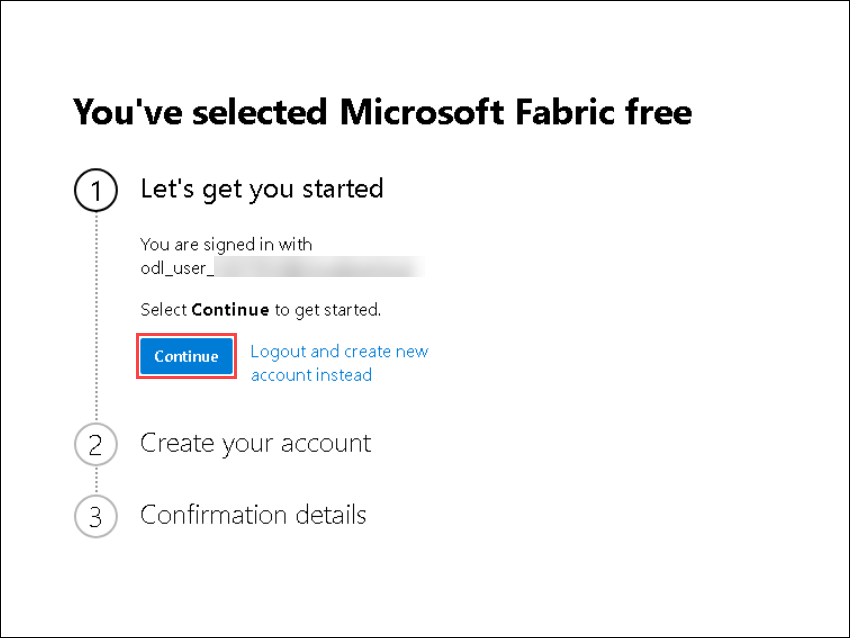
   
1. Enter a 10 digit phone number and select **Get started**. Select **Get started** once more. You will be redirected to Power BI. If prompted provide the **Password:** <inject key="AzureAdUserPassword"></inject>
   
   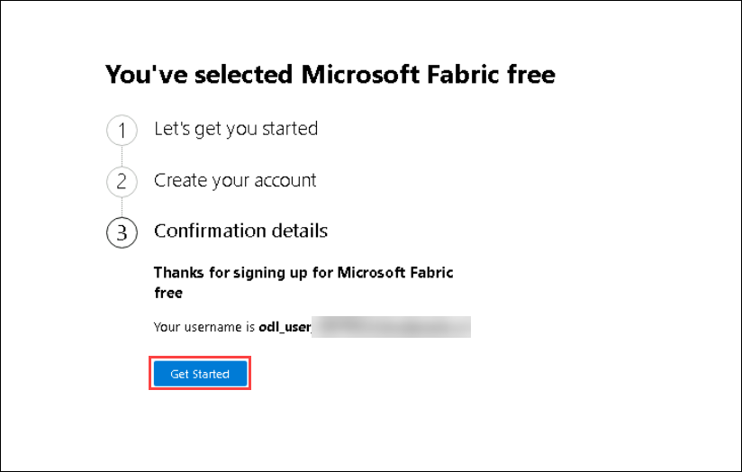
   
1. Leave the Microsoft Edge browser window open.

1. Select **Account manager (1)**, and click on **Free trial (2)**.

   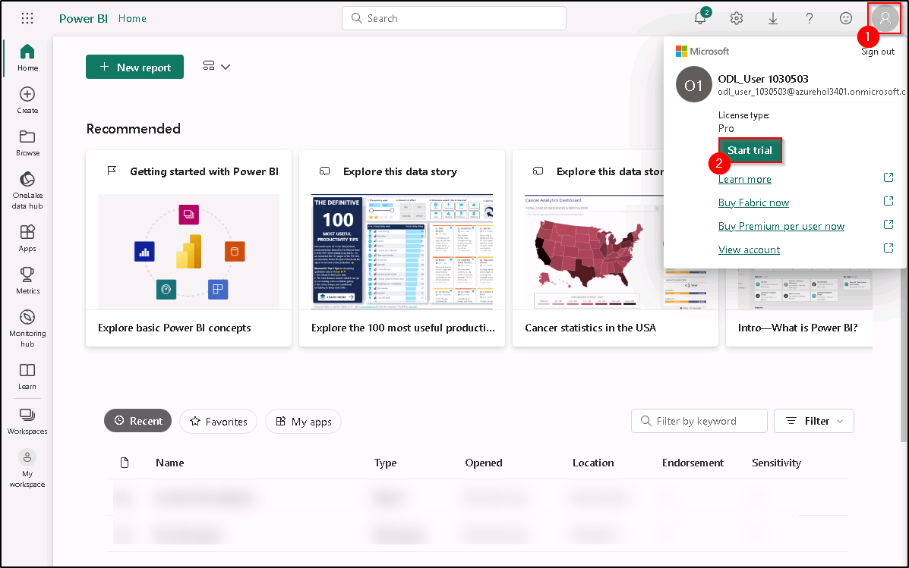

1. Upgrade to a free Microsoft Fabric trial dialog opens. Select **Activate**.

   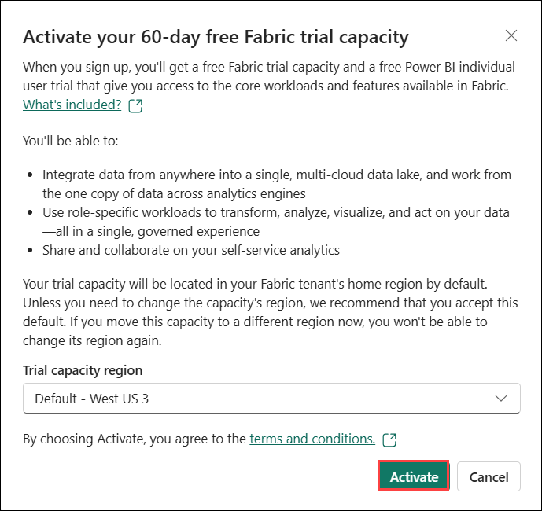

1. In the menu bar on the left, select **Workspaces (1)** (the icon looks similar to &#128455;) and click on **New workplace (2)**.

   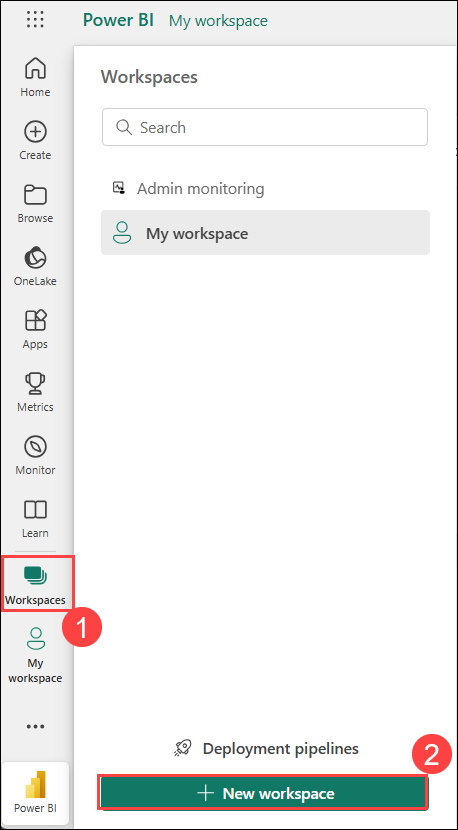

1. Create a new workspace named **dp_fabric-<inject key="Deployment ID" enableCopy="false"/> (1)**. Expand **Advanced**, then under **License mode**, select **Trial (2)** and click **Apply (3)** to create and open the workspace.
   
   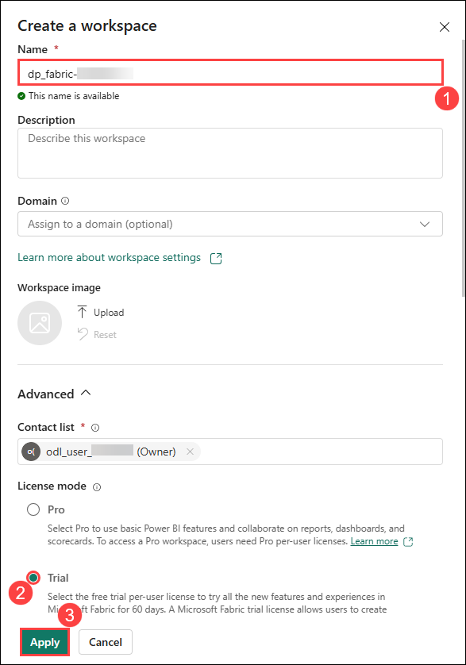

1. When your new workspace opens, it should be empty, as shown here:

   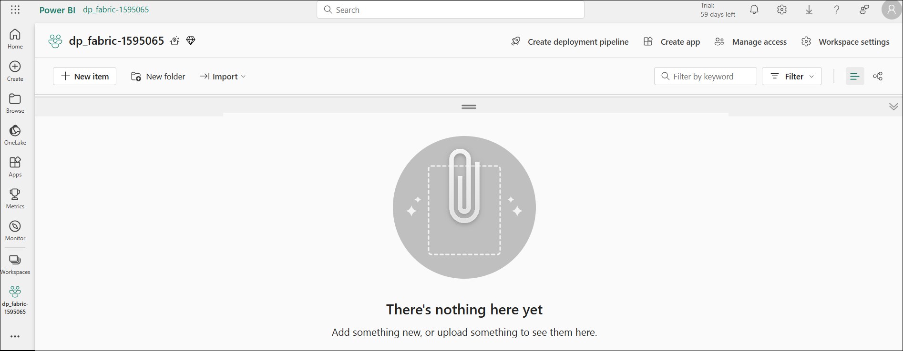
 
1. At the bottom left of the Power BI portal, select the **Power BI** icon and switch to the **Fabric** experience.

    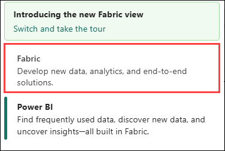

#### Congratulations! You have successfully completed this task. Please move on to the next task.

## Task 3 : Download file for KQL database and Create a KQL database

In this task, you will learn how to download a file for a KQL database and create a KQL database in Microsoft Fabric for querying and analyzing data efficiently.

Now that you have a workspace, switch to the *Synapse Real-Time Analytics* experience in the portal and download the data file for analysis. Using *Kusto Query Language (KQL)*, you can query static or streaming data in a table within a KQL database. To analyze sales data, create a table in the database and ingest the downloaded file.

1. Download the **sales.csv** data file for this exercise from **[Sales.csv](https://raw.githubusercontent.com/MicrosoftLearning/dp-data/main/sales.csv)** and save it on your local computer or lab VM. **Alternatively,** if you are using the provided lab virtual machine (lab VM), you can find the file in the **C:\LabFiles\dp-data-main** directory.

1. Return to browser window with **Microsoft Fabric** experience.

1. Navigate to **dp_fabric-<inject key="Deployment ID" enableCopy="false"/>** workspace from the hub menu bar on the left.

    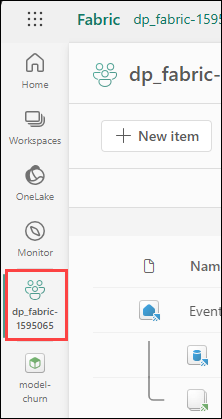

1. In the **dp_fabric-<inject key="Deployment ID" enableCopy="false"/>** page, click on **New item (1)** and in the search bar serch for **Eventhouse (2)** and select **Eventhouse (3)**.
   
   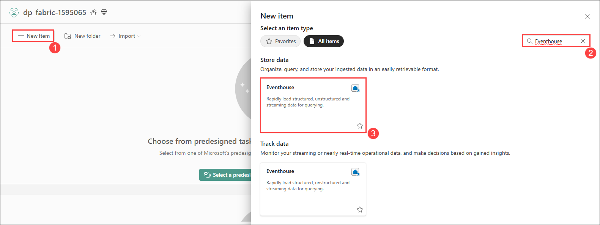

1. Enter **Eventhouse-<inject key="Deployment ID" enableCopy="false"/> (1)** as the name and click **Create (2)**.

    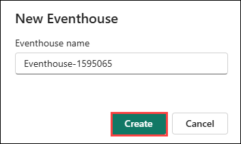

1. When the new eventhouse has been created, select the option to Get Data from **Local File**. 

    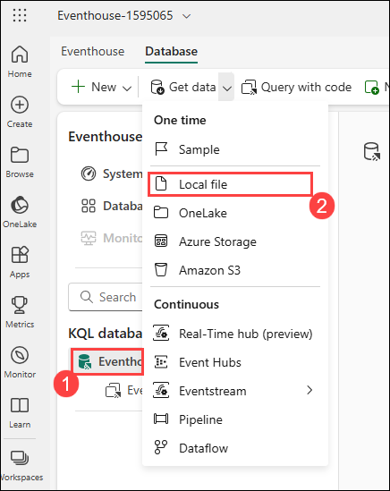

1. Then use the wizard to import the data into a new table by selecting the following options: 

    - **Select or create a destination table**:
        - **Database**: *The database you created is already selected*
        - **Table**: *Create a new table named* **sales** by clicking on the + sign to the left of ***New table***

          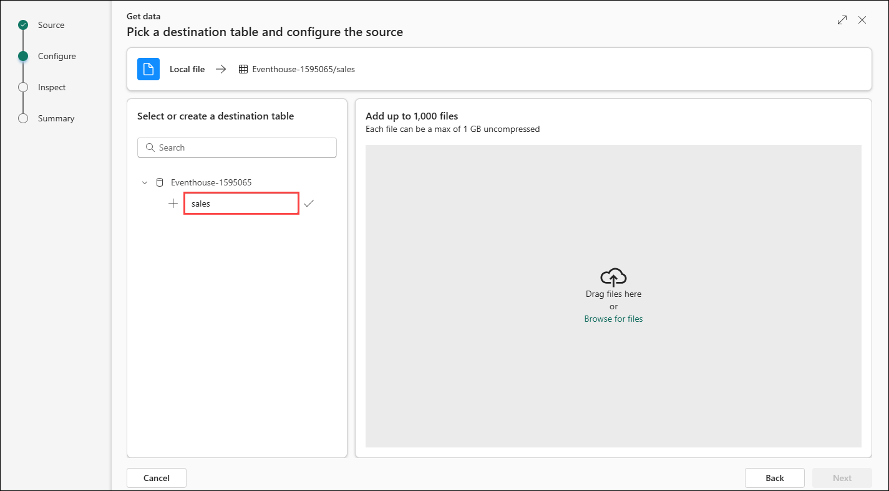

        - You will now see the **Drag files here or a Browse for files** hyperlink appear in the same window.

          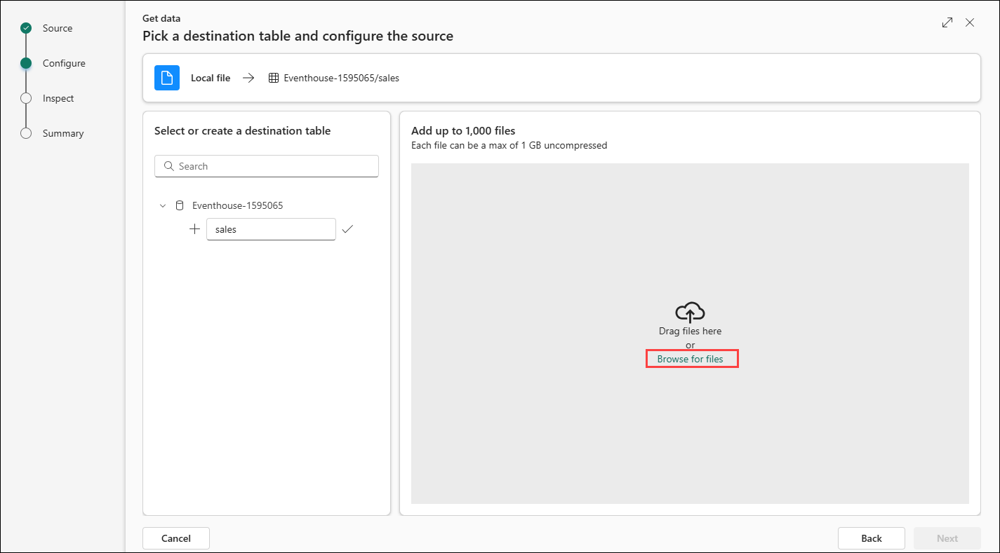

        - Browse or drag your **sales.csv** onto the screen and wait for the Status box to change to a green check box and then select **Next**

          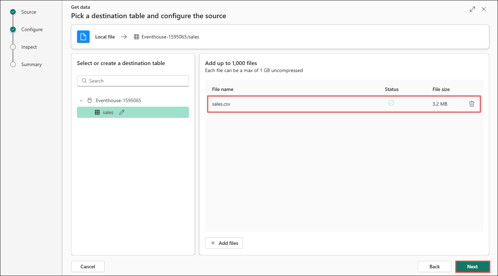

        - In this below screen, you'll notice that the column headings are in the first row. Although the system has detected them, we still need to move the **First row is column header** slider above these lines to prevent any errors. Once you adjust the slider, everything should appear correctly. Finally, click the **Finish** button in the bottom right corner of the panel to proceed.

          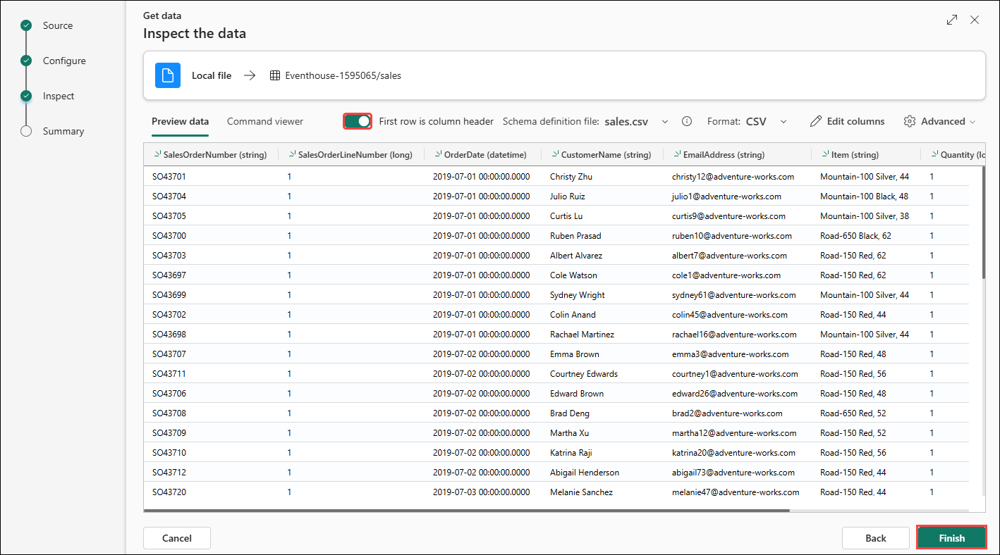

        - Wait for the steps in the summary screen to complete which include:
            - Create table (sales)
            - Create mapping (sales_mapping)
            - Data queuing
            - Blob ingestion
        - Select the **Close** button

          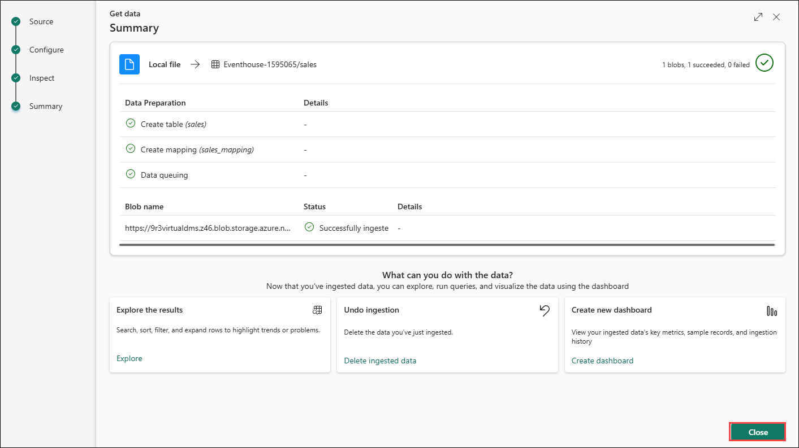

> **Note**: In this task, you imported a very small amount of static data from a file, which is fine for the purposes of this task. In reality, you can use Kusto to analyze much larger volumes of data; including real-time data from a streaming source such as Azure Event Hubs.

#### Congratulations! You have successfully completed this task. Please move on to the next task.

## Task 4 : Use KQL to query the sales table

This task will walk you through using KQL (Kusto Query Language) to query the Sales table and analyze data efficiently in Microsoft Fabric.

Now that you have a table of data in your database, you can use KQL code to query it.

1. Make sure you have the **sales (1)** table highlighted. From the menu bar, select the **Query with code (2)** drop-down, and from there select **Show any 100 records (3)** .

   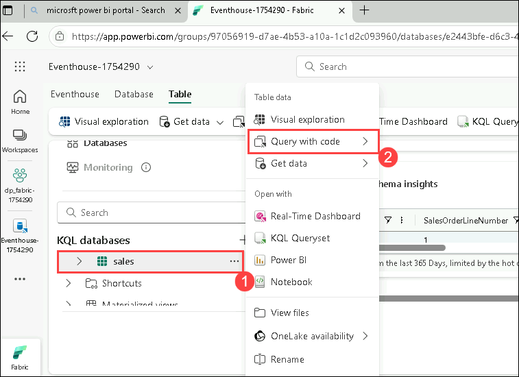

1. A new pane will open with the query and its result. 

1. Modify the query as follows:

    ```kusto
   sales
   | where Item == 'Road-250 Black, 48'
    ```

1. Run the query. Then review the results, which should contain only the rows for sales orders for the *Road-250 Black, 48* product.

1. Modify the query as follows:

    ```kusto
   sales
   | where Item == 'Road-250 Black, 48'
   | where datetime_part('year', OrderDate) > 2020
    ```

1. Run the query and review the results, which should contain only sales orders for *Road-250 Black, 48* made after 2020.

1. Modify the query as follows:

    ```kusto
   sales
   | where OrderDate between (datetime(2020-01-01 00:00:00) .. datetime(2020-12-31 23:59:59))
   | summarize TotalNetRevenue = sum(UnitPrice) by Item
   | sort by Item asc
    ```

1. Run the query and review the results, which should contain the total net revenue for each product between January 1st and December 31st 2020 in ascending order of product name.

1. Navigate to **dp_fabric-<inject key="Deployment ID" enableCopy="false"/>** workspace from the hub menu bar on the left.

    

1. Select **KQL Queryset** from the list.

   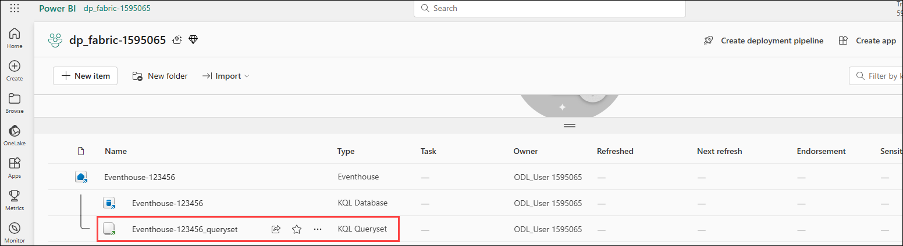

1. Change the name of KQL queryset to **Revenue by Product** and click on **Save**.

   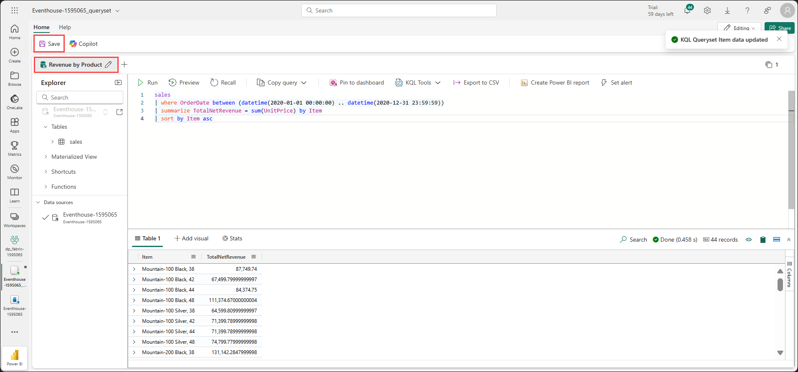

#### Congratulations! You have successfully completed this task. Please move on to the next task.

## Task 5 : Create a Power BI report from a KQL Query set

This task will guide you through visualizing and analyzing data effectively by creating a Power BI report using a KQL query set. You will learn how to transform query results into insightful reports and dashboards.

You can use your KQL Queryset as the basis for a Power BI report.

1. In the query workbench editor for your query set, run the query and wait for the results.

1. Select **Build Power BI report** and wait for the report editor to open.

1. In the report editor, in the **Data** pane, expand **Kusto Query Result** and select the **Item** and **TotalRevenue** fields.

1. On the report design canvas, select the table visualization that has been added and then in the **Visualizations** pane, select **Clustered bar chart**.

    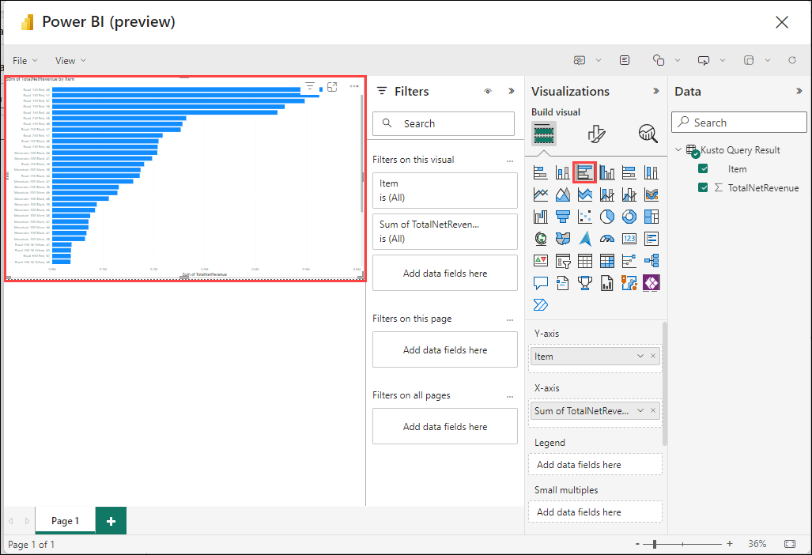

1. In the **Power BI** window, in the **File (1)** menu, select **Save (2)**. 

   

1. Then save the report as **Revenue by Item.pbix** in the workspace where your lakehouse and select your workplace from the dropdown.

1. Close the **Power BI** window, and in the bar on the left, select the icon for your workspace.

    Refresh the Workspace page if necessary to view all of the items it contains.

1. In the list of items in your workspace, note that the **Revenue by Item** report is listed.

#### Congratulations! You have successfully completed this task.

## Review:

In this lab, you have the opportunity to explore Microsoft Fabric as a platform for real-time analytics using Synapse Real-Time Analytics and Kusto Query Language (KQL). You will learn to assign the Fabric Administrator role, create a workspace, set up a KQL database, query data, and generate a Power BI report from KQL queries. This lab demonstrates how to efficiently analyze real-time data using KQL, particularly for time-series data like logs and streaming services.

You have completed the following tasks:

- Assigned Fabric Administrator Role
- Created a workspace
- Downloaded file for KQL database and Created a KQL database
- Used KQL to query the sales table
- Created a Power BI report from a KQL Query set

## You have successfully completed the lab, please click on next
