# Lab 2: Get started with data science in Microsoft Fabric

### Estimated Duration: 45 minutes

Data science is a combination of mathematics, statistics, and computer engineering. When you perform data science, you can analyze your data and identify complicated patterns that can provide you with meaningful insights for your organization. You can use data science to create artificial intelligence (AI) models that encompass the complicated patterns you find in your data. A common approach is to use data science to train machine learning models using libraries like scikit-learn in Python to achieve AI.

## Lab Objectives

You will be able to complete the following tasks:

- Task 1: Create a Lakehouse and upload files
- Task 2: Create a Notebook
- Task 3: Load data into a dataframe
- Task 4: Train a Machine Learning model
- Task 5: Use MLflow to search and view your experiments
- Task 6: Explore your experiments
- Task 7: Save the model
- Task 8: Save the Notebook and end the Spark session

## Task 1 : Create a Lakehouse and upload files

In this task, you will learn how to create a Lakehouse in Microsoft Fabric and upload files for data storage and processing.

Now that you have a workspace, it's time to switch to the *Data science* experience in the portal and create a data lakehouse for the data files you're going to analyze.

1. Navigate to **dp_fabric-<inject key="Deployment ID" enableCopy="false"/>** workspace from the hub menu bar on the left.

    

1. In the **dp_fabric-<inject key="Deployment ID" enableCopy="false"/>** page, click on **New item (1)** and in the search bar serch for **Lakehouse (2)** and select **Lakehouse (3)**.
   
   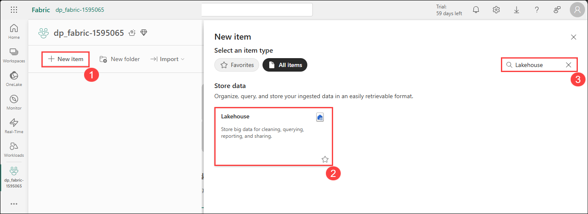

1. Enter **Lakehouse<inject key="Deployment ID" enableCopy="false"/> (1)** as the name and click **Create (2)**.

    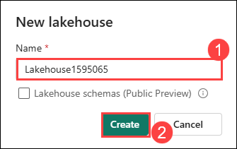

    >**Note:** After a minute or so, a new lakehouse with no **Tables** or **Files** will be created. You need to ingest some data into the data lakehouse for analysis. There are multiple ways to do this, but in this exercise you'll simply download and extract a folder of text files your local computer (or lab VM if applicable) and then upload them to your lakehouse.

1. Download the **churn.csv** file for this exercise from **[churn.csv](https://raw.githubusercontent.com/MicrosoftLearning/dp-data/main/churn.csv)** and save it on your local computer or lab VM. **Alternatively,** if you are using the provided lab virtual machine (lab VM), you can find the file in the **C:\LabFiles\dp-data-main** directory.

1. Return to the web browser tab containing your lakehouse, and under **Get data in your lakehouse**  select **Upload files**.

    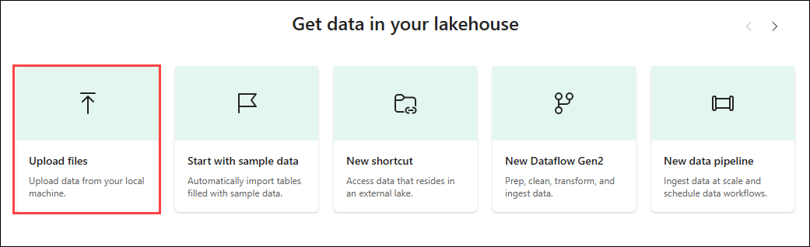

1. Upload the **churn.csv** file from your local computer (or lab VM if applicable) to the lakehouse.

   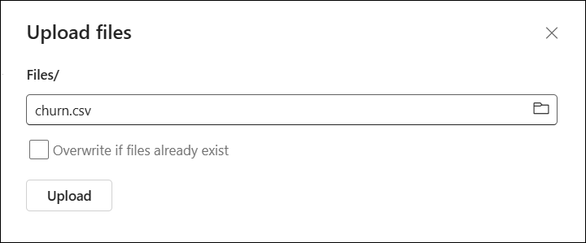

1. After the files have been uploaded, select **Files** and verify that the CSV file have been uploaded.

   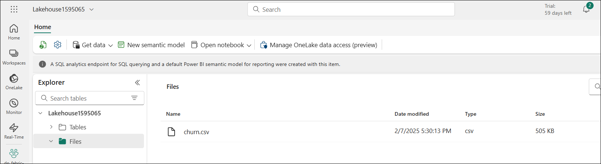

#### Congratulations! You have successfully completed this task. Please move on to the next task.

## Task 2 : Create a Notebook

In this task, you will learn how to create a Notebook in Microsoft Fabric for interactive data exploration and analysis.

To train a model, you can create a *notebook*. Notebooks provide an interactive environment in which you can write and run code (in multiple languages) as *experiments*.

1. Navigate to **dp_fabric-<inject key="Deployment ID" enableCopy="false"/>** workspace from the hub menu bar on the left.

    

1. In the **dp_fabric-<inject key="Deployment ID" enableCopy="false"/>** page, click on **New item** and in the search bar serch for **Notebook (1)** and select **Notebook (2)**.

     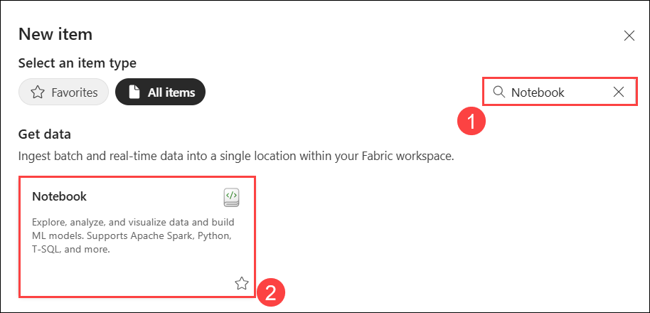

    After a few seconds, a new notebook containing a single *cell* will open. Notebooks are made up of one or more cells that can contain *code* or *markdown* (formatted text).

1. Select the first cell (which is currently a *code* cell), and then in the dynamic tool bar at its top-right, use the **M&#8595;** button to convert the cell to a *markdown* cell.

    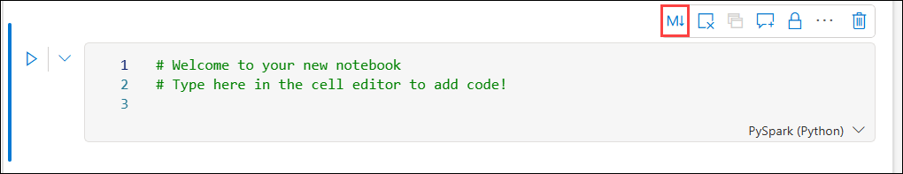

    When the cell changes to a markdown cell, the text it contains is rendered.

1. Use the **&#128393;** (Edit) button to switch the cell to editing mode.

   

1. Delete the content and enter the following text:

    ```text
   # Train a machine learning model and track with MLflow

   Use the code in this notebook to train and track models.
    ``` 
#### Congratulations! You have successfully completed this task. Please move on to the next task.

## Task 3 : Load data into a dataframe

In this task, you will learn how to load data into a DataFrame in Microsoft Fabric for processing and analysis.

Now you're ready to run code to prepare data and train a model. To work with data, you'll use *dataframes*. Dataframes in Spark are similar to Pandas dataframes in Python, and provide a common structure for working with data in rows and columns.

1. Select **Lakehouses** from the explorer.

   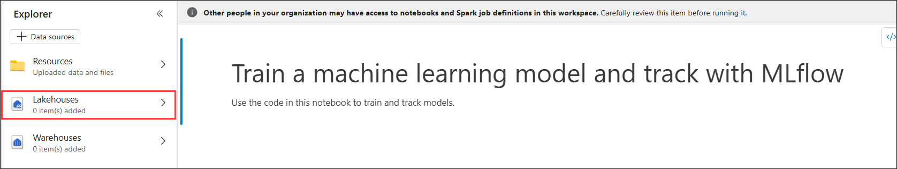

1. In the **Add lakehouse** pane, select **Add** to add a lakehouse.

   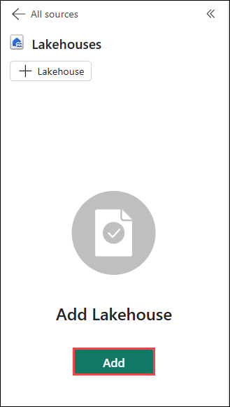

1. Select **Existing Lakehouse without Schema** in Add Lakehouse pane and select **Add**.

    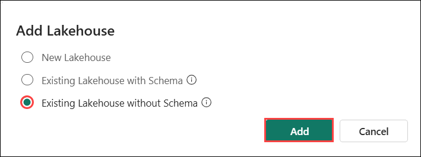

1. Select the lakehouse you created in a previous section and select **Add**

   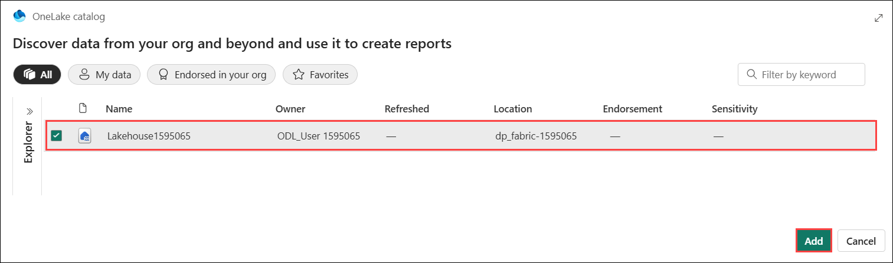

1. Select the **Files (1)** folder so that the CSV file is listed next to the notebook editor.

1. In the **...** menu for **churn.csv (2)**, select **Load data (3)** > **Pandas (4)**. 

    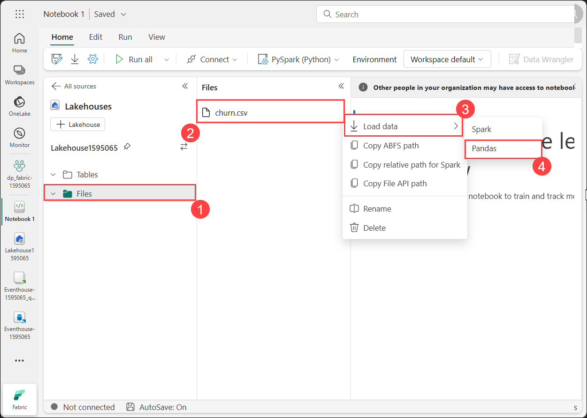

1. A new code cell containing the following code should be added to the notebook:

    ```python
   import pandas as pd
   # Load data into pandas DataFrame from "/lakehouse/default/" + "Files/churn.csv"
   df = pd.read_csv("/lakehouse/default/" + "Files/churn.csv")
   display(df)
    ```

    > **Tip**: You can hide the pane containing the files on the left by using its **<<** icon. Doing so will help you focus on the notebook.

1. Use the **&#9655; Run cell** button on the left of the cell to run it.

    > **Note**: Since this is the first time you've run any Spark code in this session, the Spark pool must be started. This means that the first run in the session can take a minute or so to complete. Subsequent runs will be quicker.

1. When the cell command has completed, review the output below the cell, which should look similar to this:

    |Index|CustomerID|years_with_company|total_day_calls|total_eve_calls|total_night_calls|total_intl_calls|average_call_minutes|total_customer_service_calls|age|churn|
    | -- | -- | -- | -- | -- | -- | -- | -- | -- | -- | -- |
    |1|1000038|0|117|88|32|607|43.90625678|0.810828179|34|0|
    |2|1000183|1|164|102|22|40|49.82223317|0.294453889|35|0|
    |3|1000326|3|116|43|45|207|29.83377967|1.344657937|57|1|
    |4|1000340|0|92|24|11|37|31.61998183|0.124931779|34|0|
    | ... | ... | ... | ... | ... | ... | ... | ... | ... | ... | ... |

    The output shows the rows and columns of customer data from the churn.csv file.

#### Congratulations! You have successfully completed this task. Please move on to the next task.

## Task 4 : Train a Machine Learning model

In this task, you will learn how to train a Machine Learning model in Microsoft Fabric using a dataset to make predictions and gain insights.

Now that you've loaded the data, you can use it to train a machine learning model and predict customer churn. You'll train a model using the Scikit-Learn library and track the model with MLflow. 

1. Use the **+ Code** icon below the cell output to add a new code cell to the notebook.

   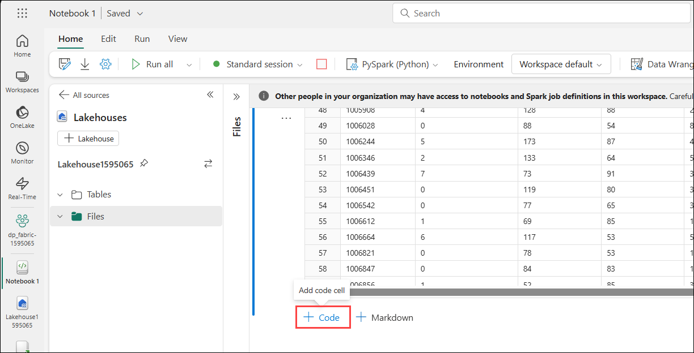

1. Enter the following code in it. If the **+ Code** icon isn't visible, hover below the cell to make it appear.:

    ```python
   from sklearn.model_selection import train_test_split

   print("Splitting data...")
   X, y = df[['years_with_company','total_day_calls','total_eve_calls','total_night_calls','total_intl_calls','average_call_minutes','total_customer_service_calls','age']].values, df['churn'].values
   
   X_train, X_test, y_train, y_test = train_test_split(X, y, test_size=0.30, random_state=0)
    ```

    

1. Run the code cell you added, and note you're omitting 'CustomerID' from the dataset, and splitting the data into a training and test dataset.
1. Add another new code cell to the notebook, enter the following code in it, and run it:
    
    ```python
   import mlflow
   experiment_name = "experiment-churn"
   mlflow.set_experiment(experiment_name)
    ```
    
    The code creates an MLflow experiment named `experiment-churn`. Your models will be tracked in this experiment.

    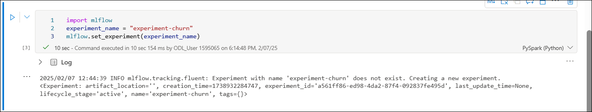

1. Add another new code cell to the notebook, enter the following code in it, and run it:

    ```python
   from sklearn.linear_model import LogisticRegression
   
   with mlflow.start_run():
       mlflow.autolog()

       model = LogisticRegression(C=1/0.1, solver="liblinear").fit(X_train, y_train)

       mlflow.log_param("estimator", "LogisticRegression")
    ```
    
    The code trains a classification model using Logistic Regression. Parameters, metrics, and artifacts, are automatically logged with MLflow. Additionally, you're logging a parameter called `estimator`, with the value `LogisticRegression`.

    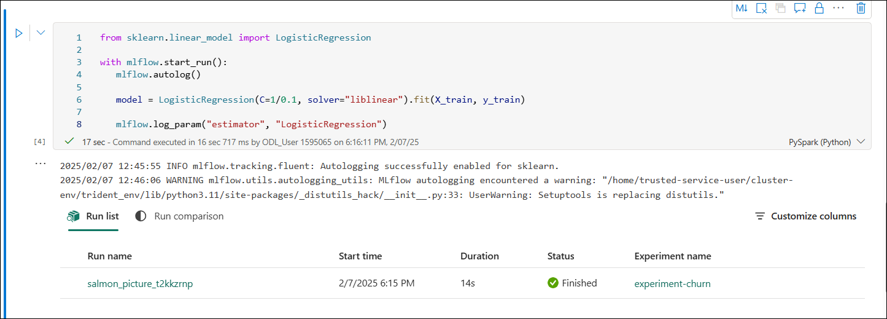

1. Add another new code cell to the notebook, enter the following code in it, and run it:

    ```python
   from sklearn.tree import DecisionTreeClassifier
   
   with mlflow.start_run():
       mlflow.autolog()

       model = DecisionTreeClassifier().fit(X_train, y_train)
   
       mlflow.log_param("estimator", "DecisionTreeClassifier")
    ```

    The code trains a classification model using Decision Tree Classifier. Parameters, metrics, and artifacts, are automatically logged with MLflow. Additionally, you're logging a parameter called `estimator`, with the value `DecisionTreeClassifier`.

    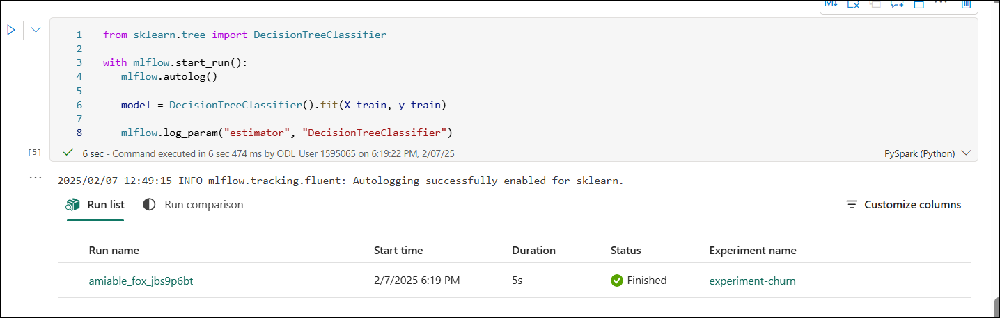

#### Congratulations! You have successfully completed this task. Please move on to the next task.

## Task 5 : Use MLflow to search and view your experiments

In this task, you will learn how to use MLflow to search and view your machine learning experiments in Microsoft Fabric for tracking and managing model performance.

When you've trained and tracked models with MLflow, you can use the MLflow library to retrieve your experiments and its details.

1. To list all experiments, use the following code:

    ```python
   import mlflow
   experiments = mlflow.search_experiments()
   for exp in experiments:
       print(exp.name)
    ```

   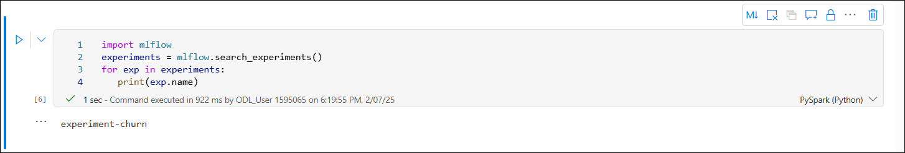

1. To retrieve a specific experiment, you can get it by its name:

    ```python
   experiment_name = "experiment-churn"
   exp = mlflow.get_experiment_by_name(experiment_name)
   print(exp)
    ```

    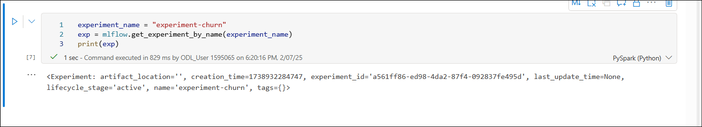

1. Using an experiment name, you can retrieve all jobs of that experiment:

    ```python
   mlflow.search_runs(exp.experiment_id)
    ```
    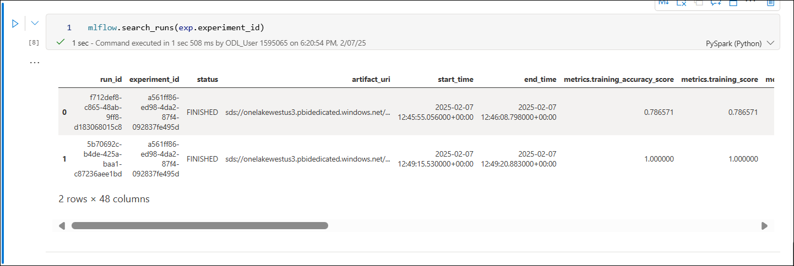

1. To more easily compare job runs and outputs, you can configure the search to order the results. For example, the following cell orders the results by `start_time`, and only shows a maximum of `2` results: 

    ```python
   mlflow.search_runs(exp.experiment_id, order_by=["start_time DESC"], max_results=2)
    ```

    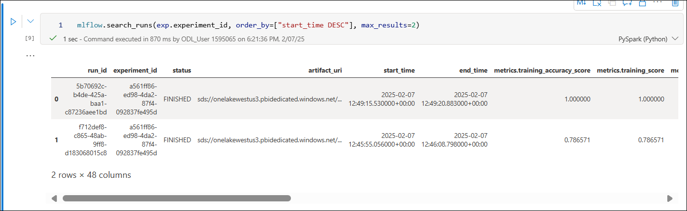

1. Finally, you can plot the evaluation metrics of multiple models next to each other to easily compare models:

    ```python
   import matplotlib.pyplot as plt
   
   df_results = mlflow.search_runs(exp.experiment_id, order_by=["start_time DESC"], max_results=2)[["metrics.training_accuracy_score", "params.estimator"]]
   
   fig, ax = plt.subplots()
   ax.bar(df_results["params.estimator"], df_results["metrics.training_accuracy_score"])
   ax.set_xlabel("Estimator")
   ax.set_ylabel("Accuracy")
   ax.set_title("Accuracy by Estimator")
   for i, v in enumerate(df_results["metrics.training_accuracy_score"]):
       ax.text(i, v, str(round(v, 2)), ha='center', va='bottom', fontweight='bold')
   plt.show()
    ```

    The output should resemble the following image:

    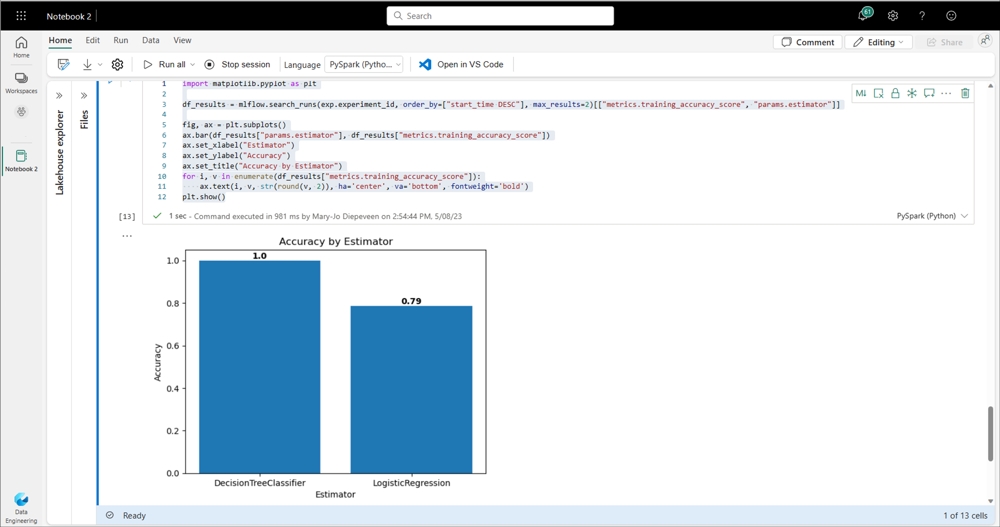

#### Congratulations! You have successfully completed this task. Please move on to the next task.

## Task 6 : Explore your experiments

In this task, you will learn how to explore your machine learning experiments in Microsoft Fabric to analyze performance metrics and insights.

Microsoft Fabric will keep track of all your experiments and allows you to visually explore them.

1. Navigate to **dp_fabric-<inject key="Deployment ID" enableCopy="false"/>** workspace from the hub menu bar on the left.

    

1. Select the `experiment-churn` experiment to open it.

    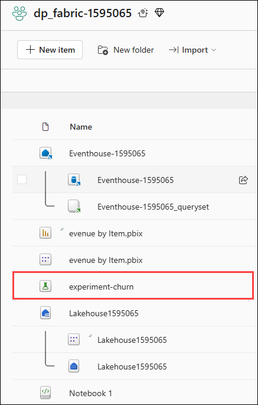

    > **Tip:** If you don't see any logged experiment runs, refresh the page.

1. Review the **Run metrics** to explore accurate your regression model is.

#### Congratulations! You have successfully completed this task. Please move on to the next task.

## Task 7 : Save the model

In this task, you will learn how to save the trained Machine Learning model in Microsoft Fabric for future use and deployment.

After comparing machine learning models that you've trained across experiments, you can choose the best performing model. To use the best performing model, save the model and use it to generate predictions.

1. Select **Save as ML model** in the experiment ribbon.
   
   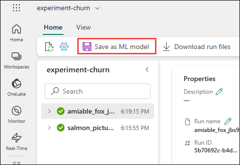

1. In the newly opened pop-up window, select **Create a new ML model**, then choose the `model` **(1)** folder. Enter **model-churn** as the name **(2)** and click **Save (3)**.

    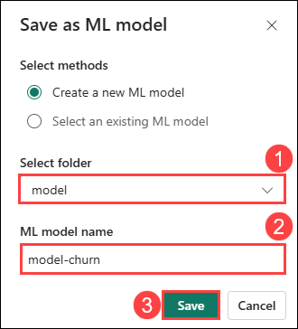

1. Select **View ML model** in the notification that appears at the top right of your screen when the model is created. You can also refresh the window. The saved model is linked under **ML model versions**.

   

Note that the model, the experiment, and the experiment run are linked, allowing you to review how the model is trained.

#### Congratulations! You have successfully completed this task. Please move on to the next task.

## Task 8 : Save the Notebook and end the Spark session

In this task, you will learn how to save the Notebook and end the Spark session in Microsoft Fabric to preserve your work and free up resources.

Now that you've finished training and evaluating the models, you can save the notebook with a meaningful name and end the Spark session.

1. In the notebook menu bar, click the ⚙️ **Settings (1)** icon to open the notebook settings. Set the **Name** of the notebook to **Train and compare models (2)**, then **close (3)** the settings pane.

   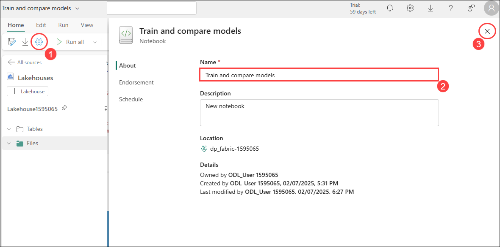

1. On the notebook menu, select **Stop session** to end the Spark session.

    

#### Congratulations! You have successfully completed this task.

## Clean up resources

If you've finished exploring your model and experiments, you can delete the workspace you created for this exercise.

1. In the bar on the left, select the **dp_fabric-<inject key="Deployment ID" enableCopy="false"/>** to view all of the items it contains.

   

1. From the top right corner, click on **Workspace settings**.

   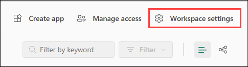

1. In the **General** section, scroll down and select **Remove this workspace** .

    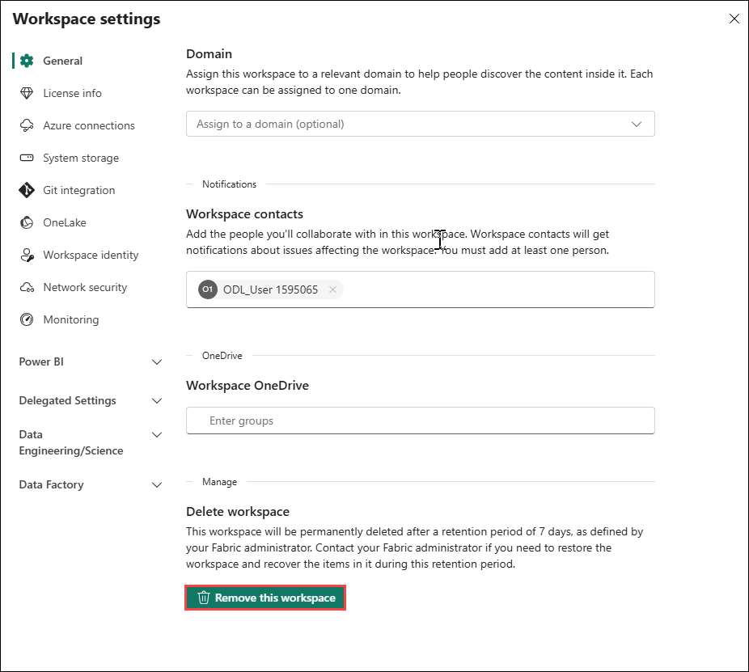

1. In the **Delete workspace** pop-up, click **Delete**.

   

#### Congratulations! You have successfully cleaned up the resources.

## Review:
You have completed the following tasks:

- Created a Lakehouse and upload files
- Created a Notebook
- Loaded data into a dataframe
- Trained a Machine Learning model
- Used MLflow to search and view your experiments
- Explored your experiments
- Saved the model
- Saved the Notebook and ended the Spark session

## Congratulations! you have successfully completed this lab.
