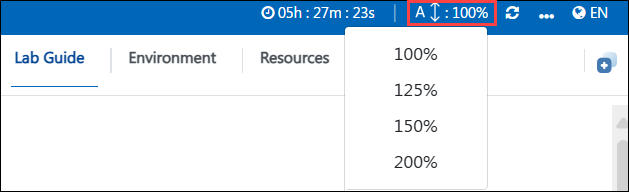

# Get started with Real-Time Analytics and Data science with Microsoft Fabric

This hands-on lab provides an immersive experience in real-time analytics and data science using Microsoft Fabric. We've set up a seamless environment for you to explore and learn about Microsoft Fabric services. 

## Objectives

- **Real-Time Analytics in Microsoft Fabric** : In this lab, you'll learn how to process and analyze real-time data using Microsoft Fabric. You'll explore key services such as event processing, data streaming, and analytics integration to gain insights from live data efficiently.
- **Data science in Microsoft Fabric** : In this lab, you'll learn how to leverage Microsoft Fabric for data science, from data preparation to model training and deployment. 

## Prerequisites

- Basic understanding of cloud computing and data analytics concepts.  
- Familiarity with Microsoft Azure services.  
- A Microsoft Fabric-enabled workspace with necessary permissions.  
- Access to Microsoft Fabric services such as OneLake, Data Engineering, and Data Science experiences.  

## Architecture

 These labs utilize a step-by-step workflow for data processing and machine learning processes. Lab 1 focuses on setting up a workspace, querying data with KQL, and generating PBI reports. Lab 2 involves uploading files in the datalake, training machine learning models, conducting experiments with MLflow, and saving the model and notebook.

## Architecture Diagram

## Explanation of Components

The architecture for this lab involves several key components:

- **Workspace**: A centralized environment for managing resources, projects, and collaboration.
- **KQL Database**: A structured database supporting Kusto Query Language (KQL) for analyzing large datasets efficiently.
- **KQL Querysets**: Predefined queries using KQL to extract, manipulate, and visualize data.
- **PBI**: Power BI-generated reports for data visualization and insights.
- **Lakehouse**: A unified storage solution combining data lakes and warehouses for scalable analytics.
- **Notebook**: An interactive document for writing, executing, and visualizing code, commonly used in data science and engineering.

## Getting Started with the Lab
Welcome to Real-Time Analytics and data science with Microsoft Fabric Workshop! We've prepared a seamless environment for you to explore and learn about fabric services. Let's begin by making the most of this experience.

## Accessing Your Lab Environment

Once you're ready to dive in, your virtual machine and lab guide will be right at your fingertips within your web browser.
 

 
## Exploring Your Lab Resources
 
To get a better understanding of your lab resources and credentials, navigate to the **Environment Details** tab.
 

 
## Utilizing the Split Window Feature
 
For convenience, you can open the lab guide in a separate window by selecting the **Split Window** button from the top right corner.
 

 
## Managing Your Virtual Machine
 
Feel free to start, stop, or restart your virtual machine as needed from the **Resources** tab. Your experience is in your hands!
 

 
1. ## Lab Guide Zoom In/Zoom Out
 
1. To adjust the zoom level for the environment page, click the **A↕ : 100%** icon located next to the timer in the lab environment.

     

### Support Contact
The CloudLabs support team is available 24/7, 365 days a year, via email and live chat to ensure seamless assistance at any time. We offer dedicated support channels tailored specifically for both learners and instructors, ensuring that all your needs are promptly and efficiently addressed.
 
Learner Support Contacts:
 
- Email Support: cloudlabs-support@spektrasystems.com
- Live Chat Support: https://cloudlabs.ai/labs-support

Now you're all set to explore the powerful world of technology. Feel free to reach out if you have any questions along the way. Enjoy your workshop!

Now, click on **Next** from the lower right corner to move on to the next page.

  
 
### Happy learning!
