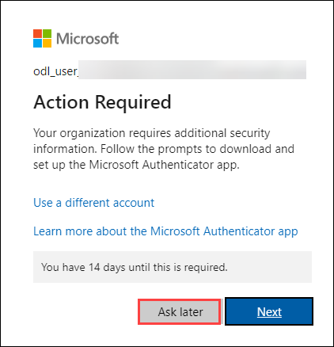

# Get started with Data Science with Microsoft Fabric
# Before Hands-On Lab 

### Overall Estimated Duration: 4 Hours

## Prerequisites

- Basic understanding of cloud computing and data analytics concepts.  
- Familiarity with Microsoft Azure services.  
- A Microsoft Fabric-enabled workspace with necessary permissions.  
- Access to Microsoft Fabric services such as OneLake, Data Engineering, and Data Science experiences.  
- Familiarity with Power BI reports.

## Overview

This lab provides a hands-on, end-to-end experience with data science in Microsoft Fabric using the Lakehouse architecture. You’ll begin by setting up administrative access and creating a workspace. From there, you’ll create a Lakehouse to store your dataset, explore data using Notebooks, and train machine learning models with Scikit-learn in Python. With built-in Apache Spark support, you’ll perform scalable data processing and model training. You’ll also integrate MLflow to track, compare, and evaluate multiple experiments. Finally, you'll save your model and notebook. This lab demonstrates a complete and reproducible machine learning workflow using Microsoft Fabric’s unified data science environment.

## Objective

- Set up Microsoft Fabric by assigning roles, creating a workspace, and configuring a Lakehouse.

- Upload data and use Notebooks to explore, preprocess, and train machine learning models using Scikit-learn.

- Track and compare model performance using MLflow experiments.

- Save the trained model and Notebook, then end the Spark session to complete the workflow.

## Architecture

The architecture for this lab is designed to enable a seamless, end-to-end workflow for data processing and machine learning within a Lakehouse environment. The process begins with the creation of a Lakehouse, which acts as the central data storage layer where raw files are uploaded for further analysis. Users then operate within a notebook interface, where data is loaded into DataFrames for exploration and transformation. Leveraging Apache Spark, machine learning models are trained efficiently at scale within this environment. To manage and monitor experiments, MLflow is integrated into the architecture, allowing users to track, compare, and analyze multiple model runs. Once a model is finalized, it is saved for future use, and the notebook is persisted as part of the workflow. Finally, the Spark session is properly terminated to optimize resource usage. This architecture supports a structured, scalable, and reproducible pipeline from data ingestion to model training and experiment tracking, ensuring clarity and control at every stage of the lab.

## Architecture Diagram

## Explanation of Components

The architecture for this lab involves several key components:

- **Workspace:** A centralized environment for managing resources, projects, and collaboration.
- **Lakehouse:** A unified storage solution combining data lakes and warehouses for scalable analytics.
- **Notebook:** An interactive document for writing, executing, and visualizing code, commonly used in data science and engineering.
- **Machine Learning Model:** The trained output of your data and algorithm, used to make predictions on new inputs.
- **MLflow:** An open source platform integrated into Microsoft Fabric for managing the ML lifecycle: tracking experiments, parameters, metrics, and models.

## Getting Started with the Lab

Welcome to Real-Time Analytics and Data Science with Microsoft Fabric Workshop! We've prepared a seamless environment for you to explore and learn about fabric services. Let's begin by making the most of this experience.

## Accessing Your Lab Environment

Once you're ready to dive in, your virtual machine and **Guide** will be right at your fingertips within your web browser.
 

## Virtual Machine & Lab Guide

Your virtual machine is your workhorse throughout the workshop. The lab guide is your roadmap to success.

## Exploring Your Lab Resources
 
To get a better understanding of your lab resources and credentials, navigate to the **Environment** Details tab.
 

 
## Utilizing the Split Window Feature
 
For convenience, you can open the guide in a separate window by selecting the **Split Window** button from the top right corner.
 

 
## Managing Your Virtual Machine
 
Feel free to **start, stop, or restart (2)** your virtual machine as needed from the **Resources** **(1)** tab. Your experience is in your hands!
 

 
## Lab Guide Zoom In/Zoom Out
 
To adjust the zoom level for the environment page, click the **A↕ : 100%** icon located next to the timer in the lab environment.

 

## Login to the Azure Portal

1. On your virtual machine, click on the **Azure Portal** icon as shown below:
 
   
 
1. You'll see the **Sign into Microsoft Azure** tab. Here, enter your credentials:
 
   - **Email/Username:** <inject key="AzureAdUserEmail"></inject>
 
       
 
1. Next, provide your password and click on **Sign in**
 
   - **Password:** <inject key="AzureAdUserPassword"></inject>
 
       

1. If you see the **Action Required** pop-up, click **Ask Later**.

   
 
   > **NOTE:** If prompted with MFA, and the Ask Later option is not available, please follow the steps highlighted under - [Steps to Proceed with MFA Setup if Ask Later Option is Not Visible](#steps-to-proceed-with-mfa-setup-if-ask-later-option-is-not-visible)

1. If you see the pop-up Stay Signed in?, select No.

1. If a Welcome to **Microsoft Azure** popup window appears, select **Maybe Later** to skip the tour.

## Steps to Proceed with MFA Setup if Ask Later Option is Not Visible

   > **Note:** Continue with the exercises if MFA is already enabled or the option is unavailable.

1. At the **"More information required"** prompt, select **Next**.

1. On the **"Keep your account secure"** page, select **Next** twice.

1. **Note:** If you don’t have the Microsoft Authenticator app installed on your mobile device:

   - Open **Google Play Store** (Android) or **App Store** (iOS).
   - Search for **Microsoft Authenticator** and tap **Install**.
   - Open the **Microsoft Authenticator** app, select **Add account**, then choose **Work or school account**.

1. A **QR code** will be displayed on your computer screen.

1. In the Authenticator app, select **Scan a QR code** and scan the code displayed on your screen.

1. After scanning, click **Next** to proceed.

1. On your phone, enter the number shown on your computer screen in the Authenticator app and select **Next**.
       
1. If prompted to stay signed in, you can click **No**.

1. If a **Welcome to Microsoft Azure** popup window appears, click **Cancel** to skip the tour.

1. Now, click on the **Next** button in the lower right corner to move to the next page.
   
### Support Contact
The CloudLabs support team is available 24/7, 365 days a year, via email and live chat to ensure seamless assistance at any time. We offer dedicated support channels tailored specifically for both learners and instructors, ensuring that all your needs are promptly and efficiently addressed.
 
Learner Support Contacts:
 
- Email Support: cloudlabs-support@spektrasystems.com
- Live Chat Support: https://cloudlabs.ai/labs-support

Now you're all set to explore the powerful world of technology. Feel free to reach out if you have any questions along the way. Enjoy your workshop!

Now, click on **Next >>** from the lower right corner to move on to the next page.

  
 
### Happy learning!
