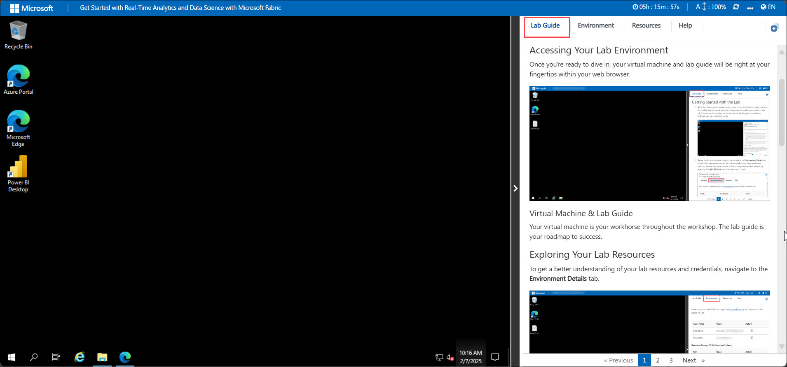
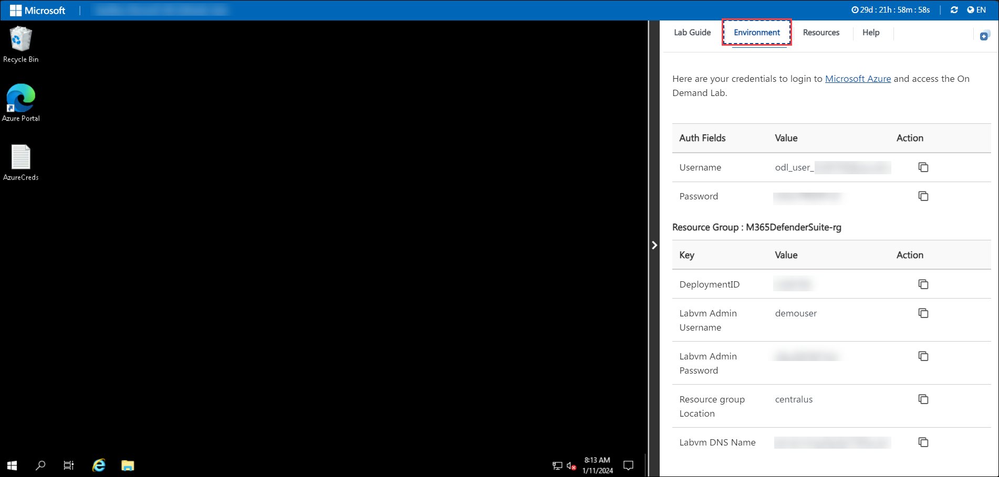
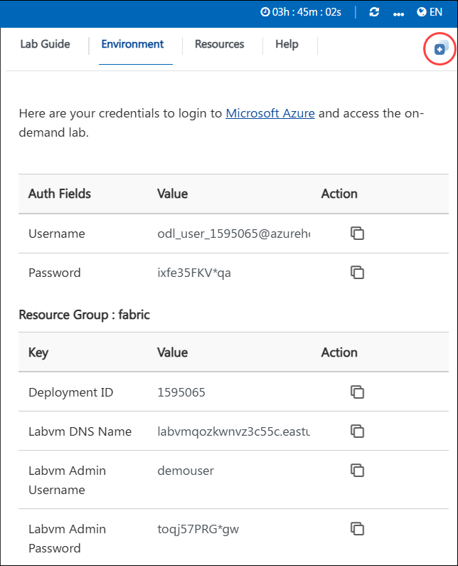

# Create and ingest data with a Microsoft Fabric Lakehouse

## Overview 
The purpose of this lab is to provide hands-on experience in creating and managing a scalable and flexible data store using Microsoft Fabric's Lakehouse. Participants will learn to integrate the capabilities of both data lakes and data warehouses for efficient big data processing and analysis.

The utilized technical specifications are as follows:

  1. Power BI: For data visualization and reporting.
  2. Power Query: For creating visual data transformation queries.
  3. OneLake: Scalable storage layer based on Azure Data Lake Store Gen2.
  4. Apache Spark: Compute engine for big data processing.
  5. SQL: Query engine for relational data analysis.
  6. Delta Lake: Open source storage layer that brings ACID transactions to Apache Spark and big data workloads.

## Objective

By the end of this lab, you will enhance your data management and analysis skills by leveraging Microsoft Fabric's. You will:

**Create a Microsoft Fabric Workspace:** etup: Learn how to initiate a new workspace within Microsoft Fabric. This involves signing into the Fabric platform, navigating to the workspace creation interface, and configuring it with the appropriate Fabric capacity. Trial Activation: Activate a Fabric trial to access all necessary features and tools required for the lab exercises. This includes enabling any additional capacity or features provided during the trial period.

**Set Up a Lakehouse:** Creation: Create a new Lakehouse within the Fabric workspace. This involves defining its name, setting up its configuration, and integrating it with the OneLake scalable storage layer.
Configuration: Configure the Lakehouse to leverage the benefits of both data lakes and data warehouses. This setup allows you to manage and query data efficiently using the unified platform.

**Ingest Data**: Upload: Import data files into the Lakehouse. This includes uploading files from your local computer or a virtual machine to the Lakehouse’s storage. Data Management: Organize the uploaded data within the Lakehouse. This may involve creating subfolders for better data organization and verifying that files are correctly uploaded and accessible.

**Convert Files to Tables**: Transformation: Convert the uploaded data files into structured tables within the Lakehouse. This process involves defining table schemas and loading data from files into these tables to make it queryable. Management: Manage and refresh the newly created tables to ensure they reflect the latest data and are properly structured for querying.

Run SQL Queries : Query Execution  Utilize the SQL endpoint provided by Microsoft Fabric to write and execute SQL queries against the Lakehouse tables. This allows you to perform complex data analysis and retrieve insights from the stored data.
Results Analysis: Review the results of your SQL queries to interpret data and generate meaningful insights. This includes analyzing query outputs and understanding the data trends.
Create Visual Queries:

**Power Query**: Use Power Query to visually create and transform data queries. This involves applying various transformations to prepare data for analysis.
Visualization: Develop visual queries to represent data in an easily understandable format, facilitating better data interpretation and decision-making.
Build Reports:

Report Creation: Develop interactive reports using Power BI based on the data in the Lakehouse. This includes designing report layouts, selecting appropriate visualizations, and configuring report elements to display data effectively.
Saving and Sharing: Save your completed reports within the Fabric workspace and share them with stakeholders. This step includes ensuring that reports are accessible and properly formatted for collaborative analysis and decision-making.

## Prerequisites 

**Necessary Skills and Knowledge:**

- Basic Understanding of Data Warehousing and Data Lakes: Familiarity with the concepts of structured and unstructured data storage.
- SQL Knowledge: Ability to write and understand basic SQL queries.
- Data Analysis: Basic experience with data analysis and reporting.

## Architecture

Microsoft Fabric Lakehouse is a unified data platform that integrates the flexibility and scalability of a data lake with the structured querying capabilities of a data warehouse. Here is a detailed explanation of the key components involved:

- **OneLake Storage Layer** OneLake is the foundation of Microsoft Fabric's Lakehouse, providing a scalable and flexible storage solution built on Azure Data Lake Store Gen2. It supports storing vast amounts of structured and unstructured data efficiently.

- **Apache Spark** is the compute engine used in Microsoft Fabric for big data processing. It provides high-performance in-memory computation capabilities.

- **SQL compute engines** in Microsoft Fabric allow for querying and managing data using SQL semantics. This enables users to run complex queries on large datasets stored in the Lakehouse.

- **Delta Lake** is an open-source storage layer that provides ACID (Atomicity, Consistency, Isolation, Durability) transactions and scalable metadata handling.

- **Power BI** is a business analytics tool integrated with Microsoft Fabric, used for data visualization and reporting.

- **Power Query** is a data connection technology that enables users to discover, connect, and manipulate data across various sources.

## Architecture diagram

## Explanation of Components

- **Microsoft Fabric Workspace:** A centralized environment within Microsoft Fabric where users can manage their data projects. This workspace provides access to various tools and services needed to create and analyze data in a unified platform.

- **Lakehouse:** A scalable and flexible data store within Microsoft Fabric that combines the features of a data lake and a data warehouse. It allows for the storage and querying of both structured and unstructured data using SQL and Apache Spark compute engines.

- **OneLake Storage Layer:** The underlying scalable storage layer used by the Lakehouse, built on Azure Data Lake Store Gen2. It provides robust, scalable storage for large volumes of data in various formats.

- **Data Files and Tables:** Ingested data files that are uploaded into the Lakehouse. These files can be transformed into structured tables that allow for efficient querying and analysis. Tables in Microsoft Fabric Lakehouse are based on the open-source Delta Lake file format.

- **SQL Endpoint:** A feature within Microsoft Fabric that enables users to perform SQL queries on the Lakehouse tables. It provides a familiar SQL interface for data analysts and engineers to query and analyze data efficiently.

- **Power Query:** A data connection technology that enables users to discover, connect, combine, and refine data across a wide variety of sources. In the context of Microsoft Fabric, Power Query allows for visual query creation and data transformation.

- **Power BI:** A suite of business analytics tools within Microsoft Fabric that enables users to create interactive reports and dashboards. Power BI is integrated with the Lakehouse to provide a seamless reporting and visualization experience based on the ingested data.

- **Data Transformation:** The process of converting raw data into a structured format that can be used for analysis. This includes operations such as grouping, filtering, and summarizing data to prepare it for querying and reporting.

- **Report Building:** The creation of interactive reports using Power BI, based on the data stored in the Lakehouse. This involves designing report layouts, selecting visualizations, and configuring report elements to effectively display data insights.

## Getting Started with the lab

## Accessing Your Lab Environment

Once you're ready to dive in, your virtual machine and lab guide will be right at your fingertips within your web browser.
 

### Virtual Machine & Lab Guide
 
Your virtual machine is your workhorse throughout the workshop. The lab guide is your roadmap to success.
 
## Exploring Your Lab Resources
 
To get a better understanding of your lab resources and credentials, navigate to the **Environment Details** tab.
 

 
## Utilizing the Split Window Feature
 
For convenience, you can open the lab guide in a separate window by selecting the **Split Window** button from the top right corner.
 

 
## Managing Your Virtual Machine
 
Feel free to start, stop, or restart your virtual machine as needed from the **Resources** tab. Your experience is in your hands!
 

 
 
 Click "Next" from the bottom right corner to embark on your Lab journey!
 
  
 
Now you're all set to explore the powerful world of technology. Feel free to reach out if you have any questions along the way. Enjoy your workshop!

#### Happy Learning!!
