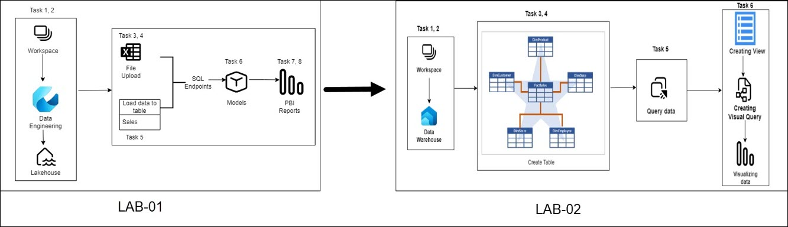

# Get started with Lakehouse in Microsoft Fabric

## Overall Estimated Duration: 4 Hours

## Overview
This hands-on lab experience involves building and administering a scalable, flexible data storage with Microsoft Fabric's Lakehouse. Participants will learn how to combine data lake and data warehouse capabilities to optimize big data processing and analysis. The technical specs include Power BI for data visualization, Power Query for visual data transformation queries, and OneLake for scalable storage using Azure Data Lake Store Gen2. Furthermore, Apache Spark will serve as the compute engine for big data processing, SQL for relational data analysis, and Delta Lake for integrating transactions into Apache Spark and big data workloads.

## Objective

This lab is designed to give learners hands-on experience with data management and analysis using Microsoft Fabric. Learners will enhance their proficiency in data integration, transformation, storage, and analysis by utilizing the advanced tools and features offered by Microsoft Fabric.

Participants will learn:

1. **Creating and Ingesting Data with a Microsoft Fabric Lakehouse**: This exercise will guide participants through setting up a Microsoft Fabric workspace and configuring a Lakehouse for scalable storage. They will ingest data from various sources, convert files into structured tables, and apply SQL queries for data manipulation and analysis. Participants will also use Power Query for advanced data transformations and create insightful reports with Power BI to effectively visualize and share their findings.

2. **Analyzing Data with Apache Spark**: This exercise involves setting up a Lakehouse, uploading data files, and loading data into a Spark DataFrame for exploration. Participants will transform the data using Spark, including filtering, aggregations, and joins, and utilize SQL queries to organize and analyze the data further. The session will culminate in visualizing data directly within Spark to derive insights and support decision-making.

## Prerequisites 

Participants should have:

- Basic Understanding of Data Warehousing and Data Lakes: Familiarity with the concepts of structured and unstructured data storage.
- SQL Knowledge: Ability to write and understand basic SQL queries.
- Data Analysis: Basic experience with data analysis and reporting.

## Architecture

This lab introduces the Microsoft Fabric Lakehouse, a unified data platform that combines the flexibility and scalability of a data lake with the structured querying capabilities of a data warehouse. Key components include OneLake, a scalable storage layer built on Azure Data Lake Store Gen2, and Apache Spark, which provides high-performance in-memory computation for big data processing. SQL compute engines enable complex queries on large datasets, while Delta Lake ensures ACID transactions and efficient metadata handling. Additionally, Power BI and Power Query are integrated for advanced data visualization, reporting, and manipulation.

## Architecture diagram

## Explanation of Components

- **Microsoft Fabric Workspace:** A centralized environment within Microsoft Fabric where users can manage their data projects. This workspace provides access to various tools and services needed to create and analyze data in a unified platform.

- **Lakehouse:** A scalable and flexible data store within Microsoft Fabric that combines the features of a data lake and a data warehouse. It allows for the storage and querying of both structured and unstructured data using SQL and Apache Spark compute engines.

- **OneLake Storage Layer:** The underlying scalable storage layer used by the Lakehouse, built on Azure Data Lake Store Gen2. It provides robust, scalable storage for large volumes of data in various formats.

- **Data Files and Tables:** Ingested data files that are uploaded into the Lakehouse. These files can be transformed into structured tables that allow for efficient querying and analysis. Tables in Microsoft Fabric Lakehouse are based on the open-source Delta Lake file format.

- **SQL Endpoint:** A feature within Microsoft Fabric that enables users to perform SQL queries on the Lakehouse tables. It provides a familiar SQL interface for data analysts and engineers to query and analyze data efficiently.

- **Power Query:** A data connection technology that enables users to discover, connect, combine, and refine data across a wide variety of sources. In the context of Microsoft Fabric, Power Query allows for visual query creation and data transformation.

- **Power BI:** A suite of business analytics tools within Microsoft Fabric that enables users to create interactive reports and dashboards. Power BI is integrated with the Lakehouse to provide a seamless reporting and visualization experience based on the ingested data.

- **Data Transformation:** The process of converting raw data into a structured format that can be used for analysis. This includes operations such as grouping, filtering, and summarizing data to prepare it for querying and reporting.

- **Report Building:** The creation of interactive reports using Power BI, based on the data stored in the Lakehouse. This involves designing report layouts, selecting visualizations, and configuring report elements to effectively display data insights.

## Getting Started with the lab

## Accessing Your Lab Environment

Once you're ready to dive in, your virtual machine and lab guide will be right at your fingertips within your web browser.
 

### Virtual Machine & Lab Guide
 
Your virtual machine is your workhorse throughout the workshop. The lab guide is your roadmap to success.
 
## Exploring Your Lab Resources
 
To get a better understanding of your lab resources and credentials, navigate to the **Environment Details** tab.
 

 
## Utilizing the Split Window Feature
 
For convenience, you can open the lab guide in a separate window by selecting the **Split Window** button from the top right corner.
 

 
## Managing Your Virtual Machine
 
Feel free to start, stop, or restart your virtual machine as needed from the **Resources** tab. Your experience is in your hands!
 

 

## Support Contact

1. The CloudLabs support team is available 24/7, 365 days a year, via email and live chat to ensure seamless assistance at any time. We offer dedicated support channels tailored specifically for both learners and instructors, ensuring that all your needs are promptly and efficiently addressed.

   Learner Support Contacts:

    - Email Support: labs-support@spektrasystems.com
    - Live Chat Support: https://cloudlabs.ai/labs-support

2. Now, click on Next from the lower right corner to move on to the next page.

Now you're all set to explore the powerful world of technology. Feel free to reach out if you have any questions along the way. Enjoy your workshop!

#### Happy Learning!!
